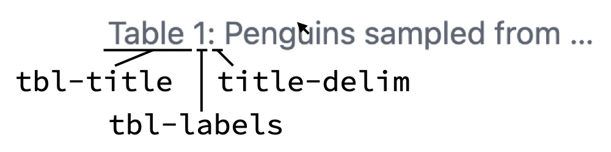
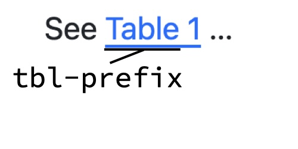

# Figures and tables {#sec-figure-table}

Figures and tables are essential components of scientific and technical documents, serving as powerful tools to communicate data and results visually. 
You often need precise control over their placement within documents, their captions, and the ability to group them into panels and cross-reference them throughout the text. 
Given their importance, we've devoted an entire part of this book to exploring figures and tables in depth. 

The first several chapters in this part are written in a way that applies regardless of how your figures and tables are produced---whether you create them directly with markdown syntax or generate them computationally from code cells. 
This approach is intentional because most aspects of working with figures and tables are independent of their source. 
For example, document-level options that control figures and tables often apply universally, as do many layout features that involve surrounding figures or tables in additional markdown.
There are a few exceptions where you'll need to use specific attributes for markdown-based content or code cell options for computational output, and we'll point these out clearly when they arise.

Of course, there are some topics specific to computationally-generated figures and tables---these topics are covered in @sec-figure-table-computational.

We expect you'll turn to this part of the book to solve particular tasks with your own tables and figures. 
The next section is designed to point you quickly to the relevant chapter to solve your problem. 

You should review @sec-syntax-variations which explains how to translate between markdown and computational syntax for figures and tables, as well as what we call the fenced div syntax, which will help you understand and apply the examples used throughout the rest of this part.

## Common tasks

TODO: revisit and link each to this chapter or advanced chapter

How do I :

* Cross-reference my figure/table 

* Change the position of the figure/table

* Arrange multiple figures and/or tables in a single panel

* Change the format or location of the caption

* Control the size or aspect ratio of my figure

* Control the styling of my table 

* Troubleshoot the table or figure output from a particular package

## Syntax variations {#sec-syntax-variations}

### Markdown vs computational

As you read this chapter you'll see examples of figures and tables that are produced in two ways: directly with markdown and computationally.
A reminder of the syntax is shown for figures in @fig-figure-syntax, and for tables in @fig-table-syntax. 

::: {#fig-figure-syntax}

::: {#fig-figure-syntax-md}
```markdown
{#fig-id fig-alt="Alternative text"}
```
:::


::: {#fig-figure-syntax-comp}
````markdown
```{{LANGUAGE}}
#| label: fig-id
#| fig-cap: "Caption"
#| fig-alt: "Alternative text"

# Code to generate a single figure
```
````
:::

Syntax for a figure with a numbered caption and alternative text produced via (a) markdown and by (b) an executable code cell.

:::

::: {#fig-table-syntax}

::: {#fig-table-syntax-md}
```markdown
| Column 1 | Column 2 |
|----------|----------|
| Cell A   | Cell B   |

: Caption {#tbl-id}
```
:::


::: {#fig-table-syntax-comp}
````markdown
```{{LANGUAGE}}
#| label: tbl-id
#| tbl-cap: "Caption"

# Code to generate a single table
```
````
:::

Syntax for a table with a numbered caption produced via (a) markdown and by (b) an executable code cell.

:::

The key difference is that for computational figures and tables you use code cell options to specify captions, identifiers, and alternative text.
When the computational engine executes a code cell that produces a table or figure, it uses the output, along with the code cell options to construct the same markdown you would write by hand to to render a figure or table.
This means for figure or table tweaks that involve setting document options, or surrounding the figure or table in additional markdown, you can swap a markdown example with a computational one and vice versa.
For tweaks that involve changes to the markdown itself, like adding an attribute, you'll usually find a corresponding code cell option for a computational output.

### Fenced div syntax

When a figure or table is cross-referenceable (i.e. it has an identifier that starts with `fig-`, `tab-` or one of the other special prefixes) another syntax variant is useful--- the fenced div syntax.

The fenced div syntax moves the caption and identifier outside of the image or table markdown.
This provides a consistent syntax for both computational and non-computational figures and tables.
For example, @fig-fenced-div-figure shows the fenced div syntax for figures.

::: {#fig-fenced-div-figure}

::: {#fig-fenced-div-figure-md}
````markdown
::: {#fig-id}
{fig-alt="Alternative text"}

Caption
:::
````
:::

:::{#fig-fenced-div-figure-comp}
````markdown
::: {#fig-id}
```{{LANGUAGE}}
#| fig-alt: "Alternative text"

# Code to generate a single figure
```

Caption
:::
````
:::

Fenced div syntax for a figure with a numbered caption and alternative text produced via (a) markdown and by (b) an executable code cell.

:::

The fenced div syntax abstracts away whether the figure or table is produced in markdown or computationally.
So, in the examples later in the chapter we'll use the shorthand:

````markdown
::: {#fig-id}
{ IMAGE }

Caption
:::
````

where `{ IMAGE }` could be a markdown image or a code cell generating a figure.
Conveniently, even if you don't replace `{ IMAGE }`, this is valid Quarto markdown and will render like @fig-id.

::: {#fig-id}
{ IMAGE }

Caption
:::


The same fenced div syntax applies to tables and we'll use a similar shorthand:

````markdown
::: {#tbl-id}
{ TABLE }

Caption
:::
````

Where `{ TABLE }` could be a code cell generating a table, or a table written directly in markdown as a pipe table, list table, or HTML table in a raw HTML block.

## Cross-references {#sec-figtab-crossref}

You'll start by diving into the two required step to cross-reference a figure or table:

1. Give your figure or table an identifier that Quarto recognizes as a cross-reference, this means that it starts with `fig-` or `tbl-`.

2. Refer to your figure or table using the syntax `@ID`.

Then, you'll learn about creating sub-references. 

This chapter focuses on creating and using cross-references. 
If you are interested in customizing the way your figures and tables are numbered or labeled see @sec-figtab-captions.

### Adding an identifier to a figure or table

Depending on how you create your figure or table, there are three ways to add an identifier that Quarto recognizes for cross-referencing:

* **Non-computational**: as an ID attribute, starting with `#`, in markdown syntax
* **Computational**: as `label` code cell option in a computational code cell
* **Both**: as an ID attribute, starting with `#`, in the fenced div syntax

We illustrate each of these for figures in @fig-id-figure, and tables in @fig-id-table.
The caption, and alternative text for figures, are optional, but you'll generally include them, so our examples do too.


::: {#fig-id-figure}

:::{#fig-id-figure-md}
```markdown
{#fig-id fig-alt="Alt text"}
```

Markdown figure
:::

::: {#fig-id-figure-comp}
````markdown
```{{LANGUAGE}}
#| label: fig-id
#| fig-cap: "Caption"
#| fig-alt: "Alt text"
# Code to generate a single figure
```
````

Computational figure
:::

:::{#fig-id-fenced-div-markdown}
````markdown
::: {#fig-id}
{fig-alt="Alt text"}

Caption
:::
````

Fenced div markdown figure
:::

:::{#fig-id-fenced-div-comp}
````markdown
::: {#fig-id}
```{{LANGUAGE}}
#| fig-alt: "Alt text"
# Code to generate a single figure
```

Caption
:::
````
Fenced div computational figure
:::

Ways to add the identifier `fig-id` to a figure using (a) markdown, (b) computational code cell, (c) fenced div with markdown, and (d) fenced div with computational code cell.
:::

::: {#fig-id-table}

:::{#fig-id-table-md}
```markdown
| Column 1 | Column 2 |
|----------|----------|
| Cell A   | Cell B   |

: Caption {#tbl-id}
```
Markdown table
:::

::: {#fig-id-table-comp}
````markdown
```{{LANGUAGE}}
#| label: tbl-id
#| tbl-cap: "Caption"
# Code to generate a single table
```
````
Computational table
:::

::: {#fig-id-fenced-div-markdown}
````markdown
::: {#tbl-id}
| Column 1 | Column 2 |
|----------|----------|
| Cell A   | Cell B   |

Caption
:::
````
Fenced div markdown table
:::

::: {#fig-id-fenced-div-table}
````markdown
::: {#tbl-id}
```{{LANGUAGE}}
# Code to generate a single table
```
Caption
:::
````
Fenced div computational table
:::  

Ways to add the identifier `tbl-id` to a table.

:::

For figures and tables you'll usually use the prefixes `fig-` and `tbl-` respectively, but see @sec-crossreferences for other available prefixes.
For working examples of computational figures and tables with cross-references see @sec-figure-table-computational

::: {.callout-tip}

### Anything can be a "Figure"

Quarto doesn't care what the content of the fenced div is. 
You can put anything inside: an image, a code block, a tabset, a table, markdown etc. 
The label prefix determines how Quarto labels it.
For example, using `fig-` gets you a "Figure X" regardless of the content.

:::

### Referring to a figure or table

To refer to the an output, use an `@` followed by the identifier (@fig-crossref-inline-syntax).
When rendered the cross-references are replaced with the figure or table counter and become links (@fig-crossref-inline-rendered).
In HTML formats, hovering on the links also shows a preview of the figure or table.

::: {#fig-crossref-inline layout-ncol="2"}

::: {#fig-crossref-inline-syntax}
```markdown
See table @tbl-id. 
@fig-id shows ...
```
:::


:::{#fig-crossref-inline-rendered}
{.border .p-3 fig-alt="Rendered cross-references to a figure and a table shows the text 'See Table 1. Figure 1 shows...', where 'Table 1' and 'Figure 1' are clickable links."}
:::

Referring to a figure and a table using cross-references.

:::

::: {.callout-warning}

### Cross-references are within document only

Cross-references are generally limited to the figures and tables within the same document.
The one exception is a Quarto book project---this is your best option if across document (i.e. chapter) cross-references are important to you.
For documents in a webpage project, an alternative approach is to link to the figure or table identifier, as explained in the @sec-websites-anchors.

:::

### Sub-references

Sub-references let you refer to one part of a multi-part figure or table, for example "Figure 1 (a)".
To make sub-references, nest your cross-referenceable elements inside a parent fenced div that has a caption and an identifier.
The children's identifiers must use the same prefix as the parent's.
For example, here the parent div has the identifier `fig-animals` and contains two markdown images, each with its own `fig-` identifier:

```markdown
::: {#fig-animals}

{#fig-elephant fig-alt="Line drawing of an elephant."}

{#fig-panther fig-alt="Line drawing of a panther."}

Two animals.
:::
```

Use `@fig-animals` to refer to the whole figure ("Figure 1"), and `@fig-elephant` to refer to one part ("Figure 1 (a)").
The captions of the children become sub-captions.

When the children become more complicated, we recommend using an explicit fenced div for each one.
For example, the general structure becomes:

```markdown
:::: {#fig-main}

::: {#fig-sub1}
CONTENT 1

Sub-caption 1
:::

::: {#fig-sub2}
CONTENT 2

Sub-caption 2
:::

Main caption
::::
```

Here, `CONTENT` can be markdown or a code cell, and can contain any kind of content.

::: callout-tip
We've used additional colons (`:`) to help you see the nesting, but they aren't required.
:::

If the children all come from one code cell that makes several outputs of the same type (all figures or all tables), you can use the `fig-subcap` or `tbl-subcap` code cell options instead.
See @sec-multiple-figures for figures and @sec-multiple-tables for tables.

By default, the children are placed one after the other.
To arrange them in rows and columns, add layout attributes to the parent fenced div as shown in @sec-panel-layout.

## Captions {#sec-figtab-captions}

### Caption text

Refer to previous sections:

* Use code cell options or last element in fenced divs to set content of captions.
* Include dynamic content in captions by using div syntax and inline code.

### The fenced div syntax {#sec-figtab-fenced-div}

As an alternative to setting the `label` and `fig-cap`/`tbl-cap` code cell options, you can use Quarto's fenced div syntax to organize your computational figures and tables. 
This approach separates the content generation from the labeling and captioning.
This can be useful in certain scenarios, two of which we'll explore in this section: long captions and dynamic captions.

The basic structure uses a fenced div with the `label` as an identifier, followed by a code cell that generates your content, and ends with the caption as the last line: 

````{.markdown}
::: {#LABEL}
```{{LANGUAGE}}
# Generate your figure or table here
```

CAPTION

:::
````

::: callout-note

### Fenced div syntax only works with cross-referenceable figures and tables

To be processed as content along with a caption, the label used in the fenced div must start with a prefix recognized by Quarto's cross-reference syntax. 
For computational figures and tables this usually means starting with `fig-` or `tbl-`.

:::

@fig-fenced-div shows how the same figure from @fig-figures would look using the fenced div approach.
The `label` code cell becomes an identifier for the fenced div (`#fig-scatter`),
the code cell no longer has `label` or `fig-cap` options,
and the caption is the last line before the closing of the fenced div.s

::: {#fig-fenced-div}
::: {.panel-tabset group="language"}

### R

````{.markdown}
::: {#fig-scatter} 
```{{r}} 
#| fig-alt: "Scatter plot of bill length vs. depth showing distinct species clustering."


```

Penguin bill length versus depth by species

:::
````

### Python

````{.markdown}
::: {#fig-scatter}
```{{python}}
#| fig-alt: "Scatter plot of bill length vs. depth showing distinct species clustering."


```

Penguin bill length versus depth by species

:::
````

:::

Using the fenced div syntax to acheive the same result as @fig-figures.

:::

Two examples of when this can be useful are: long captions, and dynamic captions.

#### Long captions {#sec-long-captions}

If your caption is getting long and it is increasingly painful to track as a code cell option, consider using the div syntax instead.
You can then split lines in a way that makes sense and not have to worry about the YAML syntax.

::: {#fig-long-captions}

::: {.panel-tabset group="language"}

### R
 
````{.markdown}
::: {#fig-scatter}

```{{r}}
#| fig-alt: "Scatter plot of bill length vs. depth showing distinct species clustering."


```

Scatter plot depicting the relationship between bill length (mm) and bill depth (mm) across different penguin species. 
The clustering of the species reveals morphological differences in bill dimensions: 
**Adelie** penguins have short, deep bills,
whereas **Gentoo** penguins have long, shallow bills.
**Chinstrap** penguins have similar depth bills to Adelie penguins but there bills are longer.

:::
````
 
### Python
 
````{.markdown}
::: {#fig-scatter}

```{{python}}
#| fig-alt: "Scatter plot of bill length vs. depth showing distinct species clustering."


```

Scatter plot depicting the relationship between bill length (mm) and bill depth (mm) across different penguin species. 
The clustering of the species reveals morphological differences in bill dimensions: 
**Adelie** penguins have short, deep bills,
whereas **Gentoo** penguins have long, shallow bills.
**Chinstrap** penguins have similar depth bills to Adelie penguins but there bills are longer.

::: 
````
 
:::

:::

:::{.callout-important}

### No multi-paragraph captions

Quarto doesn't support captions that consist of multiple paragraphs.

:::

#### Dynamic captions {#sec-dynamic-captions}

Dynamic captions are caption which depend on some computational result.
By using the fenced div syntax, you include computation in your caption via inline code execution.

For example, @fig-dynamic-captions, uses inline code to include the number of rows in the `penguins` dataset in the caption.

::: {#fig-dynamic-captions}

::: {.panel-tabset group="language"}

### R
 
````{.markdown}
::: {#fig-scatter}

```{{r}}
#| fig-alt: "Scatter plot of bill length vs. depth showing distinct species clustering."


```

Penguin bill length versus depth by species for `{{r}} nrow(penguins)` penguins.

:::
````
 
### Python
 
````{.markdown}
::: {#fig-scatter}

```{{python}}
#| fig-alt: "Scatter plot of bill length vs. depth showing distinct species clustering."


```

Penguin bill length versus depth by species `{{python}} penguins.height` penguins.

::: 
````
 
:::

:::


### Caption location {#sec-caption-location}

By default, Quarto puts figure captions at the bottom of the figure, and table captions at the top of the table.
You can control this with the `cap-location` option for both figures and tables, or separately with the `fig-cap-location` and `tbl-cap-location` options.
Can take the values `top`, `bottom`, or `margin` (`margin` only in some formats).

Document level to control computational and non-computational figures and tables.

Code cell level for individual figures and tables.

Is there an attribute equivalent for markdown figures and tables?

::: {.panel-tabset group="language"}

### R
 
````{.markdown filename="document.qmd"}
```{{r}}
#| label: tbl-species-count
#| tbl-cap: "Penguins sampled from the Palmer Archipelago"
#| cap-location: bottom


``` 
````
 
### Python
 
````{.markdown filename="document.qmd"}
```{{python}}
#| label: tbl-species-count
#| tbl-cap: "Penguins sampled from the Palmer Archipelago"
#| cap-location: bottom


``` 
````
 
:::

For example,

::: {#fig-cap-location}

:::{layout="[[1,1], [1]]"}
:::{}
{.border}

`top`
:::
:::{}
{.border}

`bottom`
:::

:::{}
{.border}

`margin`
:::
:::

Tables with the code cell option `cap-location` set to: `top`, `bottom` and `margin`.

:::


::: {#fig-cap-location-document}

:::{layout-ncol="2"}
```{.yaml filename="document.qmd"}
---
title: "My Document"
cap-location: bottom
---
```

```{.yaml filename="_quarto.yml"}
cap-location: bottom
```
:::

You can set the caption location for the entire document in the document header, or for all documents in a project using `_quarto.yml`.

:::

### Caption titles and numbering

Titles and numbering require a cross-reference. 

Document level (or project level options)!

:::{#fig-cap-title}

::: {layout="[2, 1]"}
:::{}
{.border width="50%"}

Table Caption
:::

:::{}
{.border width="50%"}

Inline reference
:::

:::
:::

```{.yaml filename="document.qmd"}
---
title: "My Document"
crossref:
  tbl-title: Sheet
  tbl-prefix: Sh
  tbl-labels: roman
  title-delim: "—"   
---
```


Same for `fig`: `fig-title`, `fig-prefix`, `fig-labels`

Shared: `title-delim`

`labels`, `subref-labels`,`fig-labels`, `tbl-labels`:`arabic`, `alpha a`, `alpha A`, `roman i`, `roman I` 


```{.yaml filename="document.qmd"}
---
title: "My Document"
crossref:
  fig-title: Fig
  fig-prefix: Fig
  fig-labels: roman
  title-delim: "."   
---
```


::: {.callout-tip}

### Custom cross-references

If you need a custom title, prefix and numbering scheme, but also want to keep the defaults for figures or tables, define a custom cross-reference type. See ... 

:::

## Layout {#sec-figtab-layout}

Link to: 

* `revealjs` code cell option: `output-location`

### Panel layout: `layout` {#sec-panel-layout}

Panel layouts arrange content in a grid with the `layout-ncol`, `layout-nrow`, or `layout` attributes, as introduced in @sec-layout.
This section covers what is specific to figures and tables: arranging several outputs, and adding captions and cross-references to them.

#### Arranging multiple tables and/or figures {#sec-multiple-outputs}

Quarto provides a set of layout code cell options and attributes that allow you to arrange multiple figures or tables in a single panel.
As an example, `layout-ncol` specifies the number of columns in a panel layout.
You can use it as a code cell option:

````{.markdown}
```{{LANGUAGE}}
#| layout-ncol: 2

# CODE TO GENERATE TWO FIGURES/TABLES
```
````

Or you can use it as an attribute in a fenced div:

````{.markdown}
::: {layout-ncol="2"}

```{{LANGUAGE}}
# CODE TO GENERATE A SINGLE FIGURE OR TABLE
```

```{{LANGUAGE}}
# CODE TO GENERATE ANOTHER FIGURE OR TABLE
```
:::

````

Using the code cell option is the simplest approach, 
but as soon as you want some combination of: a mix of figures and tables, 
individual captions, to control placement on the page, or individual cross-references, we recommend using the attribute in a fenced div and nesting your code inside.

In the following sections, learn about `layout-nrow`/`layout-ncol`, and `layout`.

`layout-align`/`layout-valign` 


````{.markdown}
::: {layout-ncol="2"}

```{{LANGUAGE}}
#| label: fig-1
#| fig-cap: "Figure 1 caption"
# CODE TO GENERATE A SINGLE FIGURE OR TABLE
```

```{{LANGUAGE}}
#| label: fig-2
# CODE TO GENERATE ANOTHER FIGURE OR TABLE
```
:::
````

````{.markdown}
::: {#fig-plots}
::::: {layout-ncol="2"}

```{{LANGUAGE}}
# CODE TO GENERATE A SINGLE FIGURE OR TABLE
```

```{{LANGUAGE}}
# CODE TO GENERATE ANOTHER FIGURE OR TABLE
```
:::::

CAPTION
:::
````

Arranging multiple figures or tables in a single panel is a common requirement.
You can do this using the `layout` code cell options, or by using fenced divs with the `layout` classes. 

It's possible to specify a layout of multiple figures or tables produced in a single code cell using the `layout` or `layout-ncol`/`layout-nrow` code cell options.

````{.markdown}
::: {layout-ncol="2"}

```{{LANGUAGE}}
# CODE TO GENERATE A SINGLE FIGURE OR TABLE
```

```{{LANGUAGE}}
# CODE TO GENERATE ANOTHER FIGURE OR TABLE
```
:::

````

However, we recommend using fenced divs instead, because they are more flexible and easier to read.

Combing multiple layout classes in a single fenced div can be unpredictable.
You should instead nest fenced divs to create complex layouts.


### Position relative to the page: `column` {#sec-page-columns}

Fenced divs with `.column-` classes place content in different columns of the page, like the right margin (@sec-layout).
The `column` code cell option is a way to apply these classes to figures or tables produced by your code cells.

For example, if you have a figure that would benefit from more horizontal space, you could set `column: screen` (@fig-page-columns-code), to allow the figure to span the full width available.
Alternatively, for figures that are small and supplementary to the main text, you could set `column: margin` to place them in the margin area.
@fig-page-columns shows the result in the resulting `html` output.

::: {#fig-page-columns-code}
::: {.panel-tabset group="language"}

### R

````markdown
```{{r}}
#| column: screen


```
````
 
### Python
 
```` 
```{{python}}
#| column: screen


```
````

:::
:::


::: {#fig-page-columns layout-ncol="2"}

{#fig-page-columns-screen}

{#fig-page-columns-margin}

Use the `column` code cell option to place a table in different parts of the page, e.g. full width of the screen, or in the margin. Applies for `html` and `typst` formats.

::: 

You can find all the possible values for `column` in the Quarto documentation on [Article Layout](https://quarto.org/docs/authoring/article-layout.html#available-columns).

::: {.callout-tip}

### Columns are responsive in `html` output

When you view the HTML output, the definition of the columns depends on your screen size.
For example, on small screens, there is only one column, regardless of `column` all elements will span the full width of the screen.

:::


### Figure alignment: `fig-align` {#sec-figure-alignment}


#### Figure alignment: `fig-align` {#sec-fig-align}

When figure is placed in your document, think about it being placed inside a container. 
By default, the width of that container is the width of the body text, but you can alter it by placing the figure in a column (@sec-page-columns).
Figure alignment refers to the horizontal alignment of a figure within that container.

You can alter figure alignment with `fig-align`, which is a *code cell option* and a *document option*.
@fig-fig-align illustrates the three possible values: `default` (the default for the target format), `left`, `right`, or `center`.

::: {#fig-fig-align layout-ncol="3"}

{fig-alt="A scatterplot aligned to the left of the page."}

{fig-alt="A scatterplot centered on the page."}

{fig-alt="A scatterplot aligned to the right of the page."}

Examples showing the effect of different `fig-align` settings: `left`, `center`, and `right`.

:::

You can set `fig-align` at document level to apply to all figures (computational or not) in a document as shown in @lst-fig-align-document.

::: {#lst-fig-align-document}

```{.yaml filename="document.qmd"}
---
fig-align: left
---
```

You can specify the alignment of all figures in a document using the `fig-align` document option.

:::


You can then override the document level alignment on a code cell basis.
For example, @fig-fig-align-code aligns a single figure to the left of its container using `fig-align: right`.

::: {#fig-fig-align-code}
::: {.panel-tabset group="language"}

### R
 
````{.markdown}
```{{r}}
#| fig-align: right


```
````
 
### Python
 
````{.markdown}
```{{r}}
#| fig-align: right


```
````

:::

Change the alignment of a figure in its enclosing container with `fig-align`.

:::


### Table column alignment and widths {#sec-table-column-widths}

#### Column alignment

In a markdown pipe table, you can add colons to the separator row to align columns to the left, right, or center.
For example, the following table aligns the first column to the left, the second column to the center, and the third column to the right:

::: {}
````markdown

````
:::

#### Column widths

Usually, column widths in tables are determined automatically based on the content of each column.
However, sometimes you may want to set specific column widths.

##### Markdown tables: `tbl-colwidths` {#sec-tbl-colwidths}

The option `tbl-colwidths` allows you to specify widths for columns for *markdown* tables.
It takes an array of values, one per column, expressed as percentages.
You can set it as a *document option* to apply to all tables in a document, or as a *code cell option* to apply to a single table.

For a markdown table, add a `tbl-colwidths` attribute to the attributes after the caption.
For example, you might give the first column 80% of the width and the remaining two columns each 10% of the width:

::: {}
````markdown

````
:::

For example, @fig-tbl-colwidths-markdown shows how to set the column widths for a single markdown table using the code cell option `tbl-colwidths`.

::: {#fig-tbl-colwidths-markdown}
::: {.panel-tabset group="language"}

### R
 
````{.markdown}
```{{r}}
#| tbl-colwidths: [25, 75]

``` 
````
 
### Python
 
````{.markdown}
```{{python}}
#| tbl-colwidths: [25, 75]

``` 
````
 
:::

Use `tbl-colwidths` to set relative column widths for markdown tables.

:::

##### HTML tables

Since HTML tables usually provide their styling, column width (and table width) are usually controlled via the package you are using to create the table.
For example, @fig-tbl-colwidths-gt shows how to replicate the table and column widths above for HTML tables using the GT and great_tables packages.


::: {#fig-tbl-colwidths-gt}

:::{.panel-tabset group="language"}

### R

````{.markdown}
```{{r}}
penguins |>
  count(species) |>
  gt() |> 
  tab_options(
    table.width = pct(100),
  ) |> 
  cols_width(
    species ~ pct(25),
    n ~ pct(75)
  )
```
````

### Python

````{.markdown}
```{{python}}
(
  pl.DataFrame(penguins)
  .group_by('species')
  .len()
  .pipe(GT) 
  .tab_options(table_width="100%")
  .cols_width(
    species="25%", 
    len="75%"
  )
)
```
````
:::

GT and great_tables provide their own functions to set table (`tab_options()`) and column widths (`cols_width()`).

:::
