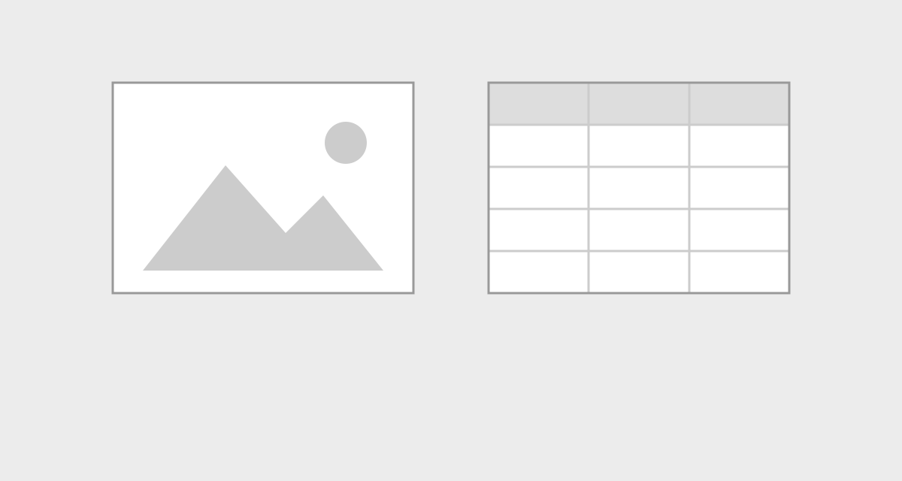
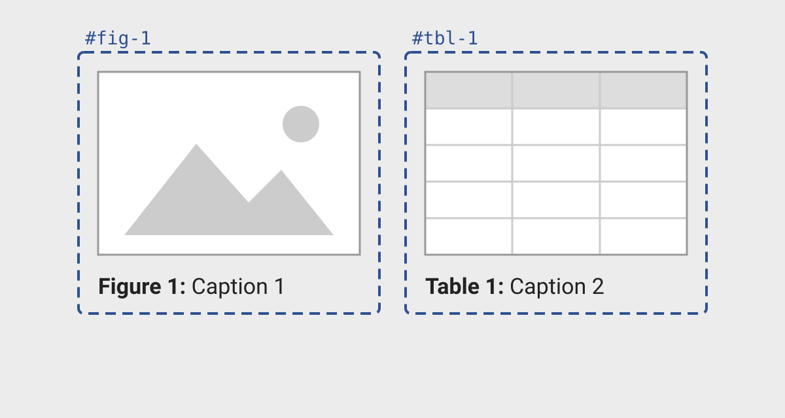
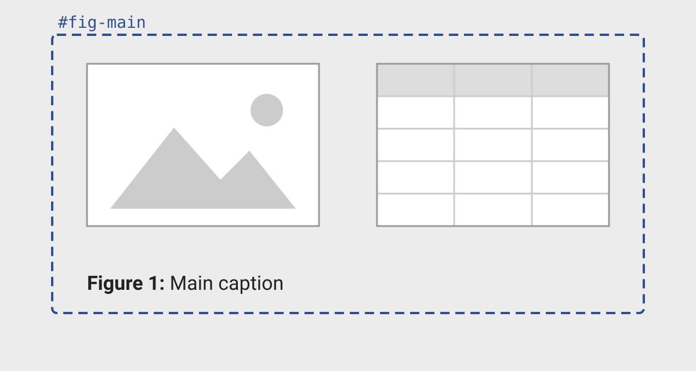
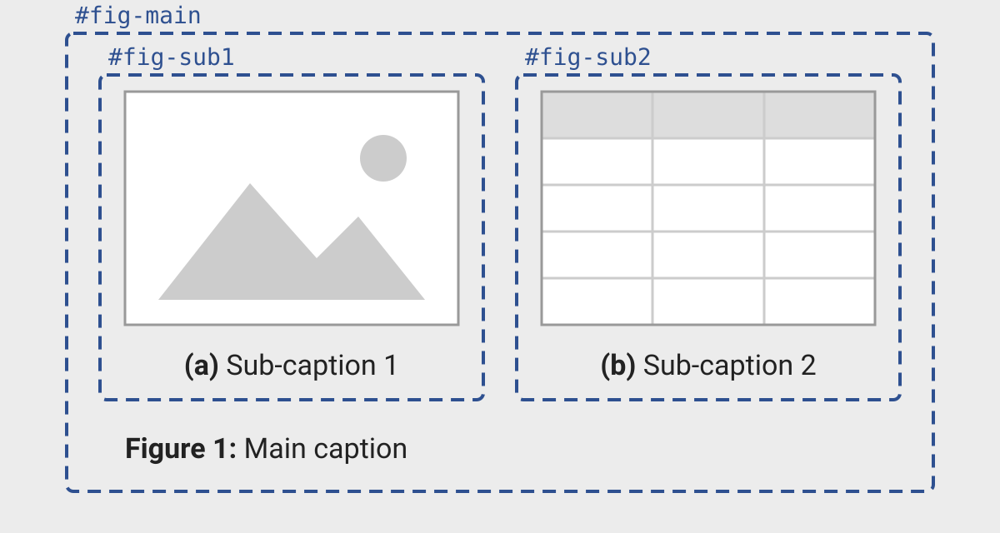

# Figures and tables {#sec-figure-table}

Figures and tables are essential components of scientific and technical documents, serving as powerful tools to communicate data and results visually. 
You often need precise control over their placement within documents, their captions, and the ability to group them into panels and cross-reference them throughout the text. 
Given their importance, we've devoted an entire part of this book to exploring figures and tables in depth. 

The first several chapters in this part are written in a way that applies regardless of how your figures and tables are produced---whether you create them directly with markdown syntax or generate them computationally from code cells. 
This approach is intentional because most aspects of working with figures and tables are independent of their source. 
For example, document-level options that control figures and tables often apply universally, as do many layout features that involve surrounding figures or tables in additional markdown.
There are a few exceptions where you'll need to use specific attributes for markdown-based content or code cell options for computational output, and we'll point these out clearly when they arise.

Of course, there are some topics specific to computationally-generated figures and tables---these topics are covered in @sec-figure-table-computational.

We expect you'll turn to this part of the book to solve particular tasks with your own tables and figures. 
The next section is designed to point you quickly to the relevant chapter to solve your problem. 

You should review @sec-syntax-variations which explains how to translate between markdown and computational syntax for figures and tables, as well as what we call the fenced div syntax, which will help you understand and apply the examples used throughout the rest of this part.

## Common tasks

TODO: revisit and link each to this chapter or advanced chapter

How do I :

* Cross-reference my figure/table 

* Change the position of the figure/table

* Arrange multiple figures and/or tables in a single panel

* Change the format or location of the caption

* Control the size or aspect ratio of my figure

* Control the styling of my table 

* Troubleshoot the table or figure output from a particular package

## Syntax variations {#sec-syntax-variations}

### Markdown vs computational

As you read this chapter you'll see examples of figures and tables that are produced in two ways: directly with markdown and computationally.
A reminder of the syntax is shown for figures in @fig-figure-syntax, and for tables in @fig-table-syntax. 

::: {#fig-figure-syntax}

::: {#fig-figure-syntax-md}
```markdown
{#fig-id fig-alt="Alternative text"}
```
:::


::: {#fig-figure-syntax-comp}
````markdown
```{{LANGUAGE}}
#| label: fig-id
#| fig-cap: "Caption"
#| fig-alt: "Alternative text"

# Code to generate a single figure
```
````
:::

Syntax for a figure with a numbered caption and alternative text produced via (a) markdown and by (b) an executable code cell.

:::

::: {#fig-table-syntax}

::: {#fig-table-syntax-md}
```markdown
| Column 1 | Column 2 |
|----------|----------|
| Cell A   | Cell B   |

: Caption {#tbl-id}
```
:::


::: {#fig-table-syntax-comp}
````markdown
```{{LANGUAGE}}
#| label: tbl-id
#| tbl-cap: "Caption"

# Code to generate a single table
```
````
:::

Syntax for a table with a numbered caption produced via (a) markdown and by (b) an executable code cell.

:::

The key difference is that for computational figures and tables you use code cell options to specify captions, identifiers, and alternative text.
When the computational engine executes a code cell that produces a table or figure, it uses the output, along with the code cell options to construct the same markdown you would write by hand to to render a figure or table.
This means for figure or table tweaks that involve setting document options, or surrounding the figure or table in additional markdown, you can swap a markdown example with a computational one and vice versa.
For tweaks that involve changes to the markdown itself, like adding an attribute, you'll usually find a corresponding code cell option for a computational output.

### Fenced div syntax

When a figure or table is cross-referenceable (i.e. it has an identifier that starts with `fig-`, `tab-` or one of the other special prefixes) another syntax variant is useful--- the fenced div syntax.

The fenced div syntax moves the caption and identifier outside of the image or table markdown.
This provides a consistent syntax for both computational and non-computational figures and tables.
For example, @fig-fenced-div-figure shows the fenced div syntax for figures.

::: {#fig-fenced-div-figure}

::: {#fig-fenced-div-figure-md}
````markdown
::: {#fig-id}
{fig-alt="Alternative text"}

Caption
:::
````
:::

:::{#fig-fenced-div-figure-comp}
````markdown
::: {#fig-id}
```{{LANGUAGE}}
#| fig-alt: "Alternative text"

# Code to generate a single figure
```

Caption
:::
````
:::

Fenced div syntax for a figure with a numbered caption and alternative text produced via (a) markdown and by (b) an executable code cell.

:::

The fenced div syntax abstracts away whether the figure or table is produced in markdown or computationally.
So, in the examples later in the chapter we'll use the shorthand:

````markdown
::: {#fig-id}
{ IMAGE }

Caption
:::
````

where `{ IMAGE }` could be a markdown image or a code cell generating a figure.
Conveniently, even if you don't replace `{ IMAGE }`, this is valid Quarto markdown and will render like @fig-id.

::: {#fig-id}
{ IMAGE }

Caption
:::


The same fenced div syntax applies to tables and we'll use a similar shorthand:

````markdown
::: {#tbl-id}
{ TABLE }

Caption
:::
````

Where `{ TABLE }` could be a code cell generating a table, or a table written directly in markdown as a pipe table, list table, or HTML table in a raw HTML block.

## Cross-references {#sec-figtab-crossref}

You'll start by diving into the two required step to cross-reference a figure or table:

1. Give your figure or table an identifier that Quarto recognizes as a cross-reference, this means that it starts with `fig-` or `tbl-`.

2. Refer to your figure or table using the syntax `@ID`.

Then, you'll learn about creating sub-references. 

This chapter focuses on creating and using cross-references. 
If you are interested in customizing the way your figures and tables are numbered or labeled see @sec-figtab-captions.

### Adding an identifier to a figure or table

Depending on how you create your figure or table, there are three ways to add an identifier that Quarto recognizes for cross-referencing:

* **Non-computational**: as an ID attribute, starting with `#`, in markdown syntax
* **Computational**: as `label` code cell option in a computational code cell
* **Both**: as an ID attribute, starting with `#`, in the fenced div syntax

We illustrate each of these for figures in @fig-id-figure, and tables in @fig-id-table.
The caption, and alternative text for figures, are optional, but you'll generally include them, so our examples do too.


::: {#fig-id-figure}

:::{#fig-id-figure-md}
```markdown
{#fig-id fig-alt="Alt text"}
```

Markdown figure
:::

::: {#fig-id-figure-comp}
````markdown
```{{LANGUAGE}}
#| label: fig-id
#| fig-cap: "Caption"
#| fig-alt: "Alt text"
# Code to generate a single figure
```
````

Computational figure
:::

:::{#fig-id-fenced-div-markdown}
````markdown
::: {#fig-id}
{fig-alt="Alt text"}

Caption
:::
````

Fenced div markdown figure
:::

:::{#fig-id-fenced-div-comp}
````markdown
::: {#fig-id}
```{{LANGUAGE}}
#| fig-alt: "Alt text"
# Code to generate a single figure
```

Caption
:::
````
Fenced div computational figure
:::

Ways to add the identifier `fig-id` to a figure using (a) markdown, (b) computational code cell, (c) fenced div with markdown, and (d) fenced div with computational code cell.
:::

::: {#fig-id-table}

:::{#fig-id-table-md}
```markdown
| Column 1 | Column 2 |
|----------|----------|
| Cell A   | Cell B   |

: Caption {#tbl-id}
```
Markdown table
:::

::: {#fig-id-table-comp}
````markdown
```{{LANGUAGE}}
#| label: tbl-id
#| tbl-cap: "Caption"
# Code to generate a single table
```
````
Computational table
:::

::: {#fig-id-fenced-div-markdown}
````markdown
::: {#tbl-id}
| Column 1 | Column 2 |
|----------|----------|
| Cell A   | Cell B   |

Caption
:::
````
Fenced div markdown table
:::

::: {#fig-id-fenced-div-table}
````markdown
::: {#tbl-id}
```{{LANGUAGE}}
# Code to generate a single table
```
Caption
:::
````
Fenced div computational table
:::  

Ways to add the identifier `tbl-id` to a table.

:::

For figures and tables you'll usually use the prefixes `fig-` and `tbl-` respectively, but see @sec-crossreferences for other available prefixes.
For working examples of computational figures and tables with cross-references see @sec-figure-table-computational

::: {.callout-tip}

### Anything can be a "Figure"

Quarto doesn't care what the content of the fenced div is. 
You can put anything inside: an image, a code block, a tabset, a table, markdown etc. 
The label prefix determines how Quarto labels it.
For example, using `fig-` gets you a "Figure X" regardless of the content.

:::

### Referring to a figure or table

To refer to the an output, use an `@` followed by the identifier (@fig-crossref-inline-syntax).
When rendered the cross-references are replaced with the figure or table counter and become links (@fig-crossref-inline-rendered).
In HTML formats, hovering on the links also shows a preview of the figure or table.

::: {#fig-crossref-inline layout-ncol="2"}

::: {#fig-crossref-inline-syntax}
```markdown
See table @tbl-id. 
@fig-id shows ...
```
:::


:::{#fig-crossref-inline-rendered}
{.border .p-3 fig-alt="Rendered cross-references to a figure and a table shows the text 'See Table 1. Figure 1 shows...', where 'Table 1' and 'Figure 1' are clickable links."}
:::

Referring to a figure and a table using cross-references.

:::

::: {.callout-warning}

### Cross-references are within document only

Cross-references are generally limited to the figures and tables within the same document.
The one exception is a Quarto book project---this is your best option if across document (i.e. chapter) cross-references are important to you.
For documents in a webpage project, an alternative approach is to link to the figure or table identifier, as explained in the @sec-websites-anchors.

:::

### Sub-references {#sec-sub-references}

Sub-references let you refer to one part of a multi-part figure or table, for example "Figure 1 (a)".
To make sub-references, nest your cross-referenceable elements inside a parent fenced div that has a caption and an identifier.
The children's identifiers must use the same prefix as the parent's.
For example, here the parent div has the identifier `fig-animals` and contains two markdown images, each with its own `fig-` identifier:

```markdown
::: {#fig-animals}

{#fig-elephant fig-alt="Line drawing of an elephant."}

{#fig-panther fig-alt="Line drawing of a panther."}

Two animals.
:::
```

Use `@fig-animals` to refer to the whole figure ("Figure 1"), and `@fig-elephant` to refer to one part ("Figure 1 (a)").
The captions of the children become sub-captions.

When the children become more complicated, we recommend using an explicit fenced div for each one.
For example, the general structure becomes:

```markdown
:::: {#fig-main}

::: {#fig-sub1}
CONTENT 1

Sub-caption 1
:::

::: {#fig-sub2}
CONTENT 2

Sub-caption 2
:::

Main caption
::::
```

Here, `CONTENT` can be markdown or a code cell, and can contain any kind of content.

::: callout-tip
We've used additional colons (`:`) to help you see the nesting, but they aren't required.
:::

If the children all come from one code cell that makes several outputs of the same type (all figures or all tables), you can use the `fig-subcap` or `tbl-subcap` code cell options instead.
See @sec-multiple-figures for figures and @sec-multiple-tables for tables.

By default, the children are placed one after the other.
To arrange them in rows and columns, nest a fenced div with layout attributes inside the parent, as shown in @sec-panel-layout.

## Captions {#sec-figtab-captions}

A caption has two parts: the caption text _you_ write, and, for cross-referenceable figures and tables, a title and number that _Quarto_ adds (e.g., "Figure 1:").
@tbl-caption-tasks outlines the caption tasks we cover in this section.

| To... | Use | See |
|:--|:--|:--|
| Write a long caption, with line breaks or formatting | The last paragraph of a fenced div | @sec-long-captions |
| Include a computed value in a caption | Inline code in a fenced div caption | @sec-dynamic-captions |
| Move captions above, below, or into the margin | `cap-location`, `fig-cap-location`, `tbl-cap-location` | @sec-caption-location |
| Change "Figure" or "Table", the numbering style, or the `:` | `crossref` options in the document header or `_quarto.yml` | @sec-caption-titles |

: Common caption tasks covered in this section. {#tbl-caption-tasks}

### Caption text

There are four places to set the caption text:

* **Markdown figures**: the text in the square brackets, ``.
* **Markdown tables**: the line that starts with a colon, `: Caption`, directly after the table.
* **Computational figures and tables**: the `fig-cap` or `tbl-cap` code cell option.
* **Fenced div syntax** (@sec-syntax-variations): the last paragraph inside the div, for both markdown and computational content.

The fenced div syntax is more verbose, but because a fenced div caption is ordinary markdown, and not a YAML string or a single line, it's useful in two specific situations: long captions and dynamic captions.

::: callout-note
The fenced div syntax only gives you a caption when the div's identifier starts with a cross-reference prefix, such as `fig-` or `tbl-`.
:::

#### Long captions {#sec-long-captions}

A long caption is hard to edit as a code cell option, because it must be a valid YAML string on one line.
In a fenced div, the caption is a markdown paragraph, so you can break lines where it makes sense and use markdown formatting.
@fig-long-captions shows an example, where `{ IMAGE }` is a markdown image or a code cell that makes a figure (@sec-syntax-variations).

::: {#fig-long-captions}

````{.markdown}
::: {#fig-scatter}
{ IMAGE }

Scatter plot of bill length (mm) against bill depth (mm) for three penguin species.
The species form separate clusters:
**Adelie** penguins have short, deep bills,
and **Gentoo** penguins have long, shallow bills.
**Chinstrap** penguins have bills as deep as Adelie penguins, but longer.
:::
````

A long caption in the fenced div syntax. The line breaks in the caption are for readability in the source; the caption renders as one paragraph.

:::

::: callout-important
## No multi-paragraph captions

A caption must be one paragraph.
If you leave a blank line in the caption, Quarto uses only the last paragraph as the caption, and puts the earlier paragraphs in the body of the figure or table.
:::

#### Dynamic captions {#sec-dynamic-captions}

A dynamic caption includes a computed value.
Inline code expressions, such as `` `{r} nrow(penguins)` ``, do not run inside the `fig-cap` or `tbl-cap` options, but they do run in the caption paragraph of a fenced div.
For example, the caption in @fig-dynamic-captions includes the number of penguins in the data.

::: {#fig-dynamic-captions}

::: {.panel-tabset group="language"}

## R

````{.markdown}
::: {#fig-scatter}
{ IMAGE }

Bill length versus depth for `{{r}} nrow(penguins)` penguins.
:::
````

## Python

````{.markdown}
::: {#fig-scatter}
{ IMAGE }

Bill length versus depth for `{{python}} len(penguins)` penguins.
:::
````

:::

A dynamic caption that uses inline code.

:::

### Caption location {#sec-caption-location}

By default, figure captions are placed below figures and table captions are placed above tables.
You can control this placement for figures and tables separately with the `fig-cap-location` and `tbl-cap-location` options, or use `cap-location` to control both.
Available values for these options are `top`, `bottom`, and `margin` as illustrated for a table in @fig-cap-location.
The `margin` value applies only to formats that have a margin, such as `html` and `typst` (@sec-layout).

::: {#fig-cap-location}

:::{layout="[[1,1], [1]]"}
:::{}
{.border}

`top`
:::
:::{}
{.border}

`bottom`
:::

:::{}
{.border}

`margin`
:::
:::

A table with `tbl-cap-location` set to `top`, `bottom`, and `margin`.

:::

You can set these options at three levels:

* In `_quarto.yml` to control all figures and tables in a project:

    ```{.yaml filename="_quarto.yml"}
    cap-location: bottom
    ```

* In the document header to control all figures and tables in a document:

    ```{.yaml filename="document.qmd"}
    ---
    title: "My Document"
    cap-location: bottom
    ---
    ```
    
* On individual tables or figures to control just a single instance. 
    Use the code cell option for computational outputs:

    ````{.markdown}
    ```{{LANGUAGE}}
    #| label: tbl-island-count
    #| tbl-cap: "Penguins sampled from the Palmer Archipelago"
    #| cap-location: bottom

    # Code to generate a single table
    ```
    ````
    
    Or the attribute form for markdown figures or tables:
    
    ```markdown
    | Island    | Count |
    |-----------|-------|
    | Biscoe    | 168   |
    | Dream     | 124   |
    | Torgersen | 52    |

    : Penguins sampled from the Palmer Archipelago {#tbl-island-count cap-location="bottom"}
    ```

    With the fenced div syntax, put the attribute on the div:

    ```markdown
    ::: {#tbl-island-count cap-location="bottom"}
    { TABLE }

    Penguins sampled from the Palmer Archipelago
    :::
    ```

### Caption titles and numbering {#sec-caption-titles}

Quarto adds a title and a number to figures and tables that are cross-referenceable.
The title and number appear in the caption, and in the inline reference.
You can control these using the `crossref` options described in @tbl-crossref-options and illustrated for tables in @fig-cap-title.

:::{#fig-cap-title}

::: {layout="[2, 1]"}
:::{}
{.border width="50%"}

Table caption
:::

:::{}
{.border width="50%"}

Inline reference
:::

:::
The default title and number in a table caption and in a cross-reference to the table.
:::

::: {#tbl-crossref-options}

::: {.list-table header-rows=1 aligns=l,l,l}

* - Option
  - Controls
  - Default

* - | `fig-title`
    | `tbl-title`
  - Title in the caption
  - | `Figure`
    | `Table`

* - | `fig-prefix`
    | `tbl-prefix`
  - Text before the number in a cross-reference
  - | `Figure`
    | `Table`

* - | `fig-labels`
    | `tbl-labels`
  - Number style
  - | `arabic`
    | `arabic`

* - `subref-labels`
  - Number style for sub-references (@sec-figtab-crossref)
  - `alpha a`

* - `title-delim`
  - Text between the number and the caption
  - `:`

:::

Options under `crossref` that change caption titles and numbering.

:::

The number style options take these values:

* `arabic`: 1, 2, 3
* `roman`: I, II, III
* `roman i`: i, ii, iii
* `alpha a`: a, b, c. To start at a different letter, give that letter, for example `alpha c` or `alpha A`.

You can set these options in the document header or in `_quarto.yml`.

For example, you might change the title of tables to "Sheet", the prefix to "Sh", the numbers to Roman numerals, and the delimiter to an em dash:

```{.yaml filename="document.qmd"}
---
title: "My Document"
crossref:
  tbl-title: Sheet
  tbl-prefix: Sh
  tbl-labels: roman
  title-delim: "—"
---
```

@fig-cap-title-edit shows the result.

{#fig-cap-title-edit}

::: {.callout-tip}
### Custom cross-reference types

The `crossref` options change all figures or all tables in a document.
To keep the defaults for figures and tables and add a different kind of numbered element (for example, "Supplementary Table S1"), define a custom cross-reference type.
See [Custom Cross-Reference Types](https://quarto.org/docs/authoring/cross-references-custom.html) in the Quarto documentation.
:::

## Layout {#sec-figtab-layout}

This section covers where figures and tables go:

* next to each other, in a grid (@sec-panel-layout),
* in a column of the page, such as the margin (@sec-page-columns),
* to the left, center, or right of their container (@sec-figure-alignment).

The last part is about the columns inside a table (@sec-table-column-widths).

Layout uses the same fenced divs and attributes as other content (@sec-layout).
Most examples here use the shorthand from @sec-syntax-variations, so `{ IMAGE }` and `{ TABLE }` can be markdown or a code cell.
Where a code cell needs a different syntax, we show the code cell option too.
For slides, the `output-location` code cell option can put output on the next slide or next to the code. See @sec-output-location.

### Panel layout {#sec-panel-layout}

Panel layouts arrange content in a grid with the `layout-ncol`, `layout-nrow`, or `layout` attributes (@sec-layout).
This section covers the most common cases for figures and tables: arranging them in a grid, grouping them under a shared caption, and aligning them in the grid.

#### Arranging multiple figures and tables {#sec-multiple-outputs}

@sec-layout covered the basic case of placing content in a grid.
Use a fenced div with the `layout-ncol` attribute, and place each element of your content in its own fenced div:

````markdown
::::: {layout-ncol="2"}
::: {}
{ CONTENT 1 }
:::

::: {}
{ CONTENT 2 }
:::
:::::
````

The placeholders, `{ CONTENT 1 }` and `{ CONTENT 2}`, could by anything, including any variation of a figure or table: a markdown image, a markdown table, or a code cell that produces a figure or table.

This example arranges the content in two columns (`layout-ncol="2"`). 
You can include more elements as fenced divs inside the layout div and Quarto will add rows to accommodate them.
Increase `layout-ncol` to add additional columns.

@fig-panel-images illustrates this side-by-side layout with an image and a table neither of which is cross-referenceable.
The other panels in @fig-panel-cases illustrate cases where identifiers are added to create one or more cross-referenceable element.
Add an identifier with a cross-reference prefix to each _inner_ div to make each item its own cross-referenceable figure or table.
Add an _outer_ div with an identifier around the layout div to make one cross-referenceable figure from the whole panel.
Do both to make one cross-referenceable figure with sub-figures.
@tbl-panel-cases summarizes these syntax differences and we give a full code example in each of the following sections.

:::: {#fig-panel-cases}
::: {layout-ncol="2"}

{#fig-panel-images .border fig-alt="An image placeholder and a table placeholder side by side, with no captions and no numbers."}

{#fig-panel-figures .border fig-alt="A separately outlined figure and table side by side, captioned Figure 1: Caption 1 and Table 1: Caption 2."}

{#fig-panel-figure-of-images .border fig-alt="One outlined figure around an uncaptioned image placeholder and table placeholder, with one caption below: Figure 1: Main caption."}

{#fig-panel-subfigures .border fig-alt="One outer figure around two outlined sub-figures, an image and a table, captioned (a) Sub-caption 1 and (b) Sub-caption 2, with Figure 1: Main caption below both."}
:::

The four ways to combine a panel layout with figures. A dashed outline marks each cross-referenceable element, labeled with its identifier.
::::


| Inner divs | Outer div | Result | Example |
|:--|:--|:--|:--|
| `{}` | none | Content side by side, not cross-referenceable | @fig-panel-images |
| `{#fig-1}`, `{#tbl-1}` | none | Separate cross-referenceable figures or tables side by side: "Figure 1", "Table 1" | @fig-panel-figures |
| `{}` | `{#fig-main}` | One cross-referenceable figure that contains content side by side: "Figure 1" | @fig-panel-figure-of-images |
| `{#fig-sub1}`, `{#fig-sub2}` | `{#fig-main}` | One cross-referenceable figure with sub-figures: "Figure 1", "Figure 1 (a)", "Figure 1 (b)" | @fig-panel-subfigures |

: How identifiers on the inner and outer divs change a panel layout. {#tbl-panel-cases}

What changes when you add identifiers depends on which divs get them.
@tbl-panel-cases summarizes the four combinations, and @fig-panel-cases shows what each one looks like.

##### Cross-referenceable figures or tables side by side

To make each item its own cross-referenceable figure or table, give each inner div an identifier and a caption:

````markdown
::::: {layout-ncol="2"}
::: {#fig-1}
{ CONTENT 1 }

Caption 1
:::

::: {#tbl-1}
{ CONTENT 2 }

Caption 2
:::
:::::
````

Each item has its own caption and number, here "Figure 1" and "Table 1" (@fig-panel-figures).
Because each item is cross-referenced on its own, the prefixes can differ, so you can put a figure next to a table.

##### One cross-referenceable figure that contains content

To make the whole panel into one cross-referenceable figure, wrap the layout div in an outer div with an identifier and a caption:

````markdown
:::::: {#fig-main}
::::: {layout-ncol="2"}
::: {}
{ CONTENT 1 }
:::

::: {}
{ CONTENT 2 }
:::
:::::

Main caption
::::::
````

The result is a single cross-referenceable figure, "Figure 1", with one caption below the panel (@fig-panel-figure-of-images).
You can refer to the whole figure, but not to the items inside it.
The prefix of the outer div decides the type, so here the whole panel is a figure, even though one item is a table.

##### One cross-referenceable figure with sub-figures

To make one cross-referenceable figure that you can also refer to in parts, do both: add an outer div with an identifier, and give each inner div an identifier with the same prefix:

````markdown
:::::: {#fig-main}
::::: {layout-ncol="2"}
::: {#fig-sub1}
{ CONTENT 1 }

Sub-caption 1
:::

::: {#fig-sub2}
{ CONTENT 2 }

Sub-caption 2
:::
:::::

Main caption
::::::
````

The inner captions become sub-captions (@fig-panel-subfigures).
Use `@fig-main` to refer to the whole figure ("Figure 1"), and `@fig-sub1` to refer to one part ("Figure 1 (a)"), as described in @sec-sub-references.
The sub-figures must all use the same prefix as the parent.
The prefix sets the type of the caption, not what the content is, so in @fig-panel-subfigures the table is still "Figure 1 (b)".
To number the whole panel as a table, use `tbl-` for the outer div and every inner div.

::: callout-tip
Do not put a cross-reference identifier and a layout attribute or column class on the same fenced div, for example `{#fig-id layout-ncol="2"}` or `{#fig-id .column-screen}`.
The result can be unpredictable.
Use one fenced div for the cross-reference and a separate, nested fenced div for the layout.
:::
If one code cell makes all the figures or tables, you can use `layout-ncol` as a code cell option instead of a fenced div:

````markdown
```{{LANGUAGE}}
#| label: fig-id
#| fig-cap: "Main caption"
#| fig-subcap:
#|   - "Sub-caption 1"
#|   - "Sub-caption 2"
#| layout-ncol: 2

# Code to generate two figures
```
````

See @sec-multiple-figures and @sec-multiple-tables for the details.
The code cell option is the shortest way, but use a fenced div if you want to mix figures and tables, mix markdown and code cell content, or put text between items.

#### Rows, columns, and custom grids

`layout-ncol` sets the number of columns, and Quarto adds rows as necessary.
`layout-nrow` sets the number of rows, and Quarto adds columns as necessary.
Each item gets the same width.

For different widths, or a different number of items in each row, use the `layout` attribute.
Its value is a list of rows.
Each row is a list of numbers that give the relative width of each item.
For example, `layout="[[1,1],[1]]"` puts two items of equal width in the first row and one item at full width in the second row:

````markdown
::: {#fig-id}
:::: {layout="[[1,1],[1]]"}
{ IMAGE 1 }

{ IMAGE 2 }

{ IMAGE 3 }
::::

Caption
:::
````

The numbers are relative, so `layout="[[70,30]]"` gives a row where the first item is 70% of the width and the second item is 30%.
A negative number adds empty space.
For example, `layout="[40,-20,40]"` puts a 20% gap between two items.

#### Alignment in a panel

Items in a row are frequently different heights, for example a tall figure next to a short table.
Use `layout-valign` to set the vertical alignment of the items in each row: `top`, `center`, or `bottom`.

````markdown
::: {layout-ncol="2" layout-valign="bottom"}
{ IMAGE }

{ TABLE }
:::
````

Use `layout-align` to set the horizontal alignment of each item in its cell: `left`, `center`, or `right`.
Both attributes are also code cell options.

### Position relative to the page: `column` {#sec-page-columns}

Fenced divs with `.column-` classes put content in different columns of the page, for example the right margin (@sec-layout).
To move a figure or table, wrap its fenced div in a fenced div with the class.
For example, to give a wide figure the full width of the screen, use `.column-screen`:

````markdown
::: {.column-screen}
:::: {#fig-id}
{ IMAGE }

Caption
::::
:::
````

For a small figure that supports the main text, use `.column-margin` to put it in the margin.
The figure keeps its caption and number.
As with panel layouts, keep the column class and the identifier on separate fenced divs.

For a code cell, use the `column` code cell option instead of a class.
The value is the class name without the `column-` prefix:

````markdown
```{{LANGUAGE}}
#| label: fig-id
#| fig-cap: "Caption"
#| column: screen

# Code to generate a single figure
```
````

The `fig-column` and `tbl-column` code cell options are similar, but they move only the figure or table output, not the other output of the cell.
@fig-page-columns shows the result in `html` output.

::: {#fig-page-columns layout-ncol="2"}

{#fig-page-columns-screen}

{#fig-page-columns-margin}

A figure in different columns of the page: (a) the full width of the screen and (b) the margin. Columns apply to the `html` and `typst` formats.

:::

You can find all the possible column values in the Quarto documentation on [Article Layout](https://quarto.org/docs/authoring/article-layout.html#available-columns).

::: callout-tip

### Columns are responsive in `html` output

In HTML output, the columns change with the screen size.
For example, a small screen has only one column, so all content uses the full width of the screen, whatever its column class.

:::

### Figure alignment: `fig-align` {#sec-figure-alignment}

A figure is in a container.
By default, the container is the width of the body text, but you can change this if you put the figure in a column (@sec-page-columns).
Figure alignment is the horizontal position of a figure in its container.

Use `fig-align` to change the alignment.
Its values are `default` (the default for the output format), `left`, `center`, and `right`.
@fig-fig-align shows the effect of `left`, `center`, and `right`.

::: {#fig-fig-align layout-ncol="3"}

{fig-alt="A scatterplot aligned to the left of the page."}

{fig-alt="A scatterplot centered on the page."}

{fig-alt="A scatterplot aligned to the right of the page."}

Examples showing the effect of different `fig-align` settings: `left`, `center`, and `right`.

:::

To align all the figures in a document, set `fig-align` as a document option (@lst-fig-align-document).
This applies to figures from markdown and from code cells.

::: {#lst-fig-align-document}

```{.yaml filename="document.qmd"}
---
fig-align: left
---
```

Use the `fig-align` document option to set the alignment of all figures in a document.

:::

To align one figure, and override the document option, add a `fig-align` attribute to a markdown image:

```markdown
{#fig-id fig-align="right"}
```

Or, for a figure from a code cell, use the `fig-align` code cell option:

````markdown
```{{LANGUAGE}}
#| label: fig-id
#| fig-cap: "Caption"
#| fig-align: right

# Code to generate a single figure
```
````

### Table column alignment and widths {#sec-table-column-widths}

#### Column alignment

In a markdown pipe table, you can add colons to the separator row to align columns to the left, right, or center.
For example, the following table aligns the first column to the left, the second column to the center, and the third column to the right:

::: {}
````markdown

````
:::

#### Column widths

Usually, column widths in tables are determined automatically based on the content of each column.
However, sometimes you may want to set specific column widths.

##### Markdown tables: `tbl-colwidths` {#sec-tbl-colwidths}

The option `tbl-colwidths` allows you to specify widths for columns for *markdown* tables.
It takes an array of values, one per column, expressed as percentages.
You can set it as a *document option* to apply to all tables in a document, or as a *code cell option* to apply to a single table.

For a markdown table, add a `tbl-colwidths` attribute to the attributes after the caption.
For example, you might give the first column 80% of the width and the remaining two columns each 10% of the width:

::: {}
````markdown

````
:::

For example, @fig-tbl-colwidths-markdown shows how to set the column widths for a single markdown table using the code cell option `tbl-colwidths`.

::: {#fig-tbl-colwidths-markdown}
::: {.panel-tabset group="language"}

### R
 
````{.markdown}
```{{r}}
#| tbl-colwidths: [25, 75]

``` 
````
 
### Python
 
````{.markdown}
```{{python}}
#| tbl-colwidths: [25, 75]

``` 
````
 
:::

Use `tbl-colwidths` to set relative column widths for markdown tables.

:::

##### HTML tables

Since HTML tables usually provide their styling, column width (and table width) are usually controlled via the package you are using to create the table.
For example, @fig-tbl-colwidths-gt shows how to replicate the table and column widths above for HTML tables using the GT and great_tables packages.


::: {#fig-tbl-colwidths-gt}

:::{.panel-tabset group="language"}

### R

````{.markdown}
```{{r}}
penguins |>
  count(species) |>
  gt() |> 
  tab_options(
    table.width = pct(100),
  ) |> 
  cols_width(
    species ~ pct(25),
    n ~ pct(75)
  )
```
````

### Python

````{.markdown}
```{{python}}
(
  pl.DataFrame(penguins)
  .group_by('species')
  .len()
  .pipe(GT) 
  .tab_options(table_width="100%")
  .cols_width(
    species="25%", 
    len="75%"
  )
)
```
````
:::

GT and great_tables provide their own functions to set table (`tab_options()`) and column widths (`cols_width()`).

:::
