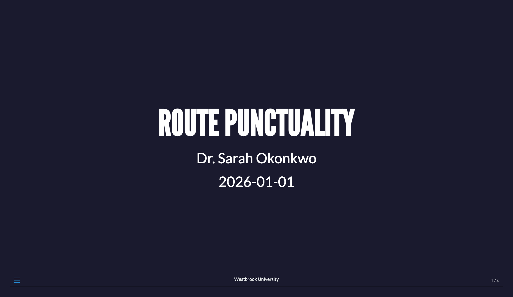
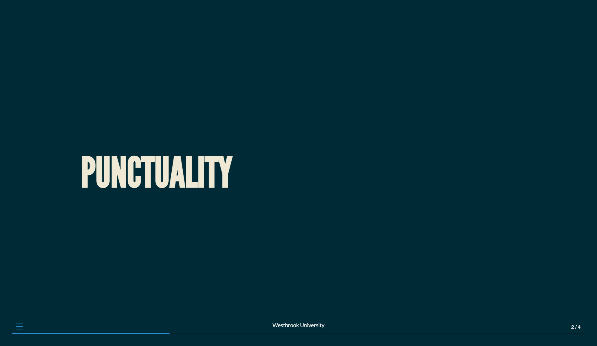
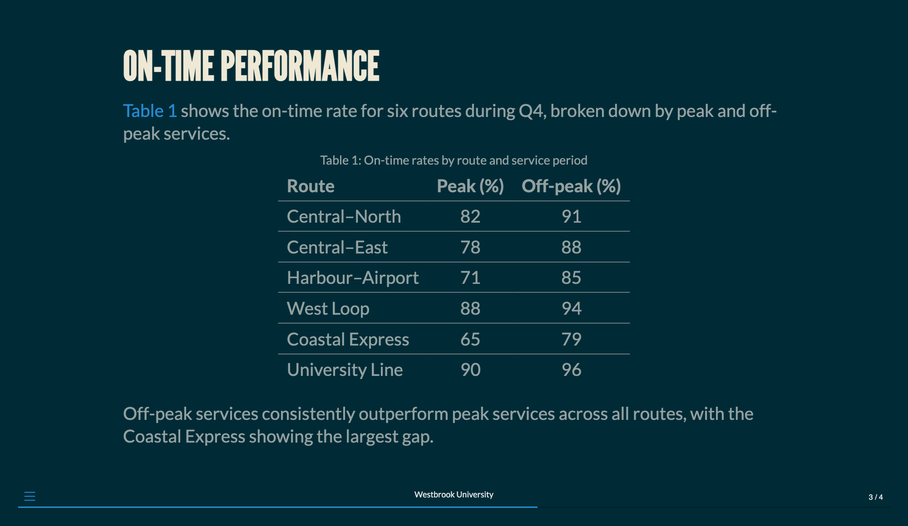
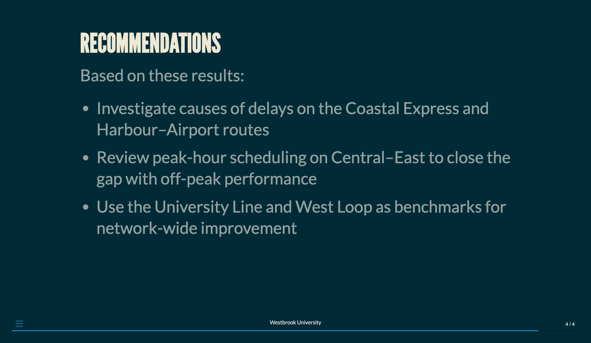
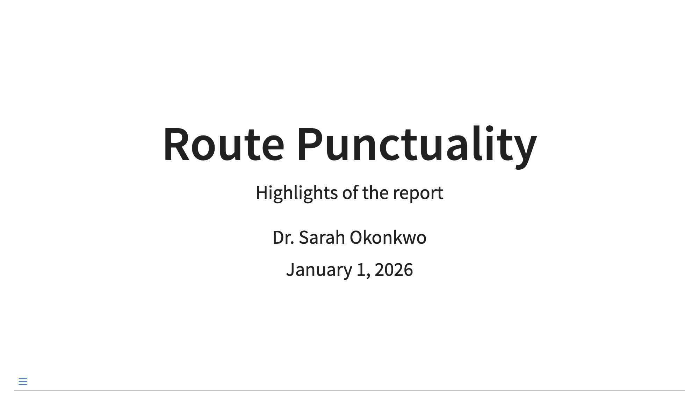
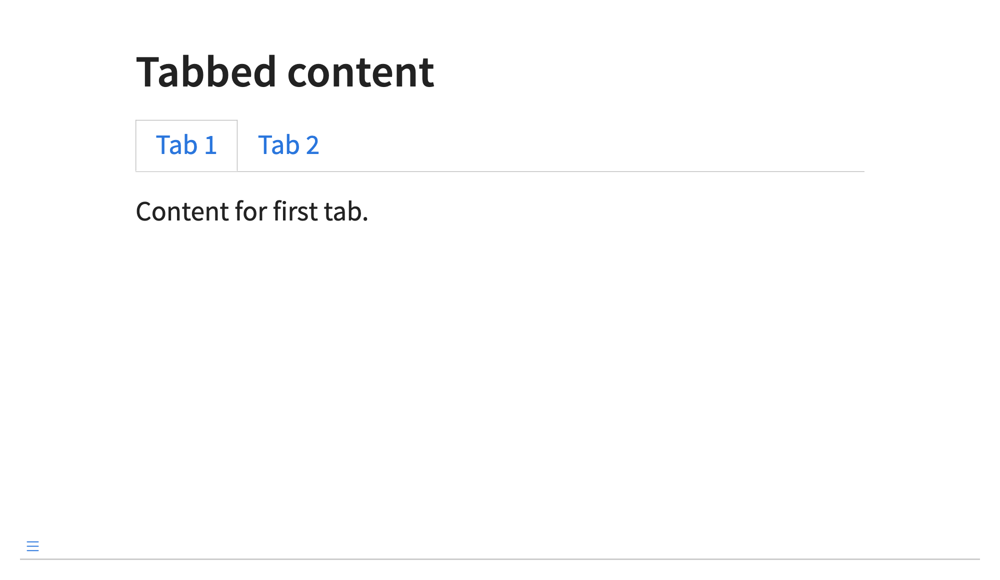

# Presentations {#sec-presentations}

In addition to long-form documents, you can also use Quarto to create presentations.

Quarto supports three main presentation formats
@tbl-pres-formats summarizes these formats and their use cases.

| Format | Output | Use Case |
|--------|--------|----------|
| `revealjs` | HTML | Most capable, recommended default |
| `pptx` | PowerPoint | Office environments |
| `beamer` | PDF | LaTeX workflows |

: Quarto presentation formats {#tbl-pres-formats}

Regardless of format type, you can use the same markdown syntax to create your presentation content.
The most flexible and feature-rich of these formats is `revealjs`, which supports a wide range of features and customizations.
HTML slides created with `revealjs` can also be printed to PDF for easier distribution, though if you have interactive features in your presentation, they will be lost in the PDF version.

This chapter focuses on the `revealjs` format, though the basic syntax we describe applies to all formats.
We will close the chapter with a complete example of a `revealjs` presentation and some tips for sharing your presentation with others as well as callouts for commonly used format-specific features in `pptx` and `beamer`.

## Your first presentation

The best way to learn Quarto presentations is to start with a working example. 
The following presentation demonstrates many of the features you'll use most often: a custom theme, incremental bullet points, code with side-by-side output, and speaker notes. 
You can copy this into a new `.qmd` file and render it to see the result immediately, then modify it to explore how each option works. 

````{.markdown filename="punctuality.qmd" .code-overflow-wrap}

````

::: {#fig-presentation-first-presentation-punctuality .border fig-alt="The rendered output showing four slides. The first slide is a title slide with the presentation title, author, and date. The second slide shows a section title. The third slide has a cross-referenced table and some text. The fourth slide has bullet points. The speaker notes are not visible in the rendered output."}

{width=40%} {width=40%} 

{width=40%} {width=40%}

The rendered output of `punctuality.qmd`

:::

::: callout-note
Throughout this chapter, we use level 1 headings for section breaks and level 2 headings for slide breaks.
See the Pandoc documentation on [structuring the slide show](https://pandoc.org/MANUAL.html#structuring-the-slide-show) for additional details on how headings map to slides.
:::

## Authoring

### Title slide

The title slide is auto-generated from YAML metadata:

````{.yaml filename="title-slide.qmd" .code-overflow-wrap}

````

{#fig-title-slide .border fig-alt="A title slide with a title, subtitle, author name, and date formatted as MMMM DD, YYYY."}

If you prefer to skip automatic title slide generation, you can omit `title` and `author` fields.

By default, the title slide is centered while all other slides are top-aligned. 
To disable centering on the title slide, set `center-title-slide: false`. 
For full control, you can replace the title slide entirely by supplying a custom `title-slide.html` template partial:

````{.yaml filename="title-slide.qmd" .code-overflow-wrap}
---
title: Route Punctuality
author: Dr. Sarah Okonkwo
format:
  revealjs:
    template-partials:
      - title-slide.html
---
````

### Section and slide breaks

By default, level 1 headings (`#`) create section breaks and level 2 headings (`##`) create slide breaks.

``` {.markdown filename="presentation.qmd"}
# Section 1

## Section 1, Slide 1

Content for first slide in Section 1.

## Section 1, Slide 2

Content for second slide in Section 1.

# Section 2

## Section 2, Slide 1

Content for first slide in Section 2.

## Section 2, Slide 2

Content for second slide in Section 2.
```

You can customize this behavior using the `slide-level` option in YAML, e.g., `slide-level: 1` to use level 1 headings for slide breaks. 

### Multiple columns

You can create side-by-side content using column divs:

``` markdown
::: {.columns}

::: {.column}

Left column content goes here.

:::

::: {.column}

Right column content goes here.

:::

:::
```

By default, this will give you two columns with equal width, but you can customize column widths using the `width` attribute:

``` markdown
::: {.columns}

::: {.column width="70%"}

Wider left column content goes here.

:::

::: {.column width="30%"}

Narrower right column content goes here.

:::

:::
```

The same syntax can be used to create more than two columns, e.g., three columns with `width="33%"` each, or a mix of fixed and flexible widths, e.g., `width="200px"` for a fixed width column and `width="auto"` for a flexible column that fills remaining space.

### Tabsets

You can create tabbed content panels:

``` markdown

```

{#fig-tabbed-content .border fig-alt="A slide with tabbed content panels, where only the first tab is visible."}

::: callout-note
When printing to PDF, only the first tab will be visible.
:::

### Content overflow

For slides with dense content, use the `.smaller` class to reduce font size:

``` markdown
## Dense slide {.smaller}

Lots of content here...
```

You can enable scrolling for slides that exceed the viewport:

``` markdown
## Scrollable slide {.scrollable}

Very long content...
```

Apply globally in YAML:

``` {.yaml filename="presentation.qmd"}
---
format:
  revealjs:
    smaller: true
    scrollable: true
---
```

### Image sizing

When a slide contains a single top-level image, Quarto's `auto-stretch` feature automatically expands it to fill the remaining vertical space (see [Image size] for details on how this applies to computational figures). 
For manual control, use `.r-stretch` on an image to opt in to the same behavior:

``` markdown
## Slide title

Some introductory text.

{.r-stretch}
```

Note that `.r-stretch` only applies to non-nested images. 
Images inside columns, fragments, or other custom divs are ignored unless you add `.r-stretch` to the outer div explicitly.

### Embedding media

Beyond background videos (see [Slide backgrounds]), you can embed media directly in slide content.

#### Videos

Use standard markdown image syntax with a video file:

```markdown
## Video demo


```

For more control, use HTML5 video attributes:

```markdown
## Video demo

<video src="demo.mp4" controls width="600"></video>
```

Or use a fenced div with Quarto's video shortcode:

```markdown
## Video demo


```

The video shortcode also supports YouTube, Vimeo, and other hosted videos:

```markdown

```

#### iframes

Embed external web content using HTML iframes:

```markdown
## Live demo

<iframe src="https://example.com/app" width="900" height="500" frameborder="0"></iframe>
```

For interactive applications that need to respond to user input during a presentation, set `sandbox="allow-scripts allow-same-origin"` if the iframe content requires JavaScript.

::: callout-tip
Consider using `preview-links: auto` (see [Preview links]) for simpler cases where you just want to show a linked webpage without leaving the presentation.
:::

### Layout helpers

Reveal provides several utility classes for positioning and sizing content on slides.

#### Absolute positioning

The `.absolute` class places elements at exact positions on a slide. 
Specify `top`, `left`, `bottom`, and/or `right` along with optional `width` and `height` (values without units are treated as pixels):

``` markdown
{.absolute top=200 left=0 width="350" height="300"}

{.absolute top=50 right=50 width="450" height="250"}
```

Positions are relative to the slide's coordinate space (1050 × 700 by default; see [Presentation size]).

#### Stacking

The `.r-stack` class centers multiple elements on top of each other. 
Combine it with fragments to incrementally reveal layered content:

``` markdown
::: {.r-stack}
{.fragment width="450"}

{.fragment width="300"}

{.fragment width="400"}
:::
```

#### Fit text

The `.r-fit-text` class scales text to be as large as possible without overflowing the slide:

``` markdown
::: {.r-fit-text}
Big Text
:::
```

#### Centering

Add the `.center` class to a slide heading to vertically center its content:

``` markdown
## Centered slide {.center}

This content will be vertically centered.
```

This is separate from `center: true` in YAML, which centers *all* slides, and `center-title-slide`, which controls only the title slide.

### Slide backgrounds

You can customize individual slide backgrounds using heading attributes.
Some options include:

- Color backgrounds:

``` markdown
## Slide title {background-color="aquamarine"}

Content on colored background.
```

- Gradient backgrounds:

``` markdown
## Gradient slide {background-gradient="linear-gradient(to right, red, blue)"}
```

- Image backgrounds:

``` markdown
## Image background {background-image="image.jpg" background-size="cover" background-opacity="0.5"}
```

- Video backgrounds:

``` markdown
## Video background {background-video="video.mp4" background-video-loop="true" background-video-muted="true"}
```

For title slides, use `title-slide-attributes` in YAML to set background options:

``` {.yaml filename="presentation.qmd"}
---
title: My Presentation
format: revealjs
title-slide-attributes:
  data-background-image: images/background.jpg
  data-background-size: cover
---
```

### Footer and logo

You can add consistent branding across slides:

``` {.yaml filename="presentation.qmd"}
---
format:
  revealjs:
    footer: Company Name - Conference 2024
    logo: images/logo.png
---
```

Remove footer from specific slides:

``` markdown
## Full screen slide {footer="false"}
```

Or use a custom footer on individual slides:

``` markdown
## Custom footer slide

Content here.

::: footer
Custom footer for this slide only.
:::
```

### Asides and footnotes

You can add peripheral commentary with asides:

``` markdown

## Slide title

Main content here.

::: {.aside}
Additional context displayed at bottom.
:::

```

For footnotes, use standard markdown syntax:

``` markdown

This is a statement[^1].

[^1]: This is the footnote text.

```

By default, footnotes appear on the slide where they are defined. 
To instead collect all footnotes at the end of the presentation, use:

``` {.yaml filename="presentation.qmd"}
---
format:
  revealjs:
    reference-location: document
---
```

## Code

In presentation formats (`revealjs`, `beamer`, `pptx`), Quarto defaults to `echo: false`, so code cells produce output without showing their source. 
To display the code, set `echo: true` globally in YAML or per cell with `#| echo: true`.

### Code blocks

#### Code highlighting

You can highlight specific lines in code blocks:

````` markdown
````{{python}}
#| code-line-numbers="2,4"
def example():
    highlighted = True  # Line 2
    not_highlighted = False
    also_highlighted = True  # Line 4
```
`````

For progressive highlighting through slide steps, use the pipe separator:

````` markdown
````{{python}}
#| code-line-numbers="|1|2|3"
first_step = 1
second_step = 2
third_step = 3
```
`````

#### Height

Set a maximum height for code blocks (content beyond this height will scroll):

``` {.yaml filename="presentation.qmd"}
---
format:
  revealjs:
    code-block-height: 650px
---
```

### Code annotation

Quarto's code annotation feature helps you explain code step-by-step. 
Add numbered markers in code comments, then provide explanations in a list below:

````markdown
```{.python code-line-numbers="true"}
import pandas as pd  # <1>

df = pd.read_csv("data.csv")  # <2>
df = df.dropna()  # <3>
```

1. Import the pandas library
2. Load data from a CSV file
3. Remove rows with missing values
````

By default, annotations appear as numbered markers that reveal explanations on hover or click. 
Use `code-annotations` to change this behavior:

```{.yaml filename="presentation.qmd"}
---
format:
  revealjs:
    code-annotations: below  # hover | select | below
---
```

| Value | Behavior |
|-------|----------|
| `hover` | Show annotation on hover (default) |
| `select` | Show annotation on click |
| `below` | Display all annotations below the code block |

For executable code cells, place annotations in the source code rather than using cell options:

````markdown
```{{python}}
import pandas as pd  # <1>
df = pd.read_csv("data.csv")  # <2>
```

1. Import pandas
2. Load the data
````

### Controlling output

#### Image size

As described in [Image sizing], Quarto's `auto-stretch` feature expands a single top-level figure to fill the remaining vertical space on a slide. 
This applies to computational output as well.
Disable it globally with `auto-stretch: false` in YAML, or per-slide by adding `.nostretch` to the slide heading.

For explicit control, use `fig-width` and `fig-height` (in inches) to set the physical dimensions of generated figures.
At the document level, these apply to both engines:

``` {.yaml filename="presentation.qmd"}
---
format:
  revealjs:
    fig-width: 8
    fig-height: 5
---
```

With the `knitr` engine, you can also override these per cell:

```` markdown
```{{r}}
#| fig-width: 6
#| fig-height: 4
plot(cars)
```
````

The `fig-asp` option (`knitr` only) sets the height-to-width aspect ratio and overrides `fig-height` when both are specified:

```` markdown
```{{r}}
#| fig-width: 6
#| fig-asp: 0.618
plot(cars)
```
````

With the `jupyter` engine, `fig-width` and `fig-height` have no effect at the cell level — they must be set at the document or project level.
For cell-level control with Matplotlib, set the figure size directly in Python:

```` markdown
```{{python}}
import matplotlib.pyplot as plt

fig, ax = plt.subplots(figsize=(6, 4))
ax.plot([1, 2, 3])
```
````

To control the *displayed* size of the output image independently of its generated dimensions, use `out-width` and `out-height`, which accept CSS values and work at the cell level with both engines:

```` markdown
```{{r}}
#| out-width: "70%"
plot(cars)
```
````

For sharper figures on high-density (retina) displays, increase `fig-dpi`:

``` {.yaml filename="presentation.qmd"}
---
format:
  revealjs:
    fig-dpi: 192
---
```

Alternatively, set `fig-format: retina` to render at 2x resolution without choosing a specific DPI value.

Like `fig-width` and `fig-height`, both `fig-dpi` and `fig-format` have no effect at the cell level with the Jupyter engine and must be set at the document or project level.
For knitr, they can be set per cell, e.g., `#| fig-dpi: 192` or `#| fig-format: retina`.

#### Output location

You can control where code output appears using `output-location`:

| Value | Behavior |
|-------|----------|
| `fragment` | Output appears incrementally |
| `slide` | Output on next slide |
| `column` | Output in adjacent column |
| `column-fragment` | Adjacent column, incremental |

Example:

````` markdown
````{{python}}
#| output-location: column
import matplotlib.pyplot as plt
plt.plot([1, 2, 3])
plt.show()
````
`````

### Interactive documents

Presentations can incorporate interactive content using Observable JS or Shiny. 
This allows you to embed reactive inputs and outputs directly in slides, turning a presentation into a live application. 
See the [Observable](https://quarto.org/docs/interactive/ojs/) and [Shiny](https://quarto.org/docs/interactive/shiny/) documentation for details.

An alternative approach is to add an interactive document hosted on Posit Connect or another platform as an iframe.

## Animation

### Slide transitions

Reveal can animate the change between slides. 
Set a global transition style in YAML:

``` {.yaml filename="presentation.qmd"}
---
format:
  revealjs:
    transition: slide
    transition-speed: fast
---
```

The available transition types are:

| Type | Effect |
|------|--------|
| `none` | Switch instantly |
| `fade` | Cross fade |
| `slide` | Slide horizontally |
| `convex` | Slide at a convex angle |
| `concave` | Slide at a concave angle |
| `zoom` | Scale in from the center of the screen |

Override the transition on individual slides using heading attributes:

``` markdown
## Slide title {transition="fade" transition-speed="slow"}
```

You can also specify separate in and out transitions:

``` markdown
## Slide title {transition="fade-in slide-out"}
```

Use `background-transition` to control the transition for slide backgrounds independently of content.

### Pauses

You can use three dots to create pauses within slides:

``` markdown
## Slide title

Content before pause.

. . .

Content after pause.
```

These pauses work with all content types, including text, images, and code blocks.
They can also be used to break up revealing bullet points, though we recommend using incremental lists for that purpose instead.

### Incremental lists

By default, list items appear all at once. 
Enable incremental display globally:

``` {.yaml filename="presentation.qmd"}
---
title: My Presentation
format:
  revealjs:
    incremental: true
---
```

For per-list control, use div classes:

``` markdown
::: {.incremental}
- First item appears
- Second item appears
- Third item appears
:::
```

Or disable incremental for specific lists when globally enabled:

``` markdown
::: {.nonincremental}
- All items
- Appear at once
:::
```

### Fragments

Fragments provide more granular control over incremental animation than pauses or incremental lists. 
Any element with the class `fragment` will be stepped through before moving on to the next slide, and you can apply a variety of animation effects:

``` markdown
::: {.fragment .fade-in}
Fade in
:::

::: {.fragment .fade-up}
Slide up while fading in
:::

::: {.fragment .fade-left}
Slide left while fading in
:::

::: {.fragment .fade-in-then-semi-out}
Fade in then semi out
:::
```

Other available fragment classes include `.fade-out`, `.fade-right`, `.fade-down`, `.highlight-red`, `.highlight-blue`, `.strike`, and `.grow`.

### Auto-animate

Quarto can automatically animate elements across adjacent slides. 
Add the `auto-animate` attribute to two consecutive slides, and Reveal will animate all matching elements between them:

``` markdown
## Slide 1 {auto-animate=true}

- Item one
- Item two

## Slide 2 {auto-animate=true}

- Item one
- Item two
- Item three
```

You can fine-tune animation behavior globally or per-slide:

``` {.yaml filename="presentation.qmd"}
---
format:
  revealjs:
    auto-animate-easing: ease-in-out
    auto-animate-unmatched: false
    auto-animate-duration: 0.8
---
```

## Customizing appearance

### Presentation size

Reveal slides default to 1050 × 700 pixels, an aspect ratio close to most laptop screens. 
Reveal scales content automatically to fit the viewer's display without changing the layout, but you can adjust the base dimensions, the margin around content, and the scaling limits:

``` {.yaml filename="presentation.qmd"}
---
format:
  revealjs:
    width: 1050
    height: 700
    margin: 0.1
    min-scale: 0.2
    max-scale: 2.0
---
```

Changing `width` and `height` affects the coordinate space for all absolute positioning and layout calculations, so pick values early and design your slides around them.

### Slide numbers

Enable slide numbers with `slide-number`. 
Rather than just `true`, you can also specify a format string:

| Value | Display |
|-------|---------|
| `true` | Slide number only |
| `c/t` | Current slide / total slides |
| `c` | Current slide only |
| `h/v` | Horizontal / vertical slide number |
| `h.v` | Horizontal . vertical slide number |

You can control when slide numbers are visible using `show-slide-number`:

``` {.yaml filename="presentation.qmd"}
---
format:
  revealjs:
    slide-number: c/t
    show-slide-number: speaker   # all | print | speaker
---
```


### Themes

Reveal includes eleven built-in themes: `default`, `beige`, `blood`, `dark`, `dracula`, `league`, `moon`, `night`, `serif`, `simple`, `sky`, and `solarized`.

Set a theme in YAML:

``` {.yaml filename="presentation.qmd"}
---
format:
  revealjs:
    theme: dark
---
```

Beyond the built-in themes, you can customize any theme using SCSS variables or create entirely new themes. 
See the [Reveal Themes documentation](https://quarto.org/docs/presentations/revealjs/themes.html) for details.

### Brand

If you want custom colors and fonts for your presentation, the easiest approach is through **brand.yml**.
Add a `_brand.yml` file alongside your presentation `.qmd` file, and Quarto will automatically apply it.

The most noticeable effect of `color` settings in a presentation is on the slide background and text.
`primary` is used for links and the presentation's navigation controls:

```{.yaml filename="_brand.yml"}
color:
  foreground: "#E0EFDE"
  background: "#162627"
  primary: "#8A7090"
```

brand.yml is also a convenient way to set fonts for your presentation using Google Fonts.
You can set the main font (`base`), the font used for headings (`headings`), and the font used for code (`monospace`):

```{.yaml filename="_brand.yml"}
color:
  foreground: "#E0EFDE"
  background: "#162627"
  primary: "#8A7090"
typography:
  fonts:
    - family: Chango
      source: google
    - family: Abel
      source: google
    - family: JetBrains Mono
  base: Abel
  headings: Chango
  monospace: JetBrains Mono
```

Swap `source: google` for `source: bunny` if you'd prefer [Bunny Fonts](https://fonts.bunny.net)---a GDPR compliant alternative to Google Fonts.

If you are using brand.yml across your organization's projects (e.g., for both a website and presentations), you can place `_brand.yml` in a parent directory and it will be found automatically.
You can read about all the options available in the [Quarto documentation Guide to using brand.yml](https://quarto.org/docs/authoring/brand.html).

### Custom CSS

Beyond brand.yml and built-in themes, you can add custom styles using CSS or SCSS files.

#### Adding a stylesheet

Reference a CSS file in YAML:

```{.yaml filename="presentation.qmd"}
---
format:
  revealjs:
    theme: [default, custom.css]
---
```

The `theme` option accepts a list, applying styles in order. 
Place your custom file after the base theme to override its defaults.

#### SCSS variables

RevealJS themes use SCSS variables for key design tokens. 
Create a `.scss` file to override them:

```{.scss filename="custom.scss"}
/*-- scss:defaults --*/
$presentation-heading-color: #2a9d8f;
$body-bg: #264653;
$body-color: #e9c46a;
$link-color: #e76f51;
$code-block-bg: #1a1a2e;

/*-- scss:rules --*/
.reveal .slide-number {
  font-size: 0.6em;
}
```

The `scss:defaults` section sets variables before the theme compiles; `scss:rules` adds custom CSS rules after.

Reference it in your YAML:

```{.yaml filename="presentation.qmd"}
---
format:
  revealjs:
    theme: [default, custom.scss]
---
```

Common SCSS variables include:

| Variable | Purpose |
|----------|---------|
| `$body-bg` | Slide background color |
| `$body-color` | Default text color |
| `$link-color` | Hyperlink color |
| `$presentation-heading-color` | Heading color |
| `$presentation-heading-font` | Heading font family |
| `$code-block-bg` | Code block background |
| `$code-color` | Inline code color |

See the [Reveal Themes documentation](https://quarto.org/docs/presentations/revealjs/themes.html) for the full list of available variables.

## Presenting

### Speaker notes

Add presenter notes visible only in speaker view:

``` markdown
## Slide title

Slide content visible to audience.

::: {.notes}
Speaker notes only visible to presenter.
Press 'S' to open speaker view.
:::
```

Speaker view displays:

- Current slide
- Upcoming slide
- Elapsed time
- Speaker notes

### Navigation

When presenting, Reveal provides several navigation tools:

- The slide menu (bottom-left button, or press `M`) lets you jump to any slide and access presentation tools.
- Jump to Slide (press `G`) opens a modal where you can navigate directly to a slide by number or ID.
- Overview mode (press `O`) shows a bird's-eye view of all slides.
- Scroll View is an alternative view that presents slides as a vertically scrolled page rather than a click-through deck. 
Toggle it by appending `?view=scroll` to the presentation URL, or set it as the default with `scroll-view: true` in YAML. 
It activates automatically on small screens such as mobile devices.

Enable browser history and disable the progress bar:

``` {.yaml filename="presentation.qmd"}
---
format:
  revealjs:
    progress: false
    history: true
---
```

### Preview links

The `preview-links` option opens hyperlinks in an iframe overlaid on the current slide, so you can navigate to a website without leaving the presentation:

``` {.yaml filename="presentation.qmd"}
---
format:
  revealjs:
    preview-links: auto
---
```

### Chalkboard

The built-in Chalkboard plugin lets you draw on slides during a presentation. 
Enable it in YAML:

``` {.yaml filename="presentation.qmd"}
---
format:
  revealjs:
    chalkboard: true
---
```

You can customize its appearance and behavior:

``` {.yaml filename="presentation.qmd"}
---
format:
  revealjs:
    chalkboard:
      theme: whiteboard
      boardmarker-width: 5
      buttons: false
---
```

::: callout-note
The Chalkboard plugin is not compatible with `embed-resources: true`. 
Using both will result in an error.
:::

### Other presenting features

- **Slide tone** plays a subtle sound when you change slides---a helpful auditory cue, particularly for presenters who are blind or low-vision. 
Enable it with `slide-tone: true`.

- **Auto-slide** advances slides on a timer without any user input. 
Set `auto-slide` to a value in milliseconds (e.g. `auto-slide: 5000` for 5 seconds). 
Add `loop: true` to repeat the presentation continuously. 
A play/pause control appears automatically; press `A` to toggle it.

- **Slide zoom** lets you zoom into any element on a slide by holding `Alt` (or `Ctrl`) and clicking on it. 
Click again to zoom back out.

- The **Multiplex** plugin allows your audience to follow along on their own devices as you advance through slides. 
See the [Presenting Slides documentation](https://quarto.org/docs/presentations/revealjs/presenting.html) for setup instructions.

## Sharing

Once your presentation is ready, you can share it as a self-contained HTML file, export it to PDF, or publish it online and share the link to the published presentation.

### Self-contained files

By default, a Reveal presentation references external CSS and JavaScript assets. 
To produce a single portable HTML file, use `embed-resources`:

``` {.yaml filename="presentation.qmd"}
---
format:
  revealjs:
    embed-resources: true
---
```

Note that this can slow rendering, so it's best to enable it only when you're ready to distribute.

### Export to PDF

Reveal presentations can be exported to PDF directly from the browser:

1. Open the presentation in Chrome, Chromium, or Firefox.
2. Append `?print-pdf` to the URL to enter print mode.
3. Open the browser print dialog (`Ctrl+P` / `Cmd+P`).
4. Set Destination to **Save as PDF**, Layout to **Landscape**, Margins to **None**, and enable **Background graphics**.
5. Save.

Press `E` to toggle out of print mode when done.

You can customize PDF export behavior with these YAML options:

```{.yaml filename="presentation.qmd"}
---
format:
  revealjs:
    pdf-separate-fragments: true
    pdf-max-pages-per-slide: 1
---
```

| Option | Default | Description |
|--------|---------|-------------|
| `pdf-separate-fragments` | `true` | Each fragment step becomes a separate PDF page |
| `pdf-max-pages-per-slide` | `20` | Maximum pages generated per slide (limits runaway fragment expansion) |

To include speaker notes in the PDF, append `?print-pdf&showNotes=true` to the URL before printing. 
Alternatively, use `?print-pdf&showNotes=separate-page` to place notes on their own pages after each slide.

::: callout-note
The `?print-pdf` view uses a different stylesheet optimized for print. 
Some visual effects like transitions and animations won't appear in the PDF.
:::

### Publishing

Use `quarto publish` to deploy your presentation to hosting services including GitHub Pages, Netlify, Posit Connect, and Posit Connect Cloud:

``` {.bash filename="Terminal"}
quarto publish gh-pages presentation.qmd
```

See the [Publishing HTML documentation](https://quarto.org/docs/output-formats/html-publishing.html) for full details on available targets and configuration.

::: callout-tip
## Positron tip

In Positron, you can also use the Posit Publisher extension to publish directly from Positron. 
See the [Posit Publisher documentation](https://docs.posit.co/connect/user/publishing-positron-vscode/) for details.
:::

## Accessibility

Accessible presentations ensure all audience members can engage with your content, regardless of how they consume it.

### Structure and semantics

Consider using heading levels consistently throughout your presentation, as they define the slide structure for screen readers and other assistive technologies. 
Keeping slide content concise helps everyone follow along—not just those using assistive technologies. 

### Images and media

You should provide alt text for all images that convey information:

```markdown
{fig-alt="A bar chart showing sales growth from 2020 to 2024."}
```

For decorative images that don't convey information, you can use empty alt text to indicate they should be skipped:

```markdown
{fig-alt=""}
```

If your presentation includes video or audio content, consider adding captions or transcripts so that all audience members can access the information.

### Color and contrast

You should maintain sufficient contrast between text and background—WCAG recommends a minimum ratio of 4.5:1 for normal text. 
Rather than relying on color alone to convey meaning, you can pair color with text labels, patterns, or icons so that color-blind users can distinguish elements. 
Testing your theme with a contrast checker before presenting can help catch issues early.

### Navigation aids

You can enable features that help audiences follow along:

```{.yaml filename="presentation.qmd"}
---
format:
  revealjs:
    slide-number: c/t
    hash-type: number
    history: true
---
```

Setting `hash-type: number` creates predictable URLs (`#/3` for slide 3 or `#/2/1` for section 2, slide 1), making it easier for attendees to share or return to specific slides.
`history: true` pushes each slide change to the browser history, allowing users to navigate back and forth with the browser's back and forward buttons.

### Slide tone

Presenters who are blind or low-vision may find it helpful to enable auditory feedback when slides change:

```{.yaml filename="presentation.qmd"}
---
format:
  revealjs:
    slide-tone: true
---
```

### Testing

Before presenting, consider navigating your presentation using only the keyboard (arrow keys, Tab, Enter) to verify that all content is reachable. 
If possible, you can use a screen reader to confirm that slide content is announced correctly and in a logical order. 
You'll also want to check that all interactive elements—links, tabs, and buttons—are focusable and have appropriate labels.
