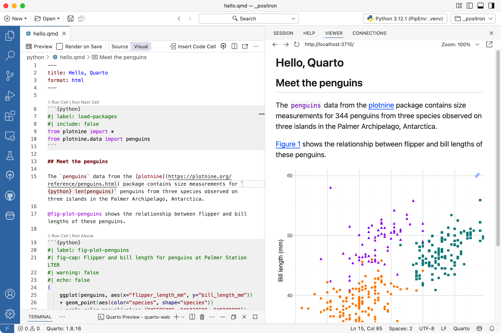

# Your Quarto workflow {#sec-tools}

You do not need a specific tool for authoring and rendering Quarto documents.
You can author Quarto documents in any plain text editor and render them with the `quarto render` command in your computer's terminal.

However, we recommend using an integrated development environment (IDE) when working with Quarto as they can enhance your authoring experience.
Some compelling reasons for using an IDE with Quarto include preview and live rendering features that allow you to see how your content will look as you write it, syntax highlighting, project management features, version control integration, debugging tools, and efficiency and productivity features like snippets, templates, and keyboard shortcuts.
Additionally, most modern IDEs offer intelligent code assistance, auto-completion, and error highlighting which can help you quickly find the right syntax and catch errors.

In this chapter we detail how to use Positron and RStudio with Quarto, as well as briefly introduce other tools you might use for Quarto authoring.

## Document structure

Quarto documents are plain text files that use markdown syntax for formatting and can include executable code chunks.
They have the file extension `.qmd` and can be rendered to various output formats such as HTML, PDF, Word documents, and more.
They are comprised of three main components: a YAML header for metadata, markdown text for content, and code chunks for executable code.

1. **YAML header:** Metadata enclosed by `---` markers, including the title, format, theme, and other document options.

2. **Code chunks:** Executable code cells marked with ` ```{r} ` or ` ```{python} ` that can include optional chunk options to control execution and output.

3. **Markdown text:** Formatted text using standard markdown syntax for headings, lists, links, emphasis, and more.

## Quarto CLI {#sec-quarto-cli}

Before diving into specific IDEs, let's start with the fundamentals: the Quarto Command Line Interface (CLI).
The Quarto CLI is the core tool that powers all Quarto rendering, regardless of which editor you use.
Understanding these basic commands will help you work with Quarto in any environment.

### Rendering

The most fundamental Quarto command is `quarto render`, which converts your Quarto document into the desired output format.
Quarto uses the term render to describe the process of taking this source document and producing a new file that combines the output from the executed code cells with the markdown.
You can render a specific Quarto document in the Terminal with:

```bash
quarto render document.qmd
```

Alternatively, you can render all Quarto documents in the current directory with:

```bash
quarto render
```

By default, Quarto will render your document to the format specified in the YAML header, defaulting to HTML if none is specified.
You can override the output format using the `--to` option:

```bash
quarto render document.qmd --to pdf
quarto render document.qmd --to docx
```

### Previewing

While `quarto render` creates the output file and stops, `quarto preview` provides a more interactive experience.
It renders your document, opens it in your web browser, and automatically re-renders when you save changes to the source file:

```bash
quarto preview document.qmd
```

This command is particularly useful during active authoring, as it allows you to see your changes immediately without manually re-running the render command.
The preview server will continue running until you stop it (typically with Ctrl+C in the Terminal).

### Other useful commands

Beyond rendering and previewing, the Quarto CLI offers several other helpful commands.
For example, you can check the version of Quarto and its dependencies by running the following command:

```bash
quarto check
```

To get help, you can use the following command:

```bash
quarto --help
```

or you can use `--help` with any command to see available options and usage information.

```bash
quarto render --help
```

Now that you understand the structure of Quarto documents and foundational CLI commands, let's explore how different IDEs integrate these capabilities into their interfaces to provide a more seamless authoring experience.

## Positron {#sec-positron}

Positron is a next-generation data science IDE that comes pre-configured for Quarto -- the Quarto CLI is built-in and the Quarto VS Code extension is bundled.
Additionally, Positron offers specialized features for Quarto authoring, such as integrated render and preview for Quarto documents, completion and diagnostics for Quarto options, and full R and Python support for code that is inside code cells in a Quarto document, including interactive execution of code in the Console, code completion, help, and diagnostics.

### Installation

To get started with Quarto in Positron, download and install Positron from [positron.posit.co](https://positron.posit.co).
Since Quarto is built into Positron, no additional installation is required for Quarto itself.
Depending on your language of choice, you'll also need to have R or Python installed on your system—R from [cran.r-project.org](https://cran.r-project.org) or Python from [python.org](https://www.python.org).

::: todo
[MCR] One thing missing right now is calling out bundled Quarto extension, need to say something about that.
:::

### Core features

Positron provides several features that make Quarto authoring efficient and productive:

**Rendering:** Use the **Quarto: Preview** command, keyboard shortcut (⇧⌘K on macOS, Ctrl+Shift+K on Windows/Linux), or the **Preview** button in the toolbar to render `.qmd` files to HTML, PDF, Word, or other formats.
The "Render on Save" option enables automatic updates during editing, so your preview refreshes every time you save your document.

**Dual editor modes:** Positron offers both visual and source editing modes.
The visual editor provides a WYSIWYM (What You See Is What You Mean) experience with formatting toolbars that make it easy to add formatted text, tables, images, and citations without memorizing markdown syntax.
The source mode displays raw markdown and code, giving you complete control over the document structure.

::: todo
[MCR] Decide on whether/how to include visual editor.
:::

**Polyglot language support:** Positron provides first-class support for working seamlessly with R and Python within your documents, making it an excellent choice for data science projects in either language or in projects that use both languages.

**Interactive code execution:** Positron also supports interactive code execution, enabling you to run individual code cells directly in the Console without rendering the entire document.
This is particularly valuable when you're developing and testing code incrementally, as it provides immediate feedback without the overhead of a full document render.

Note that for executing code cells in Quarto documents in Positron, you'll need to install some packages depending on your language of choice.

- For R, you need the **knitr** package:

```r
install.packages("knitr")
```

- For Python, you need the **jupyter** package:

```bash
pip install jupyter
```

**Side-by-side preview:** One of the most useful features for authoring Quarto documents in Positron is side-by-side editing and preview, which allows you to view your source code and rendered output simultaneously.
This works for HTML and PDF outputs and it makes it easy to see how your changes affect the final document without switching between windows or applications.

**Code completion and diagnostics:** Positron provides code completion and diagnostics that offer intelligent suggestions and error checking for Quarto-specific syntax.
As you type, Positron helps you find the right syntax and catches errors before you attempt to render your document.

::: todo
[MCR] A screenshot of Quarto help that appears as you type?
:::

### Basic workflow

The typical workflow for authoring Quarto documents in Positron follows these steps:

1. Create or open a plain text `.qmd` file in the Editor pane.

2. Preview your document by executing the **Quarto: Preview** command to render and display the output.

3. Iterate on your content by making edits and re-running the preview. You can optionally enable *Render on Save* to automatically update the preview whenever you save your file.

4. Execute code interactively by running individual code cells using the Run Cell button, which allows you to test your code without rendering the entire document.

{fig-alt="Positron with a Quarto document titled "Penguins, meet Quarto!" open on the left side and the rendered version of the document on the right side."}

### Rendering process

When you render a Quarto document in Positron, the system processes it through computational engines—knitr for R or Jupyter for Python—that execute your code and generate markdown output.
Pandoc then converts this markdown to your desired final format, such as HTML, PDF, or Word documents.

### Additional Positron features

Beyond the core authoring features, Positron provides several additional tools that enhance your Quarto workflow:

- Navigate long documents easily using the document **outline** panel in the primary sidebar.

::: todo
[MCR] Screenshot of outline panel? Also, is it called panel?
:::

- Insert common code patterns quickly with built-in **code snippets**

::: todo
[MCR] Screenshot of adding columns to slides maybe?
:::

- Version control your Quarto documents directly from the IDE and benefit from the IDE with **Git integration** that intelligently adds certain files to gitignore when you create a new Quarto project.

::: todo
[MCR] Screenshot of .quarto in .gitignore?
:::

- Access the command line directly and in the correct working directory within the IDE's **integrated terminal** for running Quarto CLI commands.

## RStudio {#sec-rstudio}

RStudio is an IDE specifically designed for R, and it provides excellent support for Quarto authoring.
RStudio comes with Quarto pre-installed and offers a rich set of features that make it easy to create, edit, and render Quarto documents such as syntax highlighting, code completion, integrated rendering and preview, and support for both visual and source editing modes.

### Installation

To get started with Quarto in RStudio, download and install the latest version of RStudio from [posit.co/download/rstudio-desktop](https://posit.co/download/rstudio-desktop/).
Also make sure that you have R installed on your system, which you can get from [cran.r-project.org](https://cran.r-project.org).

### Core features

Like Positron, RStudio provides several features that make Quarto authoring efficient and productive.

For example, you can use the **Render** button or keyboard shortcut (⇧⌘K on macOS, Ctrl+Shift+K on Windows/Linux) to render `.qmd` files to HTML, PDF, Word, or other formats.
The "Render on Save" option enables automatic updates during editing, so your preview refreshes every time you save your document.

Features like dual editor mode, interactive code execution, and side-by-side preview are also available in RStudio, providing a seamless authoring experience just like in Positron.
However, some of these features can be accessed in different ways in RStudio:

- **Dual editor modes:** Switch between source and visual editing modes using the buttons in the toolbar or the keyboard shortcut (⌘⇧F4 on macOS, Ctrl+Shift+F4 on Windows/Linux).

::: todo
[MCR] Screenshot?
:::

- **Interactive code execution:** Run individual code chunks within the editor using the run button or ⇧⌘⏎ (Ctrl+Shift+Enter on Windows/Linux) shortcut without rendering the entire document.

::: todo
[MCR] Screenshot?
:::

### Rendering process

The rendering workflow in RStudio follows this sequence: first, knitr executes all of the code chunks and creates a new markdown (`.md`) document that includes both your original markdown content and the output from your code chunks.
The markdown file generated is then processed by Pandoc, which creates the finished format.

This two-step approach enables seamless integration of executable code with formatted output, making Quarto ideal for reproducible research and technical documentation.

### Additional RStudio features

Like Positron, RStudio also offers an integrated terminal and Git integration.

The document outline looks a bit different in RStudio, located in the editor pane.

::: todo
[MCR] Screenshot of outline panel in RStudio?
:::

::: todo
[MCR] Anything about code snippets in RStudio? I don't use them so I'm not sure.
:::

## Other tools {#sec-other-tools}

While Positron and RStudio offer rich, integrated experiences for Quarto authoring, you can use Quarto with many other tools depending on your preferences and workflow.

### VS Code

Visual Studio Code with the Quarto extension provides excellent support for authoring Quarto documents.
The extension offers preview, syntax highlighting, code completion, and integrated terminal access.
VS Code is particularly popular among Python developers and those who work across multiple programming languages.

To get started with VS Code, first install VS Code from [code.visualstudio.com](https://code.visualstudio.com). Then install the Quarto CLI from [quarto.org](https://quarto.org/docs/get-started/) and the Quarto extension from the VS Code marketplace.

Similar to Positron and RStudio, you can preview documents with the keyboard shortcut ⇧⌘K (Ctrl+Shift+K on Windows/Linux) and run individual code cells with ⇧⌘⏎ (Ctrl+Shift+Enter on Windows/Linux).

### JupyterLab

If you're already working with Jupyter notebooks (`.ipynb` files), you can use Quarto to render them to various output formats.
JupyterLab provides an interactive environment for working with notebooks, and the Quarto CLI can render these notebooks just as it renders `.qmd` files.

You can also work with `.qmd` files directly in JupyterLab by installing the Quarto extension, which enables preview and rendering capabilities within the JupyterLab interface.

### Neovim and Vim

For developers who prefer terminal-based editors, both Neovim and Vim can be configured to work with Quarto documents.
Community-developed plugins provide features like syntax highlighting, code execution, and preview integration.

### Other editors

Since Quarto documents are plain text files, you can author them in virtually any text editor:

- **Emacs:** With Markdown mode and language-specific modes (ESS for R, python-mode, etc.)
- **Sublime Text:** Using markdown packages and build systems
- **Zed:** With markdown support and terminal integration
- **Any plain text editor:** You can always author in your favorite editor and use `quarto render` from the command line

## Choosing a tool {#sec-choosing-tool}

The best tool for Quarto authoring depends on your specific needs and existing workflow:

- If you primarily work with R, RStudio provides the most integrated experience with excellent support for R-specific features

- If you're working with multiple languages or prefer a modern IDE, Positron offers a comprehensive environment with strong support for both R and Python

- If you already use VS Code for development, adding the Quarto extension gives you powerful Quarto capabilities in your familiar environment.

- If you work extensively with Jupyter notebooks, continuing to use JupyterLab while leveraging Quarto for rendering may be the most natural fit.

- If you prefer keyboard-driven, terminal-based workflows, editors like Neovim or Vim can be configured to work effectively with Quarto.

Throughout this book, we'll call out features specific to the visual editor available in RStudio and Positron when relevant, as this mode provides a different authoring experience compared to working directly with markdown source.

However, all the concepts and techniques we cover are applicable regardless of which tool you choose.

::: todo
[MCR] Try all shortcuts with default settings before finalizing.
:::
