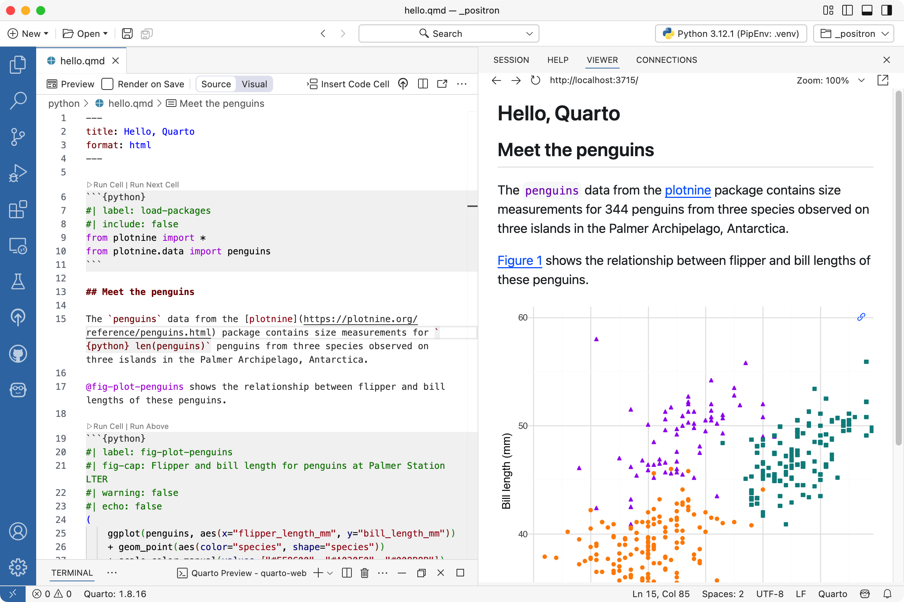

# Your Quarto workflow {#sec-tools}

You do not need a specific tool to author and render Quarto documents.
You can author Quarto documents in any plain text editor and render them with the `quarto render` command in your computer's terminal.

However, we recommend using an integrated development environment (IDE) when working with Quarto for features like preview and live rendering that let you see how your content will look as you write, syntax highlighting, project management, version control integration, debugging tools, and efficiency and productivity features such as snippets, templates, and keyboard shortcuts.
Additionally, most modern IDEs offer intelligent code assistance, auto-completion, and error highlighting, which can help you quickly find the right syntax and catch errors.

In this chapter, we detail how to use Positron and RStudio with Quarto, as well as briefly introduce other tools you might use for Quarto authoring.

## Document structure

Quarto documents are plain text files that use Markdown syntax for formatting and can include executable code chunks.
They have the file extension `.qmd` and can be rendered to various output formats, including HTML, PDF, Word documents, and more.
They comprise three main components: a YAML header for metadata, markdown text for content, and code chunks for executable code.

1. YAML header: Metadata enclosed by `---` markers, including the title, format, theme, and other document options.

2. Code chunks: Executable code cells marked with ` ```{r} ` or ` ```{python} ` that can include optional chunk options to control execution and output.

3. Markdown text: Formatted text using standard Markdown syntax for headings, lists, links, emphasis, and more.

## Quarto CLI {#sec-quarto-cli}

Before diving into specific IDEs, let's start with the fundamentals: the Quarto Command Line Interface (CLI).
The Quarto CLI is the core tool that powers all Quarto rendering, regardless of which editor you use.

### Rendering

The most fundamental Quarto command is `quarto render`, which converts your Quarto document into the desired output format.
Quarto uses the term render to describe the process of taking this source document and producing a new file that combines the output from the executed code cells with the Markdown.
You can render a specific Quarto document in the Terminal with:

```bash
quarto render document.qmd
```

Alternatively, you can render all Quarto documents in the current directory with:

```bash
quarto render
```

By default, Quarto will render your document in the format specified in the YAML header, falling back to HTML if none is specified.
You can override the output format using the `--to` option:

```bash
quarto render document.qmd --to pdf
quarto render document.qmd --to docx
```

### Previewing

While `quarto render` creates the output file and stops, `quarto preview` renders your document, opens it in your web browser, and automatically re-renders when you save changes to the source file:

```bash
quarto preview document.qmd
```

This command is particularly useful during active authoring, as it lets you see your changes immediately without having to manually rerun the render command.
The preview server will continue running until you stop it (typically with Ctrl+C in the Terminal).

### Other useful commands

Beyond rendering and previewing, the Quarto CLI offers several other helpful commands.
For example, you can check the version of Quarto and its dependencies by running the following command:

```bash
quarto check
```

To get help, you can use the following command:

```bash
quarto --help
```

Or you can use `--help` with any command to see available options and usage information.

```bash
quarto render --help
```

Now that you understand the structure of Quarto documents and foundational CLI commands, let's explore how different IDEs integrate these capabilities into their interfaces to support your authoring experience.

## Positron {#sec-positron}

Positron is a next-generation data science IDE that comes pre-configured for Quarto—the Quarto CLI is built in, and the Quarto VS Code extension is bundled.
Additionally, Positron offers specialized features for Quarto authoring, such as integrated rendering and preview for Quarto documents, completion and diagnostics for Quarto options, and full R and Python support for code that is inside code cells in a Quarto document, including interactive execution of code in the Console, code completion, help, and diagnostics.

### Installation

To get started with Quarto in Positron, download and install Positron from [positron.posit.co](https://positron.posit.co).
Since Quarto is built into Positron, no additional installation is required for Quarto itself.
Depending on your language of choice, you'll also need to have R or Python installed on your system—R from [cran.r-project.org](https://cran.r-project.org) or Python from [python.org](https://www.python.org).

Positron's Quarto support comes from the bundled Quarto extension, which is included as a *bootstrapped extension*—it behaves just as if you had installed it yourself, updates automatically as new versions appear in the extension gallery, and can be uninstalled if you ever need to.

### Managing Quarto installations

Positron ships with its own copy of the Quarto CLI, but you aren't locked into it.
If you'd prefer to use a version of Quarto that you've installed yourself—say, to match the version your project uses elsewhere—that generally works automatically.
When you need finer control over exactly which Quarto is used, set the `quarto.path` setting to point at the installation you want.

To see which version is currently active, check Positron's bottom status bar.
After changing your Quarto version, restart Positron so the status bar updates.

::: todo
[MCR] Screenshot of the status bar showing the active Quarto version?
:::

### Core features

Positron provides several features that make Quarto authoring efficient and productive:

Rendering: Use the Quarto: Preview command, keyboard shortcut (⇧⌘K on macOS, Ctrl+Shift+K on Windows/Linux), or the Preview button in the toolbar to render `.qmd` files to HTML, PDF, Word, or other formats.

Dual editor modes: Switch between source and visual editing modes using the Edit in Visual Mode / Edit in Source Mode commands or the keyboard shortcut (⇧⌘F4 on macOS, Ctrl+Shift+F4 on Windows/Linux).

Polyglot language support: Positron's first-class support for R and Python makes it an excellent choice for Quarto projects with computational cells in either language or both languages.

Interactive code execution: Positron lets you run individual code cells directly in the Console without rendering the entire document, which is useful for developing and testing code incrementally.

Note that for executing code cells in Quarto documents in Positron, you'll need to install some packages depending on your language of choice.

- For R, you need the knitr package:

```r
install.packages("knitr")
```

- For Python, you need the jupyter package:

```bash
pip install jupyter
```

Side-by-side preview: You can view your source and rendered output at the same time, in a preview panel next to the editor.

Code completion and diagnostics: As you type, Positron suggests valid Quarto and YAML options and flags syntax errors, helping you catch problems before you render.

::: todo
[MCR] A screenshot of Quarto help that appears as you type?
:::

### Basic workflow

The typical workflow for authoring Quarto documents in Positron follows these steps:

1. Create or open a `.qmd` file in the Editor pane.
2. Preview your document by executing the Quarto: Preview command to render and display the output.
3. Iterate on your content by making edits and re-running the preview. You can optionally enable *Render on Save* to automatically update the preview whenever you save your file.
4. Execute code interactively by running individual code cells using the Run Cell button, which allows you to test your code without rendering the entire document.

{fig-alt="Positron with a Quarto document titled "Penguins, meet Quarto!" open on the left side and the rendered version of the document on the right side."}

### Visual editor

The dual editor modes noted above give you access to Positron's visual editor, a WYSIWYM interface for editing Quarto markdown without working directly in the source.
Beyond basic formatting, it supports many of Quarto's richer constructs, including tables, citations, cross-references, footnotes, divs and spans, definition lists, attributes, and raw HTML or LaTeX.
The visual editor's support is still somewhat limited in Positron, though: it's a great fit for rich-text authoring, but running code and other language features aren't available in visual mode, so switch to source mode when you need them.
We keep the coverage brief here and highlight visual-editor features throughout the book where they're relevant.

::: todo
[MCR] Screenshot of the Positron visual editor.
:::

### Editing notebooks

In addition to the source and visual editors for `.qmd` files, Positron includes a Notebook Editor for authoring Jupyter notebooks (`.ipynb`) that are rendered with Quarto.
This is a natural fit if you already work in notebooks or prefer a cell-based interface.

Editing an `.ipynb` for Quarto differs from a `.qmd` file in a few ways:

- YAML front matter goes in the first cell, which should be a Raw cell containing the title, author, and any other document options. Use the cell type menu at the bottom right of a cell to switch it to Raw.

- Markdown cells accept any valid Pandoc markdown, including Quarto features such as cross-references.

- Cell options use the same `#|` comment prefix as `.qmd` files and must appear at the very start of the cell.

Rendering and preview work just as they do for `.qmd` files: run the Quarto: Preview command once, and the preview refreshes each time you save.
One key difference is execution—when rendering an `.ipynb`, Quarto does *not* run the cells by default, assuming you've already executed them while editing.
To execute cells during the render, pass the `--execute` flag:

```bash
quarto render notebook.ipynb --execute
```

or enable it in the notebook's YAML front matter:

```yaml
execute:
  enabled: true
```

You can convert between `.qmd` and `.ipynb` representations at any time with `quarto convert`:

```bash
quarto convert notebook.ipynb
quarto convert notebook.qmd
```

::: todo
[MCR] Screenshot of the Notebook Editor with a Raw front-matter cell?
:::

### Running code cells

The interactive execution introduced above is backed by a full set of commands for running R, Python, and Julia cells, with output appearing in the Console.
You can run the current cell, the next or previous cell, all cells, the cells above or below the cursor, or just the selected line(s):

| Command | macOS | Windows/Linux |
|---|---|---|
| Run Current Cell | ⇧⌘Enter | Ctrl+Shift+Enter |
| Run Selected Line(s) | ⌘Enter | Ctrl+Enter |
| Run Next Cell | ⌥⌘N | Ctrl+Alt+N |
| Run Previous Cell | ⌥⌘P | Ctrl+Alt+P |
| Run All Cells | ⌥⌘R | Ctrl+Alt+R |
| Run Cells Above | ⇧⌥⌘P | Ctrl+Shift+Alt+P |
| Run Cells Below | ⇧⌥⌘N | Ctrl+Shift+Alt+N |

You can insert a new code cell with ⇧⌘I (Ctrl+Shift+I on Windows/Linux).
Enhanced features like completion and execution are built in for R and Python cells; for Julia, install the Julia extension to enable them.

### Inline output

By default, running a code cell sends it to the Console, as described above.
Positron can instead display cell output *inline*, directly beneath each cell in the source editor—much like a Jupyter notebook or RStudio's R Notebooks.
Enable it with the `positron.quarto.inlineOutput.enabled` setting.

Turning on inline output also changes the execution model.
Rather than sharing a single Console across every document, Positron gives each `.qmd` file its own isolated R or Python session.

Because a document with inline output behaves like a notebook, it has no Console attached by default.
To run code interactively in the same session, use the Console: Show Notebook Console command (or set `console.showNotebookConsoles` to always show one).
Positron saves outputs as you run cells; the Quarto: Clear All Outputs command clears them.

::: todo
[MCR] Screenshot of a `.qmd` with inline output beneath a cell?
:::

### Contextual assistance

While you edit R and Python code cells, Positron offers the same assistance you'd get in a script or the Console: completion for functions and their arguments, help tooltips as you type or hover over a function, and full documentation in the Help pane when you press F1 with the cursor in a function.

For assistance with the prose and math around your code, run the Quarto: Show Assist Panel command to open a panel in the sidebar that updates based on where your cursor is.
It shows a preview of LaTeX math as you edit an equation, and a thumbnail preview when your cursor is on a markdown image—handy for confirming you've referenced the right file.

::: todo
[MCR] Screenshot of the Assist Panel showing an image thumbnail or equation?
:::

### Live preview

When you're writing LaTeX math or a Mermaid or Graphviz diagram, you can open a live preview that re-renders automatically as you type.
Click the Preview button above the code block, or use the ⇧⌘L shortcut (Ctrl+Shift+L on Windows/Linux).
The preview appears in the Quarto assist panel alongside your document, so you can catch mistakes in an equation or diagram without rendering the whole file.

::: todo
[MCR] Screenshot or GIF of a live diagram preview?
:::

### Previewing and rendering other formats

The Quarto: Preview command renders and previews your document's *default* format.
To preview a different format, use the Quarto: Preview Format command, which offers a list of formats to choose from—those declared in the document plus standard options like PDF and MS Word.
After you preview a different format, Quarto: Preview and its keyboard shortcut rebind to that format for the duration of the preview; run Quarto: Preview Format again to switch back.

Embedded, side-by-side preview is available for HTML- and PDF-based formats, including `revealjs` and `beamer` slides.
For Word and other formats, Positron renders the file, but you'll open it in an external application to view the result.

Because preview only renders one format at a time, use the Quarto: Render Document command when a document declares multiple formats, and you want to produce them all.
This command lets you render all declared formats at once, or selectively render any declared or standard format, such as PDF or MS Word.

::: todo
[MCR] Screenshot of the Preview Format quick pick?
:::

### Render on Save

By default, Positron does not re-render your document every time you save—rendering can be slow if it involves long-running computations, and it's useful to be able to save freely without triggering a full render.
When you do want automatic rendering, you have three ways to enable Render on Save:

1. Check the *Render on Save* box in the editor toolbar for the current document.
2. Search for `quarto.render` in settings and enable the Render on Save option to make it the default for all documents.
3. Set the `editor` option in your front matter (or project `_quarto.yml`), which overrides the Positron setting:

```yaml
editor:
  render-on-save: true
```

With Render on Save enabled, the preview refreshes automatically each time you save.

### External preview

By default, the rendered preview opens in a side-by-side panel inside Positron.
If you'd rather preview in an external browser—or suppress the automatic preview entirely—change the Preview Type setting.
Search for `quarto preview type` in user or workspace settings to find Quarto > Render: Preview Type, which offers three choices: `internal` (the default side-by-side panel), `external` (open in your default browser), and `none` (render without opening a preview).

::: todo
[MCR] Screenshot of the Preview Type setting dropdown?
:::

### Additional Positron features

Positron provides several additional features and tools that enhance your Quarto workflow:

- Get help from Posit Assistant, the AI assistant built into recent versions of Positron, which connects to your live R or Python session to help you author, explore, and debug. Its Quarto-specific skills include authoring `.qmd` documents—covering cross-references, callouts, citations, diagrams, and YAML options—generating reports from a conversation, and publishing your work to Posit Connect Cloud.

- Navigate long documents easily using the document outline panel in the primary sidebar.

::: todo
[MCR] Screenshot of outline panel? Also, is it called panel?
:::

- Insert common code patterns quickly with built-in code snippets

::: todo
[MCR] Screenshot of adding columns to slides maybe?
:::

- Version control your Quarto documents directly from the IDE and benefit from the IDE with Git integration that intelligently adds certain files to gitignore when you create a new Quarto project.

::: todo
[MCR] Screenshot of .quarto in .gitignore?
:::

- Access the command line directly and in the correct working directory within the IDE's integrated terminal for running Quarto CLI commands.

## RStudio {#sec-rstudio}

RStudio is an IDE specifically designed for R, and it provides excellent support for Quarto authoring.
RStudio comes with Quarto pre-installed and provides a rich set of features that make it easy to create, edit, and render Quarto documents, including syntax highlighting, code completion, integrated rendering and preview, and support for both visual and source editing modes.

### Installation

To get started with Quarto in RStudio, download and install the latest version of RStudio from [posit.co/download/rstudio-desktop](https://posit.co/download/rstudio-desktop/).
Support for editing and previewing Quarto documents was added in RStudio v2022.07, so you'll need that release or later; using the latest release is recommended.
Also make sure that you have R installed on your system, which you can get from [cran.r-project.org](https://cran.r-project.org).

### Creating documents

To create a new Quarto document in RStudio, use the File > New File > Quarto Document… command.
This opens the New Quarto Document dialog, where you can give the document a title and author and choose a default output format before RStudio creates a ready-to-edit `.qmd` file.

::: todo
[MCR] Screenshot of the New Quarto Document dialog?
:::

### Core features

Like Positron, RStudio provides several features that make Quarto authoring efficient and productive.

For example, you can use the Render button or keyboard shortcut (⇧⌘K on macOS, Ctrl+Shift+K on Windows/Linux) to render `.qmd` files to HTML, PDF, Word, or other formats.
The "Render on Save" option enables automatic updates during editing, so your preview refreshes every time you save your document.

Features like dual editor mode, interactive code execution, and side-by-side preview are also available in RStudio, though they are accessed in different ways:

- Dual editor modes: Switch between source and visual editing modes using the buttons in the toolbar or the keyboard shortcut (⇧⌘F4 on macOS, Ctrl+Shift+F4 on Windows/Linux).

::: todo
[MCR] Screenshot?
:::

- Interactive code execution: Run individual code chunks within the editor using the run button or ⇧⌘⏎ (Ctrl+Shift+Enter on Windows/Linux) shortcut without rendering the entire document.

::: todo
[MCR] Screenshot?
:::

### Visual editor

The dual editor modes noted above give you access to RStudio's visual editor, a WYSIWYM interface for editing Quarto markdown without working directly in the source.
Beyond basic formatting, it supports many of Quarto's richer constructs, including tables, citations, cross-references, footnotes, divs and spans, definition lists, attributes, and raw HTML or LaTeX.
We keep the coverage brief here and highlight visual-editor features throughout the book where they're relevant.

::: todo
[MCR] Screenshot of the RStudio visual editor.
:::

### Projects

To create a project for a Quarto document or a set of related documents, use the File > New Project… command, choose New Directory, and then select Quarto Project.

The New Project wizard can create plain document projects as well as websites and books.
It also provides options to initialize a [git](https://git-scm.com/) repository and set up an [renv](https://rstudio.github.io/renv/) environment, which help make your project reproducible from the start.

::: todo
[MCR] Screenshot of the Create Quarto Project wizard?
:::

### Knitr engine

Quarto is designed to be highly compatible with existing [R Markdown](https://rmarkdown.rstudio.com/) documents—you can generally render an existing `.Rmd` file with Quarto without any changes.

The main difference to be aware of is how chunk options are specified.
In Quarto, chunk options are typically written as special comments at the top of the chunk using the `#|` prefix, rather than on the line that opens the chunk:

```{{r}}
#| echo: false
#| fig-cap: "Air Quality"
library(ggplot2)
ggplot(airquality, aes(Temp, Ozone)) +
  geom_point() +
  geom_smooth(method = "loess", se = FALSE)
```

This makes it easier to work with longer options like `fig-cap`, `fig-subcap`, and `fig-alt`, and to edit chunk options in structured editors such as notebooks.
Since options use YAML syntax rather than R syntax, when you need an R expression for a value, you need to prefix it with `!expr`:

```
#| fig-cap: !expr 'paste("Air", "Quality")'
```

### Jupyter engine

You can also author Quarto documents that use the Jupyter engine in RStudio, for example to execute Python code.
These documents include a `jupyter` option in the YAML front matter that specifies the kernel to use:

```yaml
---
title: Matplotlib Demo
author: Norah Smith
jupyter: python3
---
```

To work within a Python virtual environment (venv), use the File > New Project… command, choose the Jupyter engine, and specify the packages you'd like to seed the environment with.
RStudio then activates this environment automatically whenever you open the project.
You can install additional packages later from the RStudio Terminal tab, for example:

```bash
python3 -m pip install scikit-learn
```

### YAML intelligence

RStudio provides code completion for the YAML you write in Quarto documents, covering project files, the document's YAML front matter, and executable cell options.
As you type, it suggests valid keys and values, which helps you discover options and avoid typos.
If your YAML is invalid, RStudio also flags it when you save the document, underlining the problem so you can fix it before rendering.

::: todo
[MCR] Screenshots of YAML completion and diagnostics?
:::

### Additional RStudio features

Like Positron, RStudio also offers an integrated terminal and Git integration.

The document outline looks a bit different in RStudio, where it is located in the editor pane.

::: todo
[MCR] Screenshot of outline panel in RStudio?
:::

::: todo
[MCR] Anything about code snippets in RStudio? I don't use them so I'm not sure.
:::

## Other tools {#sec-other-tools}

While Positron and RStudio offer rich, integrated experiences for Quarto authoring, you can use Quarto with many other tools depending on your preferences and workflow.

### VS Code

Visual Studio Code with the Quarto extension provides excellent support for authoring Quarto documents.
The extension offers preview, syntax highlighting, code completion, and integrated terminal access.
VS Code is particularly popular among Python developers and those who work across multiple programming languages.

To get started with VS Code, first install VS Code from [code.visualstudio.com](https://code.visualstudio.com). Then install the Quarto CLI from [quarto.org](https://quarto.org/docs/get-started/) and the Quarto extension from the VS Code Marketplace.

Similar to Positron and RStudio, you can preview documents with the keyboard shortcut ⇧⌘K (Ctrl+Shift+K on Windows/Linux) and run individual code cells with ⇧⌘⏎ (Ctrl+Shift+Enter on Windows/Linux).

### JupyterLab

If you're already working with Jupyter notebooks (`.ipynb` files), you can use Quarto to render them to various output formats.
JupyterLab provides an interactive environment for working with notebooks, and the Quarto CLI can render these notebooks just as it renders `.qmd` files.

You can also work with `.qmd` files directly in JupyterLab by installing the Quarto extension, which offers preview and rendering capabilities within the JupyterLab interface.

### Neovim and Vim

For developers who prefer terminal-based editors, both Neovim and Vim can be configured to work with Quarto documents.
Community-developed plugins provide features like syntax highlighting, code execution, and preview integration.

### Other editors

Since Quarto documents are plain text files, you can author them in virtually any text editor:

- Emacs: With Markdown mode and language-specific modes (ESS for R, python-mode, etc.).
- Sublime Text: Using markdown packages and build systems.
- Zed: With Markdown support and terminal integration.
- Any plain text editor: You can always author in your favorite editor and use `quarto render` from the command line.

## Choosing a tool {#sec-choosing-tool}

The best tool for Quarto authoring depends on your specific needs and existing workflow:

- If you primarily work with R, RStudio provides the most integrated experience with excellent support for R-specific features.

- If you're working with multiple languages, Jupyter notebooks, or prefer a modern IDE, Positron offers a rich set of features, with strong support for both R and Python.

- If you already use VS Code for development, adding the Quarto extension gives you powerful Quarto capabilities in your familiar environment.

- If you prefer keyboard-driven, terminal-based workflows, editors like Neovim or Vim can be configured to work effectively with Quarto.

Throughout this book, we'll call out features specific to the visual editor available in RStudio and Positron when relevant, as this mode offers a different authoring experience than working directly with markdown source.

However, all the concepts and techniques we cover are applicable regardless of which tool you choose.

::: todo
[MCR] Try all shortcuts with default settings before finalizing.
:::
