# PDF {#sec-typst}

## Overview

Why Typst for PDF?

What are the alternatives? LaTeX via `format: pdf`, print to PDF from other formats (`html`, `docx`). 

When to use PDF? Targeting print, easily share a single file. Consider accessibility: HTML has longer history and often better. PDF improving, check accessibility section.

## Your first PDF document

```{.markdown}
---
format: typst
---
```

````{.markdown filename="train-punctuality.qmd" .code-overflow-wrap}

````

{#fig-typst-train-punctuality .border fig-alt="A rendered PDF showing a Route Punctuality Report with a table of on-time rates by route and a recommendations section."}

::: {.callout-note}

## PDFs are static documents

Everything we talk about in @sec-authoring works in `format: typst`.
Beware of features that introduce interactivity, like code folding, hover effects, these won't be supported in PDF

:::


## Navigation

`toc`, `number-sections`

Relative links work.

```{.yaml filename="train-punctuality.qmd"}
---
format:
  typst:
    toc: true
    number-sections: true
---
```

{#fig-typst-navigation .border fig-alt="A rendered PDF of the Route Punctuality Report showing a table of contents and numbered section headings."}

## Citations

`bibliography`, setting `csl` style. Using `@` syntax

````{.markdown filename="train-punctuality.qmd" .code-overflow-wrap}

````

::: {.callout-note collapse="true"}
## `references.bib`

```{.bibtex}

```

:::

{#fig-typst-citations .border fig-alt="A short PDF document showing a numbered in-text citation and a bibliography entry."}

````{.yaml filename="train-punctuality.qmd"}
---
format: typst
bibliography: references.bib
csl: chicago-author-date
---
````

{#fig-typst-citations-chicago .border fig-alt="A short PDF document showing a Chicago author-date in-text citation and a bibliography entry."}

Read more in @sec-citations, including various syntax variations.

## Math

### Typst math

Use TeX math. Pandoc will convert to typst math.

````{.markdown filename="equations.qmd" .code-overflow-wrap}

````

{#fig-typst-math-equations .border fig-alt="A PDF showing an inline mean symbol in a sentence and a numbered display equation for the sample mean."}

### Alt text

````{.markdown filename="equations.qmd" .code-overflow-wrap}

````

{#fig-typst-math-equations-alt .border fig-alt="A PDF showing a numbered display equation for the sample mean."}

### Theorems

````{.markdown filename="theorem.qmd" .code-overflow-wrap}

````

Control the appearance with `theorem-appearance`:

```{.yaml filename="_quarto-fancy.yml"}
format:
  typst:
    theorem-appearance: fancy
```

The default is `simple`

::: {#fig-typst-math-theorem}
::: {layout-ncol=2}
{#fig-typst-math-theorem-simple .border fig-alt="A theorem in simple LaTeX style with bold title and italic body text."}

{#fig-typst-math-theorem-fancy .border fig-alt="A theorem in a rounded box with an orange header."}

{#fig-typst-math-theorem-clouds .border fig-alt="A theorem with a soft pink background and rounded corners."}

{#fig-typst-math-theorem-rainbow .border fig-alt="A theorem with a red left border and red title."}
:::

The available options for `theorem-appearance` are `simple`, `fancy`, `clouds`, and `rainbow`. 
:::

## Code blocks

Set the language on a fenced code block for syntax highlighting:

````{.markdown filename="report.qmd" .code-overflow-wrap}

````

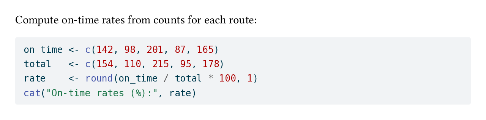{#fig-typst-code-blocks-highlight .border fig-alt="A short PDF showing a sentence followed by an R code block with colored syntax highlighting on a light blue-gray background."}

Control the theme with `syntax-highlighting`:

```{.yaml filename="_quarto.yml"}
format:
  typst:
    syntax-highlighting: github
```

::: {#fig-typst-code-blocks-themes}
::: {layout-ncol=2}
{#fig-typst-code-blocks-github .border fig-alt="An R code block with GitHub-style syntax highlighting on a white background."}

{#fig-typst-code-blocks-idiomatic .border fig-alt="An R code block with Typst's native syntax highlighting on a gray background."}
:::

`github` uses Quarto's GitHub theme; `idiomatic` uses Typst's own native highlighting.
:::

### Filename

::: todo
[CVW] Regenerate screenshot and remove this once quarto-dev/quarto-cli#14170 is merged.
:::

````{.markdown filename="report.qmd" .code-overflow-wrap}

````

## Computational outputs

::: {.panel-tabset}
## R

````{.r filename="report.qmd" .code-overflow-wrap}
```{{r}}

```
````

## Python

````{.python filename="report.qmd" .code-overflow-wrap}
```{{python}}

```
````
:::

### Figure format

Quarto defaults to SVG for computational figures in Typst. Use `fig-format: png` to switch to PNG:

```{.yaml filename="_quarto.yml"}
format:
  typst:
    fig-format: png
```

### Tables

::: {.panel-tabset}
## R

````{.r filename="report.qmd" .code-overflow-wrap}
```{{r}}

```
````

## Python

````{.python filename="report.qmd" .code-overflow-wrap}
```{{python}}

```
````
:::

::: {.panel-tabset}
## R

{#fig-typst-computational-outputs-tables .border fig-alt="A table of on-time rates by route with four columns: Route, On time, Total, and On-time rate (%)."}

## Python

{#fig-typst-computational-outputs-tables-py .border fig-alt="A table of on-time rates by route with four columns: Route, On time, Total, and On-time rate (%)."}
:::

### Long tables

::: todo
[CVW] Also cover the non-figure case: without `label:`/`tbl-cap:` the table isn't wrapped in a `#figure()` and breaks across pages fine by default.
:::

A cross-referenceable table (one with `label:` and `tbl-cap:`) is wrapped in a Typst `#figure()` block, which isn't breakable by default. A long table will overflow a single page:

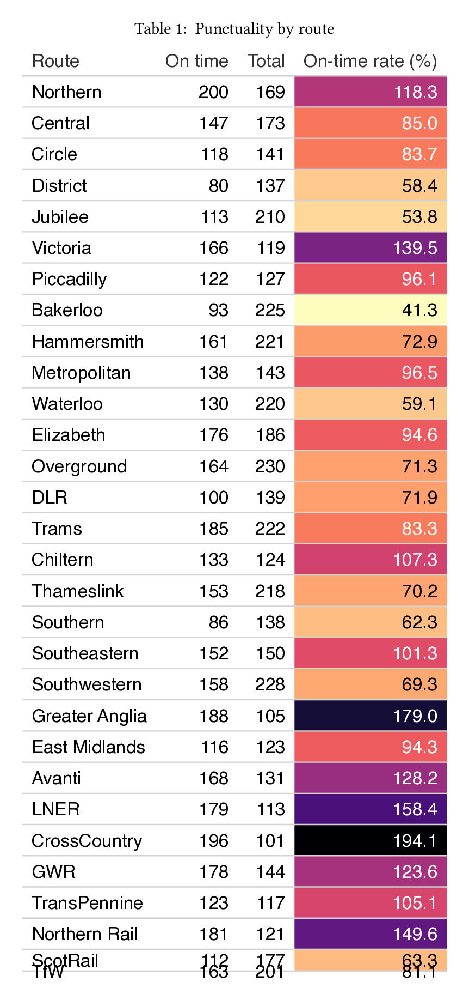{#fig-typst-computational-outputs-long-table-broken .border fig-alt="A long gt table whose last two rows are cut off at the bottom of the page."}

Add a raw Typst block to make figures breakable:

````{.markdown filename="report.qmd"}
```{{=typst}}
#show figure: set block(breakable: true)
```
````

::: {#fig-typst-computational-outputs-long-table-fix}
::: {layout-ncol=2}
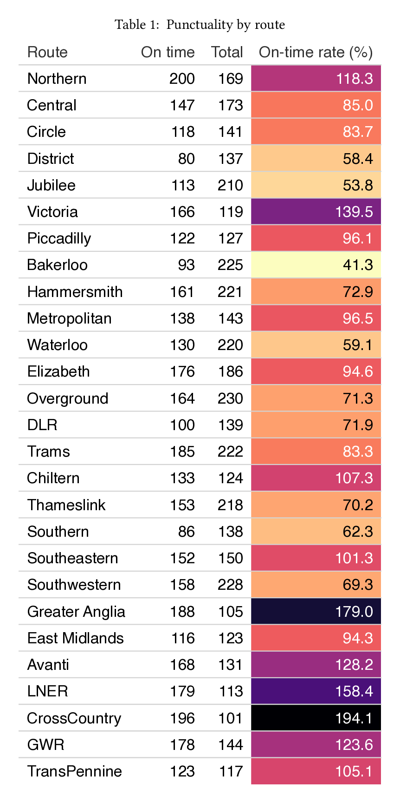{#fig-typst-computational-outputs-long-table-fix-p1 .border fig-alt="Page 1 of a long gt table, with the first 27 rows visible."}

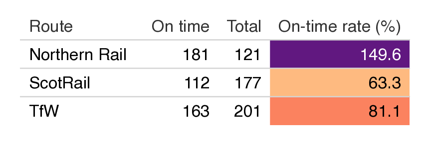{#fig-typst-computational-outputs-long-table-fix-p2 .border fig-alt="Page 2 of the long gt table, with the final 3 rows visible and the header repeated."}
:::

The long table broken cleanly across two pages.
:::

## Raw Typst blocks

Markdown doesn't reach every corner of Typst. For a shape, a decorative element, or any Typst function call, drop into a `{=typst}` fenced block — its contents pass straight through to Typst:

````{.markdown filename="report.qmd"}
Service status:

```{{=typst}}
#rect(width: 4cm, height: 1cm, fill: rgb("#2e5090"), radius: 4pt)
```

Deployed to production 2026-04-22.
````

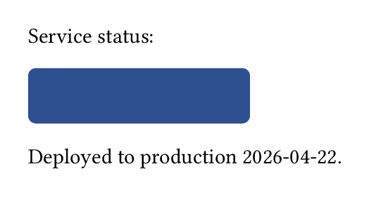{#fig-typst-raw-typst-shape .border fig-alt="A short paragraph reading Service status followed by a rounded blue rectangle, followed by a line reading Deployed to production 2026-04-22."}

Typst's full function catalogue — shapes, icons (`#emoji.rocket`), dates, layout primitives — is fair game. You'll see raw blocks again when we [customise appearance with set and show rules](#use-raw-typst).

## Full-width or margin content

Fenced divs let you lift figures, tables, or text out of the body column. `.column-margin` pushes content into the margin as an aside:

````{.markdown filename="report.qmd" .code-overflow-wrap}

````

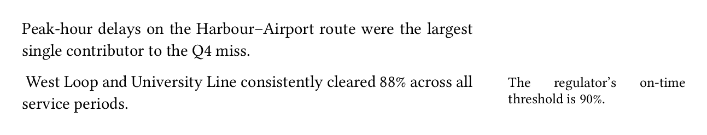{#fig-typst-column-layout-margin .border fig-alt="A PDF showing two body paragraphs with a short note in the right margin."}

`.column-page` widens content across the page, extending beyond the body text:

````{.markdown filename="report.qmd" .code-overflow-wrap}

````

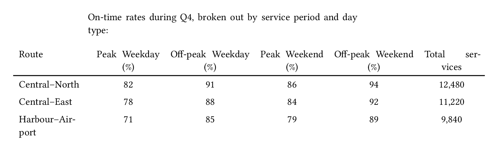{#fig-typst-column-layout-page .border fig-alt="A PDF showing a narrow introductory line and a wide six-column table extending beyond the body width."}

The full set of column classes — `.column-body-outset`, `.column-page-inset`, `.column-screen`, left/right variants, and more — works in Typst via the Marginalia package, just as it does for HTML output.

::: todo
[CVW] Show the code-cell equivalents (`column: page`, `fig-column: margin`, `tbl-column: ...`) for computational outputs, and the document-level defaults in the YAML header that apply the same column choice to every chunk.
:::

## Making accessible PDFs

Set `pdf-standard: ua-1` to produce a tagged PDF suitable for screen readers. Quarto validates the output against PDF/UA-1 at render time; a document that fails validation won't be produced.

Add PDF metadata — `title`, `author`, `date`, `lang` — so assistive tools can identify the document and announce it in the right language:

```{.yaml filename="report.qmd"}
---
title: "Route Punctuality Report"
author: "Dr. Sarah Okonkwo"
date: 2026-04-15
lang: en
format:
  typst:
    pdf-standard: ua-1
---
```

::: {.callout-tip}
## PDF/UA-1 is strict about alt text

Every image *and* every equation — display **and inline** — must carry alt text. Display equations take `alt=` in their attribute block (`$$ ... $$ {#eq-mean alt="..."}`); inline math currently doesn't. Avoid inline math under `ua-1`, or switch to a looser standard.
:::

See the Quarto accessibility guide for alt text syntax on images and equations. Other conformance standards are supported — archival PDF/A variants (`a-1b`, `a-2b`, ...) and explicit PDF versions; see the Typst format reference for the full list.

Don't skip heading levels: screen readers build the document outline from `##` → `###` in order. And some things no tool can check — color contrast, readability for color-deficient readers, and whether the reading order in the PDF matches your intent. Review those manually.

## Customizing appearance

### Page layout

#### Geometry

Set paper size with `papersize`:

```{.yaml filename="_quarto.yml"}
format:
  typst:
    papersize: a5
```

Typst accepts any of its supported paper sizes (`a4`, `a5`, `us-legal`, `jis-b5`, ...); the default is `us-letter`.

Use `margin` for page margins. Provide any combination of `top`, `bottom`, `left`, `right` — or the shortcuts `x` and `y`:

```{.yaml filename="_quarto.yml"}
format:
  typst:
    margin:
      top: 2cm
      bottom: 2cm
      left: 3cm
      right: 3cm
```

For finer control over how the body and margin columns split the page, use `grid`:

```{.yaml filename="_quarto.yml"}
format:
  typst:
    grid:
      body-width: 4in
      margin-width: 2in
      gutter-width: 0.25in
```

`body-width` is the text column; `margin-width` is the column reserved for `.column-margin` content; `gutter-width` is the gap between them.

#### Structure

Set the number of body-text columns with `columns`:

```{.yaml filename="_quarto.yml"}
format:
  typst:
    columns: 2
```

Margin content stays in the margin column and doesn't flow between body columns.

Use `page-numbering` to set the footer format (or `""` to suppress it), and `section-numbering` with `number-sections: true` to number headings:

```{.yaml filename="_quarto.yml"}
format:
  typst:
    page-numbering: "1 / 1"
    section-numbering: "1.A"
    number-sections: true
```

`page-numbering` follows Typst's numbering-pattern syntax — `1` for the current page, a second `1` for the total. `section-numbering` uses a similar scheme, one placeholder per heading level (`1.A` gives numeric first-level headings and alphabetic second-level).

Quarto doesn't expose YAML options for page headers or running titles in Typst output. For those, drop into a raw Typst block (covered below in [Use raw typst](#use-raw-typst)).

### Fonts and colors

#### Use brand

Add Typst fonts and colors to your project's `_brand.yml` — Quarto picks it up automatically and flows the keys into Typst's document template. No raw Typst required for the common cases.

Set the body font, page background, and foreground (body text color) under `typography.base` and `color`:

```{.yaml filename="_brand.yml"}
typography:
  base: Helvetica
color:
  background: "#fdf6e3"
  foreground: "#073642"
```

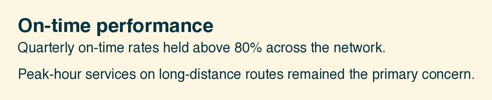{#fig-typst-fonts-colors-base .border fig-alt="A short document with a solarized-light cream background, dark-teal text, and a Helvetica sans-serif face."}

Customise headings independently with `typography.headings`. Family, color, and weight can all be set:

```{.yaml filename="_brand.yml"}
typography:
  headings:
    family: Helvetica
    color: "#b58900"
    weight: bold
```

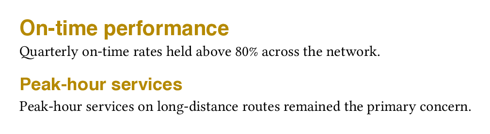{#fig-typst-fonts-colors-headings .border fig-alt="Two headings rendered in bold amber Helvetica above serif body paragraphs."}

Set the code font with `typography.monospace.family`. Declare the font under `typography.fonts` and pick a `source` — `system` for an already-installed font, or `google` to have Quarto fetch it at render time:

```{.yaml filename="_brand.yml"}
typography:
  fonts:
    - family: JetBrains Mono
      source: google
  monospace:
    family: JetBrains Mono
```

{#fig-typst-fonts-colors-mono-font .border fig-alt="An R code block rendered in JetBrains Mono, with a left-arrow ligature replacing the two-character <- assignment operator."}

`monospace` covers both inline and block code. To target them separately, use `monospace-inline` and `monospace-block`.

Colour the code-block background with `typography.monospace-block.background-color`. Pair it with a `syntax-highlighting` theme whose token colors contrast against the background you picked — e.g. `a11y-dark` for a dark bg:

```{.yaml filename="_brand.yml"}
typography:
  monospace-block:
    background-color: "#1e1e2e"
```

```{.yaml filename="_quarto.yml"}
format:
  typst:
    syntax-highlighting: a11y-dark
```

{#fig-typst-fonts-colors-code-bg .border fig-alt="An R code block on a dark bluish-purple background with bright yellow function names, white variables, and orange numeric literals."}

::: {.callout-warning}
## Coordinate code backgrounds with syntax highlighting

Code-block background and `syntax-highlighting` aren't independent knobs. The default highlighting theme is tuned for a light code bg; on a dark background its argument-gray tokens fade into the page. Pick a theme whose token palette matches your chosen background.

`syntax-highlighting: github` is a second gotcha — it currently ignores `monospace-block.background-color` entirely, emitting its own code-block fill that the brand override doesn't reach.
:::

#### Use raw typst

When YAML and brand keys don't reach what you want, drop into a raw Typst block. Two rule flavours cover most cases:

- **Set rules** — `#set X(...)` — change default parameters for element `X`.
- **Show rules** — `#show X: ...` — transform how element `X` renders, often by setting parameters on a *different* element.

Both take effect from the point they appear onwards. Put them near the top of your document to apply globally.

##### Set rules

Add a running header to every page with `#set page(...)`:

````{.markdown filename="report.qmd"}
```{{=typst}}
#set page(header: align(right, text(fill: gray, [Route Punctuality Report])))
```
````

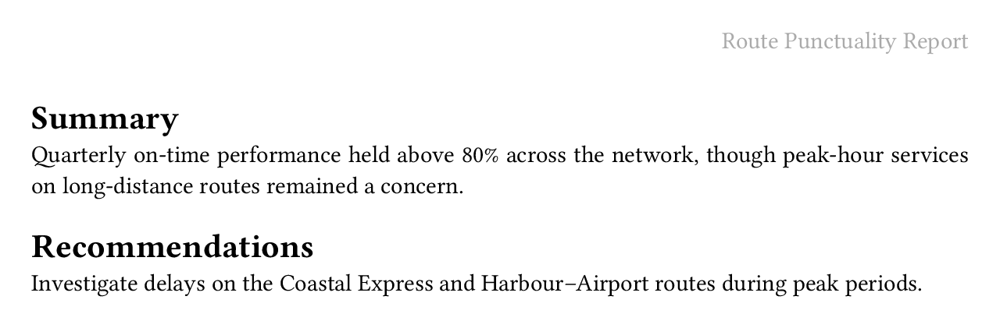{#fig-typst-raw-typst-page-header .border fig-alt="A PDF page with a gray Route Punctuality Report header at top right, followed by Summary and Recommendations sections."}

::: {.callout-note}
## `#set page()` starts a new page

Typst treats `#set page()` as a page break — the current page finishes, the new settings take effect on the one that follows. A raw block at the top of the body therefore only applies from page 2 onwards. To reach page 1, override the `page.typ` partial instead (see [Custom templates](#custom-templates)).
:::

Widen paragraph line spacing with `#set par(...)`:

````{.markdown filename="report.qmd"}
```{{=typst}}
#set par(leading: 1em)
```
````

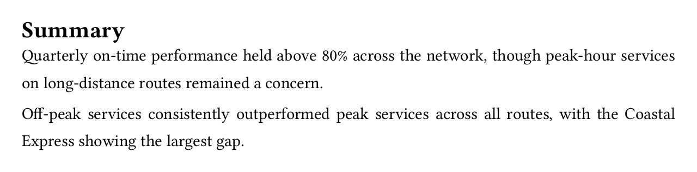{#fig-typst-raw-typst-par-leading .border fig-alt="Two short paragraphs with extra vertical space between every line."}

Tint body text with `#set text(...)`. Because set rules apply forward from where they appear, you can open a scope, drop a paragraph in, then revert:

````{.markdown filename="report.qmd"}
```{{=typst}}
#set text(fill: rgb("#4a4a4a"))
```

Quarterly on-time performance held above 80% across the network...

```{{=typst}}
#set text(fill: black)
```

Off-peak services consistently outperformed peak services...
````

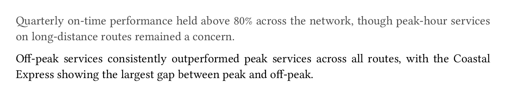{#fig-typst-raw-typst-text-fill .border fig-alt="Two paragraphs of body text: the first rendered in medium gray, the second in black."}

##### Show rules

Reach for a show rule when the parameter you want lives on a *different* element. Heading spacing, for example, is a `block` parameter, not a `heading` one — `#show heading: set block(...)` bridges the two:

````{.markdown filename="report.qmd"}
```{{=typst}}
#show heading: set block(above: 2em, below: 0.5em)
```
````

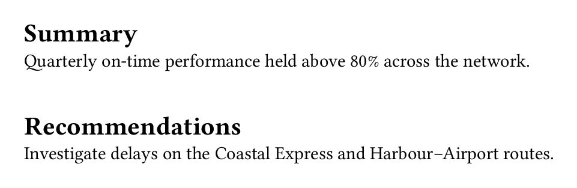{#fig-typst-raw-typst-heading-spacing .border fig-alt="Summary and Recommendations headings with wide vertical space above each."}

Narrow the target with `.where()`. Here level-2 headings go italic; level-1 stays upright:

````{.markdown filename="report.qmd"}
```{{=typst}}
#show heading.where(level: 2): set text(style: "italic")
```
````

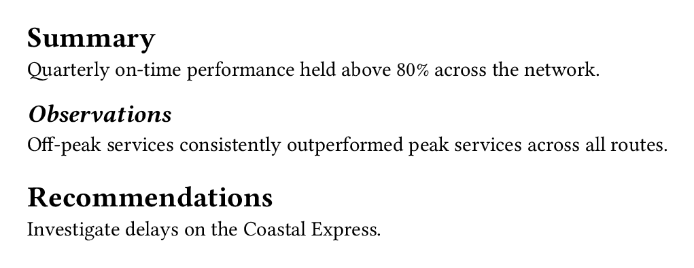{#fig-typst-raw-typst-heading-level .border fig-alt="Three headings: Summary and Recommendations in upright bold, with Observations rendered in italic bold between them."}

::: {.callout-note}
## Heading levels are shifted by one

Quarto's Typst format defaults to `shift-heading-level-by: -1`, so markdown `##` renders as Typst level 1 and `###` as level 2. That's why the rule above targets `level: 2` to match a `###` heading in the source. Override with `shift-heading-level-by: 0` in your YAML if you'd rather the numbers line up.
:::

Quarto exposes `_brand.yml` colors to raw Typst via the `brand-color` dictionary. With

```{.yaml filename="_brand.yml"}
color:
  primary: "#2e5090"
```

every heading can be painted in the brand primary:

````{.markdown filename="report.qmd"}
```{{=typst}}
#show heading: set text(fill: brand-color.primary)
```
````

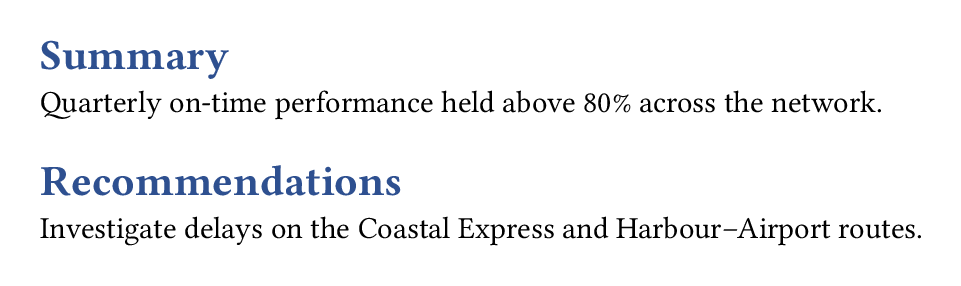{#fig-typst-raw-typst-heading-color .border fig-alt="Summary and Recommendations headings rendered in a dark blue brand color on white."}

## Custom templates

When set and show rules aren't enough. Or you want a reusable template.

Focus on the why you would build this, not how. Point to docs for how.

::: todo
[CVW] Cover the `page.typ` partial. It's the file that turns YAML like `papersize`, `margin`, `page-numbering`, and `columns` into a `#set page()` call; overriding it is the supported way to reach the Typst page parameters Quarto doesn't expose — running headers and footers are the motivating example.
:::