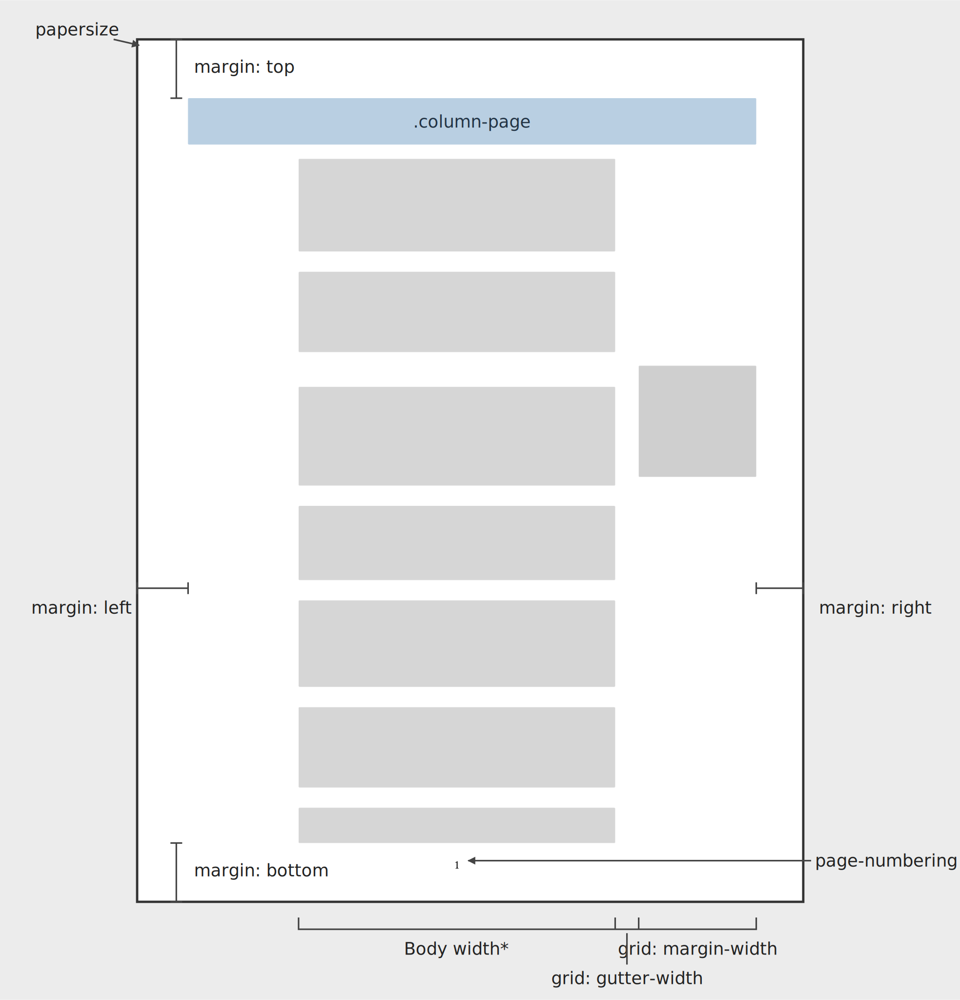
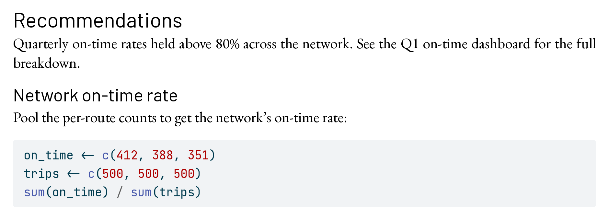
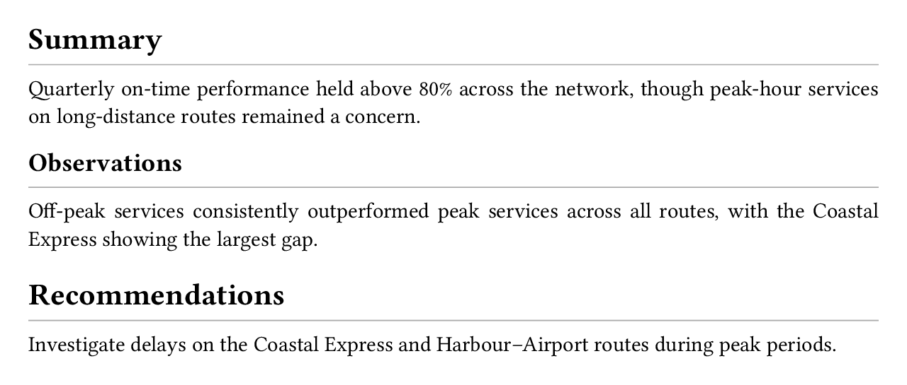

# PDF {#sec-typst}

## Overview

In this chapter, you'll learn how to create PDF documents with Quarto.
PDF is the right target when you plan to print, need a single self-contained file to share, or care about the precise layout of content on "pages". 

We'll focus exclusively on creating PDFs via Typst, i.e., `format: typst`.
Typst is a modern typesetting system that comes bundled with Quarto.
There are alternatives in Quarto,
most notably, `format: pdf` which creates a PDF via LaTeX. 
We think for new authors, it's both easier to get started and easier to advance with Typst:

* Typst comes bundled with Quarto, so getting to your first PDF document requires nothing more than adding `format: typst`.

* Typst compiles very quickly, reducing the time it takes to preview your changes.

* Typst's scripting language is similar to other languages you may already know (like R and Python), which makes it easier to understand existing templates and customize your documents.

There are situations where LaTeX may be a better fit:

* You need to work with existing LaTeX templates, like a journal article template.

* You already rely on LaTeX packages for advanced typesetting of math or equations.

If you are in these situations, you may find the [PDF Basics guide](https://quarto.org/docs/output-formats/pdf-basics.htmlv) in the Quarto documentation a better place to start. 

Readers who use screen readers and other assistive technologies generally have a smoother experience with HTML (@sec-html) than with PDF. 
If that describes part of your audience — or if accessibility is a primary concern — HTML is often the better target. 
Accessible PDFs are possible (we'll cover that in @sec-pdf-accessibility), but the tooling ecosystem is younger.

In the next section, you'll create your first PDF document with `format: typst`.
Then, you'll cover the types of content you'll most likely need in your first few documents: navigation, citations, math, code blocks, and computational outputs.

In @sec-pdf-accessibility, you'll learn the keys to creating accessible PDFs, and in @sec-customizing-appearance, how to customize the page layout, fonts, and colors of your document.

Finally, you'll learn where to head next if you need to go beyond Quarto's default Typst options.

## Your first PDF document

Creating a PDF is as simple as adding `format: typst` to your document header:

```{.markdown}
---
format: typst
---
```

Here's a short but complete example, with some common content types — headings, 
a table, and cross-references:

````{.markdown filename="train-punctuality.qmd" .code-overflow-wrap}

````

To create the PDF, render, either by Previewing in your IDE or in the terminal:

```{.bash filename="Terminal"}
quarto render train-punctuality.qmd
```

Behind the scenes, Quarto converts your markdown source into Typst's own markup language (`.typ`), then uses the bundled Typst to compile the `.typ` to PDF.
The result is `train-punctuality.pdf`, the rendered PDF, shown in @fig-typst-train-punctuality. 

{#fig-typst-train-punctuality .border fig-alt="A rendered PDF showing a Route Punctuality Report with a table of on-time rates by route and a recommendations section."}

You can see the headings, table and cross-references all "just work".
In the following sections, we'll cover other common content types you commonly need in your first few documents. 
You can also check out @sec-authoring for a more comprehensive set of features available across formats, including `format: typst`.

::: {.callout-note}

## PDFs are static documents

You can try swapping to `format: typst` in any existing Quarto document.
Most markdown features will carry over, but beware of features that introduce interactivity, like code folding or hover effects; these won't be supported in PDF because PDF is a static format.

:::

## Navigation

PDF documents support links, allowing your readers to quickly navigate your document.
To make navigation easier for readers, you can add a table of contents (`toc`) and section numbers (`number-sections`) in your document header:

```{.yaml filename="train-punctuality.qmd"}
---
format:
  typst:
    toc: true
    number-sections: true
---
```

{#fig-typst-navigation .border fig-alt="A rendered PDF of the Route Punctuality Report showing a table of contents and numbered section headings."}

Items in the table of contents and cross-references are automatically clickable links that take readers to the relevant item.

## Links

You can also use markdown link syntax to add links directly to other sections in your document, or to external resources:

```{.markdown filename="train-punctuality.qmd" .code-overflow-wrap}

```

Both render as plain text in the default template — they're clickable in a PDF viewer, but visually indistinguishable from the surrounding prose.
You'll learn how to style them in @sec-typst-fonts-colors.

## Citations

Citations require a bibliography file holding reference metadata. 
A common format for this is BibTeX (`.bib`):

```{.bibtex filename="references.bib"}

```

To cite an item in the bibliography, specify the bibliography file in `bibliography` and use the `@` syntax in your text:

````{.markdown filename="train-punctuality.qmd" .code-overflow-wrap}

````

{#fig-typst-citations .border fig-alt="A short PDF document showing a numbered in-text citation and a bibliography entry."}

Citations in `format: typst` use Typst's native processing and, consequently, a different default citation style from other Quarto formats.
You can specify the citation style with the `csl` option.
Set `csl: chicago-author-date` to get the same Chicago author-date style as HTML output:

````{.yaml filename="train-punctuality.qmd"}
---
format: typst
bibliography: references.bib
csl: chicago-author-date
---
````

{#fig-typst-citations-chicago .border fig-alt="A short PDF document showing a Chicago author-date in-text citation and a bibliography entry."}

You can read more about citations in @sec-citations, including about various `@` syntax variations.

## Mathematical equations

When you author to Typst from Quarto, use TeX math syntax to write your equations.
Use single dollar signs (`$...$`) for inline math, and double dollar signs (`$$...$$`) for display equations:

````{.markdown filename="equations.qmd" .code-overflow-wrap}

````

{#fig-typst-math-equations .border fig-alt="A PDF showing an inline mean symbol in a sentence and a numbered display equation for the sample mean."}

::: {.callout-note}
## Typst has its own math syntax

Typst has its own (non-TeX) math notation, but you won't need to learn it, because Quarto converts TeX math to Typst math for you.
This keeps math portable — the same TeX syntax renders across HTML, Typst and other formats without edits.
:::

You can read more about writing equations, including cross-referencing, in @sec-equations.

### Alt text {#sec-typst-math-alt}

Alt text makes an equation accessible to screen readers and is required to meet the PDF/UA-1 standard.
You can add alternative text to cross-referenced display equations with an `alt=` attribute:

````{.markdown filename="equations.qmd" .code-overflow-wrap}

````

{#fig-typst-math-equations-alt .border fig-alt="A PDF showing a numbered display equation for the sample mean."}

::: {.callout-caution}

## No alt text for inline math

There is currently no way to add alt text to inline math in `format: typst`.

:::

### Theorems

When you use one of Quarto's theorem environments, you'll get special styling in Typst.
To declare a theorem, you wrap it in a fenced div with an identifier that starts with `#thm-`:

````{.markdown filename="theorem.qmd" .code-overflow-wrap}

````

The default theorem appearance is `simple`: a bold title followed by italic body text.
Switch to a different flavor with `theorem-appearance`:

```{.yaml filename="_quarto-fancy.yml"}
format:
  typst:
    theorem-appearance: fancy
```

The available options are `simple`, `fancy`, `clouds`, and `rainbow`:

::: {#fig-typst-math-theorem}
::: {layout-ncol=2}
{#fig-typst-math-theorem-simple .border fig-alt="A theorem in simple LaTeX style with bold title and italic body text."}

{#fig-typst-math-theorem-fancy .border fig-alt="A theorem in a rounded box with an orange header."}

{#fig-typst-math-theorem-clouds .border fig-alt="A theorem with a soft pink background and rounded corners."}

{#fig-typst-math-theorem-rainbow .border fig-alt="A theorem with a red left border and red title."}
:::

Available values for `theorem-appearance` to style theorems.
:::

`theorem-appearance` applies to every type of theorem-like element Quarto recognizes, not just `thm-`.
When you use `fancy`, `clouds`, or `rainbow`, different types get different accent colors so you can tell a definition from a theorem at a glance.
You can find all the available types in @sec-theorems-proofs.

## Code blocks

When you include a code block, it will get automatic syntax highlighting based
on the language you specify.
For example, here's a code block specified as `r`:

````{.markdown filename="report.qmd" .code-overflow-wrap}

````

In the PDF, the block gets R syntax highlighting as shown in @fig-typst-code-blocks-highlight.
Executable code cells that are echoed in your document get the same treatment, so your code is styled consistently.

{#fig-typst-code-blocks-highlight .border fig-alt="A short PDF showing a sentence followed by an R code block with colored syntax highlighting on a light blue-gray background."}

The default highlighting theme is `arrow`.
Pick a different one with `syntax-highlighting`:

```{.yaml filename="report.qmd"}
---
format:
  typst:
    syntax-highlighting: github
---
```

Supported themes include: `a11y`, `arrow`, `pygments`, `tango`, `espresso`, `zenburn`, `kate`, `monochrome`, `breezedark`, `haddock`, `atom-one`, `ayu`, `breeze`, `dracula`, `github`, `gruvbox`, `monokai`, `nord`, `oblivion`, `printing`, `radical`, `solarized`, and `vim`.

Typst also has a native highlighter, if you'd prefer to use it, you can set `syntax-highlighting` to `idiomatic`:

::: {#fig-typst-code-blocks-themes}
::: {layout-ncol=2}
{#fig-typst-code-blocks-github .border fig-alt="An R code block with GitHub-style syntax highlighting on a white background."}

{#fig-typst-code-blocks-idiomatic .border fig-alt="An R code block with Typst's native syntax highlighting on a gray background."}
:::

A comparison of the `github` theme for syntax highlighting and Typst's native `idiomatic` theme.
:::

### Filename

You can add a `filename` attribute to label the code block:

````{.markdown filename="report.qmd" .code-overflow-wrap}

````

The filename renders as a label on the code block, as shown in @fig-typst-code-blocks-filename.

{#fig-typst-code-blocks-filename .border fig-alt="A sentence followed by a syntax-highlighted R code block on a light grey background, labelled with the filename analysis.R."}

::: todo
[CVW] @fig-typst-code-blocks-filename currently shows the pre-fix behaviour: the filename label isn't rendered. Regenerate the screenshot and remove this note once <https://github.com/quarto-dev/quarto-cli/pull/14170> is merged.
:::

## Computational outputs

Computational code cells work in `format: typst` just as they do in other formats.
Outputs like figures, tables, and inline values are inserted into the PDF at the point of the cell.

For example, here's a cell that produces a figure:

::: {.panel-tabset}
## R

````{.markdown filename="report.qmd" .code-overflow-wrap}
```{{r}}

```
````

## Python

````{.markdown filename="report.qmd" .code-overflow-wrap}
```{{python}}

```
````
:::

The cell uses `echo: false`, so the code itself is hidden in the rendered output; the figure appears directly below the surrounding prose with a numbered caption, as shown in @fig-typst-computational-outputs-figures.

{#fig-typst-computational-outputs-figures .border fig-alt="A page showing the sentence 'Figure 1 shows on-time rates across the network's routes' followed by a bar chart of on-time rate by route, captioned Figure 1: On-time rate by route."}

While most computational outputs render as expected, there are a few quirks to be aware of that we'll cover in the sections below: figure formats, table formats, and long tables.


### Figure format

Quarto defaults to SVG for computational figures in Typst.
SVG is a vector format, so it scales well and looks crisp at any size.
However, it can be slow to render when a figure contains many elements, like a busy scatterplot with thousands of points.
Set `fig-format` in the document header to switch default format, e.g. to `png` for raster output:

```{.yaml filename="report.qmd"}
---
format:
  typst:
    fig-format: png
---
```

### Table formats

Any code that produces a markdown, HTML, or raw Typst table will render as a table in your PDF.
Often it's not easy to tell which format you've ended up with. 
The easiest way to check is to add `keep-md` to your header:

````{.yaml filename="report.qmd"}
---
format:
  typst:
    keep-md: true
---
````

Then examine the table output in the resulting `.md` file, e.g. `report.typst.md`.

For simple tables, code that outputs a markdown table (@sec-markdown-pipe-tables) will often be the best choice.
Markdown tables are converted to native Typst tables by Quarto and inherit your document's styling, such as fonts and colors, so the table blends with the rest of your document. 

The advantage of HTML tables (@sec-html-tables) is that cell-level formatting, such as data-dependent coloring, will be preserved. 
For example, the following code blocks use the `gt` package in R and `great_tables` in Python to produce tables with colored cells:

::: {.panel-tabset}
## R

````{.markdown filename="report.qmd" .code-overflow-wrap}
```{{r}}

```
````

## Python

````{.markdown filename="report.qmd" .code-overflow-wrap}
```{{python}}

```
````
:::

When rendered to Typst, the cell-level coloring survives, as shown in @fig-typst-computational-outputs-tables.
However, notice the font is now the `gt`/`great_tables` default san-serif font.

{#fig-typst-computational-outputs-tables .border fig-alt="A table of on-time rates by route with four columns: Route, On time, Total, and On-time rate (%)."}

Most packages that produce HTML tables offer a way to customize the styles of the tables they produce. 
You'll need to look into the package documentation to find out how.


Packages that produce raw Typst tables may get the best of both worlds, inheriting the document's fonts and styling while allowing for cell-level formatting. 
However, there are currently very few packages that produce raw Typst tables.

### Long tables

When your code creates a very long table, you'll want it to break across pages, rather than being cut off at the bottom of the page.
If you haven't set `label:` and `tbl-cap:`, i.e., it isn't cross-referenceable, the table will break across pages by default.

If you have set `label:` and `tbl-cap:`, the table won't be breakable by default and will overflow the page instead of breaking across it, as shown in @fig-typst-computational-outputs-long-table-broken.

{#fig-typst-computational-outputs-long-table-broken .border width="40%" fig-alt="A long gt table whose last two rows are cut off at the bottom of the page."}

To let cross-referenceable tables break across pages, add a raw Typst block after your document header:

````{.markdown filename="report.qmd"}
---
title: "Route Punctuality Report"
---

```{{=typst}}
#show figure: set block(breakable: true)
```
````

Now the long table flows cleanly across pages, with the table header repeated on each:

::: {#fig-typst-computational-outputs-long-table-fix}
::: {layout-ncol=2 layout-valign="top"}
{#fig-typst-computational-outputs-long-table-fix-p1 .border width="80%" fig-alt="Page 1 of a long gt table, with the first 27 rows visible."}

{#fig-typst-computational-outputs-long-table-fix-p2 .border width="80%" fig-alt="Page 2 of the long gt table, with the final 3 rows visible and the header repeated."}
:::

The long table broken cleanly across two pages.
:::

You'll learn more about raw Typst blocks in the next section.

## Raw Typst blocks

If you explore the [Typst documentation](https://typst.app/docs/reference/), you'll find a rich syntax that can go beyond what Quarto markdown supports.
For anything that Quarto doesn't support you can use Typst syntax directly inside a raw block (@sec-raw-blocks).

The contents of a raw block pass through to Typst without being processed by Quarto, and are ignored in any other format.
For example, you can use a raw Typst block to add status badge that uses the [`rect`](https://typst.app/docs/reference/visualize/rect/), [`align`](https://typst.app/docs/reference/layout/align/), and [`text`](https://typst.app/docs/reference/text/text/) Typst functions:

````{.markdown .code-overflow-wrap filename="report.qmd"}

````

{#fig-typst-raw-typst-shape .border fig-alt="A line reading Service status, followed by a rounded blue rectangle with the word Normal centered in white."}

Another good use case for raw blocks is to customize appearance with set and show rules, as you'll see in @sec-use-show-rules.

## Full-width or margin content {#sec-typst-full-width-margin}

By default, your document content will appear in the body column of your PDF.
Sometimes you may want to break out of that column and use the full page width, or put content into the right margin.

Add the `.column-margin` class to a fenced div to push content into the margin as an aside:

````{.markdown filename="report.qmd" .code-overflow-wrap}

````

{#fig-typst-column-layout-margin .border fig-alt="A PDF showing two body paragraphs with a short note in the right margin."}

Use the `.column-page` class to widen content across the page, extending beyond the body text:

````{.markdown filename="report.qmd" .code-overflow-wrap}

````

{#fig-typst-column-layout-page .border fig-alt="A PDF showing a narrow introductory line and a wide six-column table extending beyond the body width."}

In Typst, the column classes give you four distinct widths beyond the default body:

- `.column-margin` — content sits in the margin column
- `.column-body-outset` — slightly wider than the body, extending into the margins
- `.column-page-inset` — almost the full page width
- `.column-page` — extends to the page margins

Each of the wider three has `-left` and `-right` variants for one-sided expansion.
@fig-typst-column-layout-extents shows the extent of each.

{#fig-typst-column-layout-extents .border fig-alt="A page laid out with one rectangle per column class, sized to its width: a small body rectangle at top, a margin rectangle in the right margin, three body-outset rectangles slightly wider than the body, three page-inset rectangles wider still, and three page rectangles extending to the page margins."}

For document-wide defaults, set `tbl-column` and `fig-column` in the document header:

```{.yaml filename="report.qmd"}
---
format: typst
fig-column: page
tbl-column: page
---
```

Both apply to every cross-referenceable table or figure in the document — markdown pipe tables, list tables, and computational outputs alike.
Tables and figures without an identifier are unaffected, as are non-cross-referenceable images and tables.


When you place content outside the default body column, the layout mechanism of your document changes from a simple single body area to a layout using the Typst [marginalia package](https://typst.app/universe/package/marginalia/) to manage the margin allocation.
You'll learn more about managing this layout in @sec-margin-geometry.

## Making accessible PDFs {#sec-pdf-accessibility}

Accessibility is about increasing the reach of your documents. 
A PDF that's well-structured can be used by more people -- like readers who navigate with a screen reader, who zoom to 400%, who can't tell red from green, or who depend on assistive technology to work through a long document.

The Web Content Accessibility Guidelines (WCAG) are the most widely accepted standard for what counts as "accessible".
When a regulation says your document must be accessible, it almost always points to these guidelines.
However, since the WCAG was written for the web and is deliberately technology-agnostic, it doesn't directly map to requirements for PDFs.

For PDF documents, you'll be more likely to work with a PDF standard. 
PDF/UA-1 is one such standard, supported by Typst, that translates WCAG into testable rules for PDFs.
You can target this standard by setting `pdf-standard: ua-1` in your document header:

```{.yaml filename="report.qmd"}
---
title: "Route Punctuality Report"
author: "Dr. Sarah Okonkwo"
lang: en
format:
  typst:
    pdf-standard: ua-1
---
```

When you do so, your document is marked as targeting this standard and is checked twice during the rendering process:

1. By Typst itself, when it compiles the `.typ` to `.pdf`. 

2. By Quarto, which uses veraPDF to validate the resulting `.pdf` against the PDF/UA-1 standard. 

::: {.callout-important}

## veraPDF is a separate install

You'll need to install veraPDF to get the second check:

```{.bash filename="Terminal"}
quarto install verapdf
```

:::

For a document that passes validation, you'll see the `[typst]` compile step completing with `DONE`, and a `PASSED` message from `veraPDF`:

```{.default filename="Terminal"}
[typst]: Compiling train-punctuality.typ to train-punctuality.pdf...DONE

[verapdf]: Validating train-punctuality.pdf against PDF/UA1...PASSED
```

For a document that fails validation, you'll see an error from the `[typst]` compile step along with an error from Typst that describes the failure:

```{.default filename="Terminal"}
[typst]: Compiling train-punctuality-not.typ to train-punctuality-not.pdf...error: PDF/UA-1 error: missing alt text

...

ERROR: Typst compilation failed
```

Because the Typst compilation fails, you won't get the `.pdf` output. 

### What does it mean to pass PDF/UA-1 validation?

Passing PDF/UA-1 validation is a useful first step to ensuring an accessible document, but it doesn't mean your document is accessible.
There are two big caveats to be aware of:

#### Passing PDF/UA-1 validation does not mean your document meets PDF/UA-1 {.unnumbered}

There are rules in PDF/UA-1 that cannot be checked automatically.
For example, consider the rule:

> PDF/UA-1: 7.1-8: `dc:title` clearly identifies the document. 

The `dc:title` element is set by `title` in your document header. 
Validation can check `dc:title` is set, but it can't check it "clearly identifies the document".
As a human, meeting rules that require human judgment is your responsibility.

#### Meeting PDF/UA-1 does not mean your document meets WCAG {.unnumbered}

The rules in PDF/UA-1 cover structural requirements that are necessary for accessibility, but they don't cover all the content-level requirements in WCAG. 
For example, consider the rule:

> WCAG 2.1: 1.4.3 Contrast (Minimum): The visual presentation of text and images of text has a contrast ratio of at least 4.5:1, except for the following: ...

This rule has no PDF/UA-1 equivalent, so you can fully meet all machine- and human-checkable PDF/UA-1 requirements without meeting WCAG.
Some tools can check additional WCAG rules but these are beyond the automated checks you'll get from Quarto.

### Accessibility best practices

The following best practices will help you meet most PDF/UA-1 and WCAG AA requirements.

#### Use semantic structure

Your resulting PDF needs to tag content based on what it is, not how it looks: a section heading needs to be tagged as a heading, not just be big and bold.
Quarto's markdown encourages this naturally — when you write `## Recommendations`, Quarto knows it is a second-level heading and tags it as such in the PDF.
Be careful not to skip heading levels, e.g., jumping from `##` to `####` without an intervening `###`. Skipping levels can make navigation difficult for screen readers.

#### Communicate a logical reading order

Quarto encourages this naturally too: the implied reading order is the same as the top-to-bottom order of elements in your `.qmd`.
For example, a figure is "read" based on its location in your `.qmd`, not where it ends up in the `.pdf`. As long as you write your `.qmd` to read from top-to-bottom, you'll meet this requirement.

#### Set required metadata

PDF/UA-1 validation will flag missing required metadata.
For example, you must set `title` in your document header to pass validation.

Some metadata is filled with default values, so you'll pass validation without setting them.
One example is `lang`, the document language, which is set to `en-US` by default. 
If your document is written in a language other than English, set `lang` appropriately. 

#### Provide alternative text for all images and equations

Validation will flag missing alt text — but you still need to write meaningful descriptions yourself.
Every image and every equation must have alt text.
For images, add alt text with the `fig-alt` attribute or code cell option (see @sec-markdown-figures).
For display equations, add alt text with the `alt` attribute in the equation's attribute block (see @sec-typst-math-alt).
There is currently no way to add alt text to inline math in `format: typst`, so avoid inline math, or use raw Typst for inline math, if you need to meet PDF/UA-1.

#### Use informative titles, headings, and alternative text

No automated check can tell whether a field's content is meaningful — only that the field is set.
"My document", "Section 4", or "chart" pass every automated check and leave your reader with nothing to navigate by.
It's your responsibility to ensure these accurately describe their content.

#### Use color choices that are readable

No automated check covers color or contrast — these are your responsibility.
Foreground and background must have sufficient contrast, both in textual elements (body text, headings, code blocks, syntax highlighting) and in any parts of a figure important for understanding it (points, bars, lines, key icons, etc.).
Meaning shouldn't depend on color alone — supplement with labels, patterns, or shape.
    

## Customizing appearance {#sec-customizing-appearance}

While the default appearance of `format: typst` is great for many "working" documents, you'll likely need to customize the appearance for published documents.

In this section, you'll learn how to customize the page layout (@sec-typst-page-layout) with document options, and fonts and colors with brand.yml (@sec-typst-fonts-colors).

If none of the techniques in this section meet your needs, you might need the techniques in @sec-advanced-customization.

### Page layout {#sec-typst-page-layout}

You can control some aspects of your page layout by specifying options in your document header. 
@fig-typst-page-layout illustrates those that apply regardless of how you lay out your body content: `papersize`, `margin`, and `page-numbering`.

{#fig-typst-page-layout .border fig-alt="A page with a blue body column, a pink margin column, and a gray gutter between them."}

Two other options control how body content is arranged as illustrated in @fig-typst-layout-columns.
These options don't work well together so you should pick *one* approach:

* Arrange body content automatically into multiple columns with `columns`

* Explicitly arrange content into columns with the `.column-*` classes (@sec-typst-full-width-margin) and control their layout with `margin-geometry`.

::: {#fig-typst-layout-columns }
::: {layout-ncol=2}
{.border fig-alt="A page with two grey body columns; the second column is shorter than the first."}

{.border fig-alt="A page with a wide blue block at the top spanning the full content area, a narrower grey body block beneath, and a small grey block in the right margin."}
:::

Two options for controlling the layout of body content: automatically into columns with `columns`, and using the `.column-*` classes with `margin-geometry`.

:::

The following sections go into the details of each option.

#### `papersize`

Set paper size with `papersize`:

```{.yaml filename="report.qmd"}
---
format:
  typst:
    papersize: a4
---
```

Use any of Typst's [supported paper sizes](https://typst.app/docs/reference/layout/page/#parameters-paper) like `a4`, `a5`, `us-legal`, `jis-b5` etc. The default is `us-letter`.

#### `margin` {#sec-typst-layout-margin}

Set page margins with `margin`.
You can specify any combination of `top`, `bottom`, `left`, `right`, or the shortcuts `x` (for `left` and `right`) and `y` (for `top` and `bottom`):

```{.yaml filename="report.qmd"}
---
format:
  typst:
    margin:
      top: 2cm
      bottom: 2cm
      left: 3cm
      right: 3cm
---
```

You can use anything Typst will recognize as a [relative length](https://typst.app/docs/reference/layout/relative/) and includes simple lengths with units like `2cm`, `1in`, or `254mm`, ratios like `10%`, and combinations like `25% + 1cm`.

#### `page-numbering`

Use `page-numbering` to set the page number format (or `false` to suppress page numbers):

```{.yaml filename="report.qmd"}
---
format:
  typst:
    page-numbering: "1 / 1"
---
```

`page-numbering` follows [Typst's numbering-pattern syntax](https://typst.app/docs/reference/model/numbering/) — `1` for the current page, a second `1` for the total.

The footer region, where page numbers appear, is inside the bottom margin. 
If your margins need to be completely free of content, consider increasing the bottom margin to account for the room the page number needs.

Quarto doesn't expose document options for page headers or running titles in Typst output.
For those, use a raw Typst block with a set rule (@sec-use-show-rules).

#### `columns`

Set the number of columns the body text is arranged in with `columns`:

```{.yaml filename="report.qmd"}
---
format:
  typst:
    columns: 2
---
```

Content will flow automatically into two columns. 
These columns don't combine well with full width or margin content, so avoid using `.column-*` classes.

#### `margin-geometry` {#sec-margin-geometry}

When you place content outside the body column, e.g. in the margin or across the full page-width, as described in @sec-typst-full-width-margin, the layout switches to use the Typst [marginalia package](https://typst.app/universe/package/marginalia/).

In this layout, the left and right side of the pages are split into several regions as illustrated in @fig-typst-margin-geometry.
The `margin-geometry` option is used to control the widths of each region.
You can specify widths for `far`, `width` and `separation` under `inner` and `outer` corresponding to the left and right side of the page respectively.

{#fig-typst-margin-geometry .border fig-alt="A page diagram. Labelled brackets across the top mark the inner and outer geometry on each side: far, width, and separation. The page below shows a full-width .column-page block, a .column-body text block, and a narrower .column-margin block in the right margin; the page continues past the bottom edge of the figure."}

For example, to remove the inner margin column and use a symmetric one-inch `far` margin on both sides:

```{.yaml filename="report.qmd"}
---

---
```

{#fig-typst-margin-geometry-example .border fig-alt="A rendered page. Body paragraphs are inset from the left edge; one paragraph spans nearly the full page width to a one-inch margin on each side; a short note sits in the right margin." width="50%"}

The width of the region corresponding to `.column-body` is whatever remains of the page width as specified by `papersize`.
So, in this example, using the default `papersize` of `us-letter`, the body area is:

$$
\underset{\text{page width}}{8.5^"} - \left(\underset{\texttt{far}}{2(1^")} + \underset{\texttt{separation}}{2(0.25^")} + \underset{\texttt{outer.width}}{1.5^"}\right) =  4.5^"
$$

Top and bottom margins are controlled with the `margin` option as shown in @sec-typst-layout-margin.

### Colors and fonts with brand {#sec-typst-fonts-colors}

The easiest way to customize fonts and colors is to use **brand.yml**.
One option is to use a standalone brand file, `_brand.yml`:

```{.yaml filename="_brand.yml"}

```

If `_brand.yml` is in the same directory as your report, or at your Quarto project root, Quarto will pick it up automatically and apply it to your document.

Alternatively, you can specify brand in your document header under `brand`:

```{.yaml filename="report.qmd"}
---
brand: 
  color:
    background: "#fdf6e3"
    foreground: "#073642"
    primary: "#b58900"
---
```

::: callout-tip

## Using an external brand

In this section, we focus on defining your own colors and fonts, but you might need to use organizational ones.
If your organization has a brand repository, you can bring in into your project with the `use brand` command,

For example, for a brand repository on GitHub at `github.com/org/repo` use:

```{.bash filename="Terminal"}
quarto use brand org/repo
```

Check out the [Quarto documentation on `use brand`](https://quarto.org/docs/authoring/brand.html#quarto-use-brand) for getting brand from other locations.

If your external brand defines a light and dark brand, your PDF document will use the `light` one by default. 
You can select the `dark` one with `brand-mode`:

```{.yaml filename="report.qmd"}
---
format:
  typst:
    brand-mode: dark
---
```

:::

#### Colors

The most salient colors are controlled by the `color` variables `background`, `foreground`, and `primary`:

```{.yaml filename="_brand.yml"}

```

{#fig-typst-brand .border fig-alt="A cream document with dark-teal headings and body text; the link is rendered in a low-contrast amber."}

As you can see in @fig-typst-brand, `background` and `foreground` control the page color and font color respectively and `primary` is used for links.
In this example, `primary` doesn't have great contrast with the `background`.
You can set an explicit link color, and a `decoration`, with the `link` option under `typography`:

```{.yaml filename="_brand.yml"}

```

{#fig-typst-brand-link .border fig-alt="The same cream document, now with the link in a dark blue and underlined."}

@fig-typst-brand-link has much better contrast, and the underline marks the link clearly.

As soon as you have a few colors, set a color `palette` to name them.
This makes it easier to reuse each color in multiple places:

```{.yaml filename="_brand.yml"}

```

If you alter `background` and your document includes code blocks, you'll generally also want to set the code-block background with `typography.monospace-block.background-color`.
Pair it with a `syntax-highlighting` theme whose token colors contrast against the background you picked — for example, `a11y-dark` for a dark background:

```{.yaml filename="_brand.yml"}

```

```{.yaml filename="report.qmd"}
---
format:
  typst:
    syntax-highlighting: a11y-dark
---
```

{#fig-typst-brand-code .border fig-alt="The cream document with the code block now on a dark charcoal background with a11y-dark syntax highlighting."}

::: {.callout-warning}
## Coordinate code backgrounds with syntax highlighting

Each theme you can pick from  `syntax-highlighting`  is tuned for either a light or dark background. 
To maintain sufficient contrast between your code and its background, make sure you pick a dark-tuned syntax highlighting theme when using a dark code background.

Also be aware that some syntax highlighting themes explicitly set a background color (e.g., `github`), and you cannot alter it via brand.
:::

#### Fonts

To specify fonts, use `fonts` under `typography` to describe the `family` and `source`.
Set `source` to be `google` or `bunny` to fetch fonts from online font repositories, or `system` for a font that's already installed.

You can then provide `family` to other typography keys to assign the font to the corresponding elements.
For example, you could use a different font for `base`, `headings` and `monospace`:

```{.yaml filename="_brand.yml"}

```

{#fig-typst-brand-fonts .border fig-alt="A white document with body text in EB Garamond, headings in the Barlow sans-serif, and code in JetBrains Mono showing a left-arrow ligature."}

The `monospace` option covers both inline and block code.
To target them separately, use `monospace-inline` and `monospace-block`.

We've illustrated `color` and `typography` independently, but you can set both in one `_brand.yml` to style colors and fonts together, as in @fig-typst-brand-all.

{#fig-typst-brand-all .border fig-alt="The document with a cream background, teal headings, a navy underlined link, and a dark code block, now also rendered in EB Garamond, Barlow, and JetBrains Mono."}

## Advanced customization {#sec-advanced-customization}

Most of the time, the strategies in @sec-customizing-appearance will be enough to produce a document that meets your needs, but they have limitations.
When you need to customize something beyond what document options and brand can do, you'll need to use Typst syntax to achieve your goals.

You'll learn about two approaches in this section:

* Using raw Typst blocks in the body of your document to write set and show rules (@sec-use-show-rules)

* Editing the template partials to customize the Typst that surrounds your document body (@sec-typst-templates).

We consider both advanced techniques, and you can safely skip this section if you are happy with the way your document looks.

### Use raw Typst {#sec-use-show-rules}

Typst provides its own [styling mechanism](https://typst.app/docs/reference/styling/) through what are known as **set** and **show** rules.
You can use this mechanism directly in your document by defining these rules in a raw Typst block.

In the following sections, we'll give you a feel for the kind of styling adjustments you can make with set and show rules.
To achieve specific adjustments, you'll need to learn some Typst syntax basics.
A good place to start is the [Typst tutorial](https://typst.app/docs/tutorial/) followed by reading the [Syntax](https://typst.app/docs/reference/syntax/), [Styling](https://typst.app/docs/reference/styling/) and [Scripting](https://typst.app/docs/reference/scripting/) sections in the Typst Reference.


#### Set rules

Every element you see in your PDF is the result of calling a Typst function.
Set rules are a way to change the default arguments for these functions.
For example, the [`page()` function](https://typst.app/docs/reference/layout/page/) is called to layout content on pages. 
It takes arguments for things like paper size, margin, numbering, header and footer.
If you wanted a header on your pages, you could use a set rule on `page` to set the `header` argument to your document title:


````{.markdown filename="report.qmd"}

````

{#fig-typst-raw-typst-page-header .border fig-alt="A PDF page with a Route Punctuality Report header at top, followed by Summary, Observations, and Recommendations sections."}

::: {.callout-note}
## `#set page()` starts a new page

Typst treats `#set page()` as a page break — the current page ends, and the new settings take effect on the following page.
A raw block at the top of your content with `#set page()` starts a new page after the title block with the new defaults.
To reach the first page, override the `page.typ` partial instead (see [Custom templates](#custom-templates)).
:::

As another example, the [`par()` function]() is called on every paragraph of text.
It has arguments for things like spacing between lines (`leading`), spacing between paragraphs (`spacing`), justification (`justify`) and hanging indents (`hanging-indents`).
You could double the line spacing from the default of `0.65em` with a set rule on `par()`:

````{.markdown filename="report.qmd"}

````

{#fig-typst-raw-typst-par-leading .border fig-alt="Summary, Observations, and Recommendations sections, each paragraph with extra vertical space between its lines."}

At the finest level, any text, regardless of where it appears, flows through the [`text()` function](https://typst.app/docs/reference/text/text/). 
The `text()` function has arguments controlling the appearance of text like color (`stroke` and `fill`), font properties (`font`, `weight`, `style`, `size` and `stretch`) and many more.

#### Show rules

Show rules allow you to set the defaults for a function within the scope of another.
For example, the headings in your document are created with the [`heading()` function](https://typst.app/docs/reference/model/heading/).
The `heading()` function takes arguments for things like the level of the heading, how it should be numbered etc, but not how it appears.
To control the appearance of a heading, you use set rules for the appropriate elements inside a show rule on `heading()`.

For example, the space above and below a heading is controlled by the `above` and `below` parameters of the [`block()` function](https://typst.app/docs/reference/layout/block/).
To increase the space above a heading you use a show rule on `heading()` combined with a set rule on `block` which sets the `above` argument:

````{.markdown filename="report.qmd"}

````

{#fig-typst-raw-typst-heading-spacing .border fig-alt="Summary, Observations, and Recommendations headings with wide vertical space above each."}

You can narrow the target of a show rule by appending `.where()` with a condition for the element. 
For example, `heading()` has a `level` argument. 
You could style level-2 headings to be italic with:

````{.markdown filename="report.qmd"}

````

{#fig-typst-raw-typst-heading-level .border fig-alt="Three headings: Summary and Recommendations in upright bold, with Observations rendered in italic bold between them."}

::: {.callout-note}
## Heading levels are shifted by one

Quarto's Typst format defaults to `shift-heading-level-by: -1`.
This means the show rule above that targets a Typst level-2 heading,
will apply to headings you've written in your markdown as level-3 headings, e.g. `### Observations`
:::

Quarto exposes your brand colors to Typst via the `brand-color` dictionary. 
If you've set a primary color, for example in `_brand.yml`:

```{.yaml filename="_brand.yml"}
color:
  primary: "#2e5090"
```

You can access that color in raw Typst blocks with `brand-color.primary`.
For example, you could have only first-level headings appear using your primary color by using a show rule on headings that targets only `level: 1` with a set rule on `text()` setting `fill` to `brand-color.primary`:

````{.markdown filename="report.qmd" .code-overflow-wrap}

````

{#fig-typst-raw-typst-heading-color .border fig-alt="Summary and Recommendations headings in a dark blue brand color, with an Observations subheading between them in default black."}

You can also provide custom functions as show rules.
These functions take an existing element as input and can return anything, but you'll usually return a transformed version of the input.
As an example, you could place a horizontal rule beneath every heading by returning the original heading followed by a [`line()`](https://typst.app/docs/reference/visualize/line/):

````{.markdown filename="report.qmd"}

````

{#fig-typst-raw-typst-heading-rule .border fig-alt="Summary, Observations, and Recommendations headings, each followed by a thin gray horizontal rule spanning the page width."}

:::{.callout-tip}

## Including many set and show rules

If you've got a lot of set and show rules you are defining in raw blocks at the top of your content, you might want to move them into a separate file and include them with `include-before` in your document header:

```{.yaml filename="report.qmd"}
---
format:
  typst:
    include-before: styles.typ
---
```

Where `styles.typ` contains your Typst with set and show rules (and no raw Typst block syntax):

````{.typst filename="styles.typ"}
#set par(leading: 1.3em)
#show heading: set block(above: 2em)
#show heading.where(level: 1): set text(fill: brand-color.primary)
````

:::


### Custom templates {#sec-typst-templates}

When the set and show rules aren't enough, you can further customize by providing your own **template partials**.
Partials reach places a raw Typst block in your document body can't:

- You can apply set and show rules to content that appears before your body, i.e., the title block.
- You can provide your own definition for how the title, authors, date, etc. should be laid out.
- You can reference options you've set in the document header.
- You can add new kinds of document elements.

When you render, Quarto (with Pandoc) translates your markdown to Typst syntax, but that translated content isn't a complete document on its own.
Quarto wraps it in boilerplate: setting up the page layout from your document options, building a title block from your metadata, and supplying the Typst infrastructure behind callouts, cross-references, and footnotes.
The boilerplate and your content together form an intermediate `.typ` file, which Typst compiles to `.pdf`.

Quarto breaks this boilerplate into small pieces, the **partials**, assembled by a single **template** file.
As @fig-typst-partials shows, `template.typ` is the master partial: it includes each of the others in order, wrapping your translated content (`$body$`).
Two do the central work: `typst-template.typ` defines an `article()` function that adds the title block, table of contents, and base styling, while `typst-show.typ` calls it with a show rule, passing your metadata and everything below the rule (body, footnotes, bibliography) in as `doc`.

{#fig-typst-partials .border fig-alt="A schematic of template.typ as an ordered stack of partial files: numbering.typ (number formats), definitions.typ (helpers), typst-template.typ, page.typ (#set page()), typst-show.typ, then the body, notes.typ (footnotes), and biblio.typ (bibliography). Three dashed injection slots sit between them: header-includes, include-before, and include-after. A callout marks typst-template.typ as defining article() and typst-show.typ as calling article(doc) with a #show rule. A dashed region groups include-before, the body, notes, biblio, and include-after as doc."}

::: callout-note

## Partials and templates change over time

We've documented the template and partials as of the time of writing, but they are subject to change as Quarto evolves.
If you want to view the exact state of the template and partials, you can look at their source code for your version of Quarto in the [`quarto-cli` repo](https://github.com/quarto-dev/quarto-cli/) at <https://github.com/quarto-dev/quarto-cli/tree/v1.10.11/src/resources/formats/typst/pandoc/quarto> replacing `v1.10.11` with your version of Quarto.

:::

It's best practice to start by editing partials, and only if you can't get what you need override the complete template.
A complete discussion of editing partials and templates is beyond the scope of this book, but to give you a feel for how this kind of customization works, we'll walk through a small example of adding a running header to every page of a document.

In Typst a page header is a parameter of the `page()` function. 
In @sec-use-show-rules you saw that you can use a set rule inside a raw block to set the header, but this won't reach the first page of your document.
The first page of your document is governed by `#set page()` called earlier in the intermediate `.typ` file:

```{.typst filename="report.typ"}
// Code from the template and partials 
// that come before the `page.typ` partial
// ... 
#set page(
  paper: "us-letter",
  margin: (x: 1.25in, y: 1.25in),
  numbering: none,
  columns: 1,
)
// ...
// your body down here somewhere
```

This call is coming from the template partial `page.typ`, which literally starts with:

```{.typst filename="page.typ"}
#set page(
  paper: $if(papersize)$"$papersize$"$else$"us-letter"$endif$,
$if(margin-geometry)$
  // Margins handled by marginalia.setup below
$elseif(margin)$
  margin: ($for(margin/pairs)$$margin.key$: $margin.value$,$endfor$),
$else$
  margin: (x: 1.25in, y: 1.25in),
$endif$
  numbering: $if(page-numbering)$"$page-numbering$"$else$none$endif$,
  columns: $if(columns)$$columns$$else$1$endif$,
)
// ... 
```

The `$` wrap Pandoc's template syntax, which is used for basic control flow, and to translate your document options into Typst syntax.
For example `$papersize$` is replaced with the value you set for `papersize` in your document header.
Essentially, this chunk is setting any `page()` parameters you've specified as document options, and setting default values if you haven't.

To add a header we need to call `page()` with a `header` argument anywhere after this chunk, but before the call to `article()` in `typst-show.typ`.
It makes sense to do this in `page.typ`, since page setup is nominally its job, and doing so means we don't need to track updates to the more complicated `typst-show.typ`, and `typst-template.typ` partials.

To do so, you can copy the default `page.typ` into your project, then append this additional `#set page()` call to the bottom of the file:

```{.typst filename="page.typ"}
// the default page.typ content
// ...

```

Notice this addition directly references `$title$`.
This pulls in the `title` you've set in the document header and means changes to `title` will automatically propagate to our page header.

To have Quarto use this custom partial, set the `template-partials` document option to point at your edited copy of `page.typ`:

```{.yaml filename="report.qmd"}
---
title: Route Punctuality Report

---
```

Now, when rendered the document has a header on every page, as shown in @fig-typst-custom-template.

{#fig-typst-custom-template .border fig-alt="A rendered page with a small Route Punctuality Report header at top right, a thin horizontal rule across the full page width below it, then a large Route Punctuality Report title block, Dr. Sarah Okonkwo as author, and Summary and Recommendations sections."}

If you find yourself using the same partial across many projects, or want to share is more widely, you could bundle it into a Typst format extension. 
You can read more about building Typst format extensions in the [Quarto documentation on Typst customization](https://quarto.org/docs/output-formats/typst-custom-formats.html).

## Wrapping Up

In this chapter, you created your first PDF with `format: typst`, then worked through the types of content you'll most often use: navigation, links, citations, math, code blocks, and computational outputs.
You saw how to make a PDF accessible by targeting the PDF/UA-1 standard, and how to customize its appearance through document options, and brand.
When you need further customization, you can use `set` and `show` rules in raw Typst blocks, and template partials.

There's plenty more you can do with `format: typst` that we didn't cover. Two more worth knowing about:

* **Typst books.** This chapter focused on single documents, but Typst output works in Quarto [books](https://quarto.org/docs/books/) too.

* **Prebuilt templates.** The community publishes Typst formats, such as journal article templates, that you can add to your project with `quarto use template`. 
A good place to look for them are on [Quarto's format listing](https://quarto.org/docs/extensions/listing-formats.html) and the community run [Quarto extensions listing](https://m.canouil.dev/quarto-extensions/).

We only covered a subset of the document options available for `format: typst`. For the full set, see the [Typst format reference](https://quarto.org/docs/reference/formats/typst.html) in the Quarto documentation.
