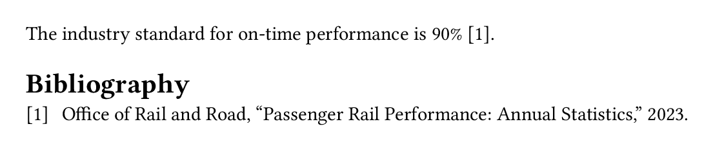
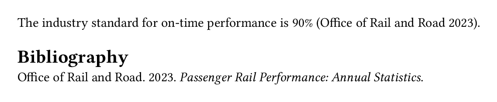
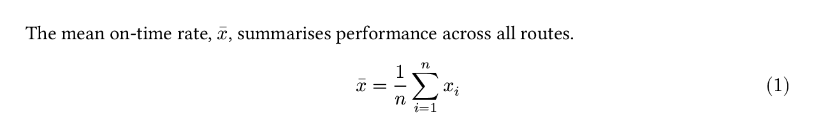
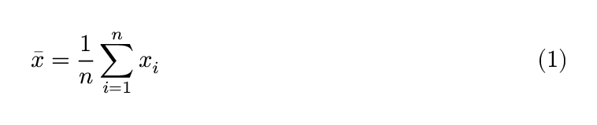

# PDF {#sec-typst}

## Overview

Why Typst for PDF?

What are the alternatives? LaTeX via `format: pdf`, print to PDF from other formats (`html`, `docx`). 

When to use PDF? Targeting print, easily share a single file. Consider accessibility: HTML has longer history and often better. PDF improving, check accessibility section.

## Your first PDF document

```{.markdown}
---
format: typst
---
```

````{.markdown filename="train-punctuality.qmd" .code-overflow-wrap}

````

{#fig-typst-train-punctuality .border fig-alt="A rendered PDF showing a Route Punctuality Report with a table of on-time rates by route and a recommendations section."}

::: {.callout-note}

## PDFs are static documents

Everything we talk about in @sec-authoring works in `format: typst`.
Beware of features that introduce interactivity, like code folding, hover effects, these won't be supported in PDF

:::


## Navigation

`toc`, `number-sections`

Relative links work.

```{.yaml filename="train-punctuality.qmd"}
---
format:
  typst:
    toc: true
    number-sections: true
---
```

{#fig-typst-navigation .border fig-alt="A rendered PDF of the Route Punctuality Report showing a table of contents and numbered section headings."}

## Citations

`bibliography`, setting `csl` style. Using `@` syntax

````{.markdown filename="train-punctuality.qmd" .code-overflow-wrap}

````

::: {.callout-note collapse="true"}
## `references.bib`

```{.bibtex}

```

:::

{#fig-typst-citations .border fig-alt="A short PDF document showing a numbered in-text citation and a bibliography entry."}

````{.yaml filename="train-punctuality.qmd"}
---
format: typst
bibliography: references.bib
csl: chicago-author-date
---
````

{#fig-typst-citations-chicago .border fig-alt="A short PDF document showing a Chicago author-date in-text citation and a bibliography entry."}

Read more in @sec-citations, including various syntax variations.

## Math

### Typst math

Use TeX math. Pandoc will convert to typst math.

````{.markdown filename="equations.qmd" .code-overflow-wrap}

````

{#fig-typst-math-equations .border fig-alt="A PDF showing an inline mean symbol in a sentence and a numbered display equation for the sample mean."}

### Alt text

````{.markdown filename="equations.qmd" .code-overflow-wrap}

````

{#fig-typst-math-equations-alt .border fig-alt="A PDF showing a numbered display equation for the sample mean."}

### Theorems

````{.markdown filename="theorem.qmd" .code-overflow-wrap}

````

Control the appearance with `theorem-appearance`:

```{.yaml filename="_quarto-fancy.yml"}
format:
  typst:
    theorem-appearance: fancy
```

The default is `simple`

::: {#fig-typst-math-theorem}
::: {layout-ncol=2}
{#fig-typst-math-theorem-simple .border fig-alt="A theorem in simple LaTeX style with bold title and italic body text."}

{#fig-typst-math-theorem-fancy .border fig-alt="A theorem in a rounded box with an orange header."}

{#fig-typst-math-theorem-clouds .border fig-alt="A theorem with a soft pink background and rounded corners."}

{#fig-typst-math-theorem-rainbow .border fig-alt="A theorem with a red left border and red title."}
:::

The available options for `theorem-appearance` are `simple`, `fancy`, `clouds`, and `rainbow`. 
:::

## Code blocks

Set language for syntax highlighting, control theme with `syntax-highlighting: github`.  Or `syntax-highlighting: idiomatic` to get default typst syntax highlighting.

Set `filename`. Check what this looks like.

## Computational outputs

### Figure format

### Tables

## Full-width or margin content

## Making accessible PDFs

Focus on `pdfstandard: ua-1` Point to docs for other supported standards.

Don't skip headings, provide alt text. Set metadata.

What can't be checked: contrast, color deficiencies, reading order.

## Customizing appearance

### Page layout

#### Geometry

Paper size, margins, grid customization.

#### Structure

Columns, page numbering, headers and footers.

### Fonts and colors

#### Use brand

Note font paths and font sizes. Check if this covers everything available in the typst template.

#### Use raw typst

Briefly cover set and show rules and how to use them in a raw typst block.

## Custom templates

When set and show rules aren't enough. Or you want a reusable template. 

Focus on the why you would build this, not how. Point to docs for how. 