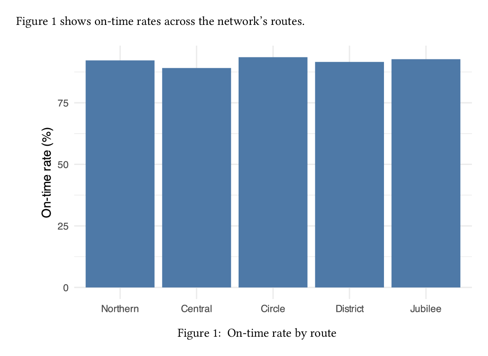
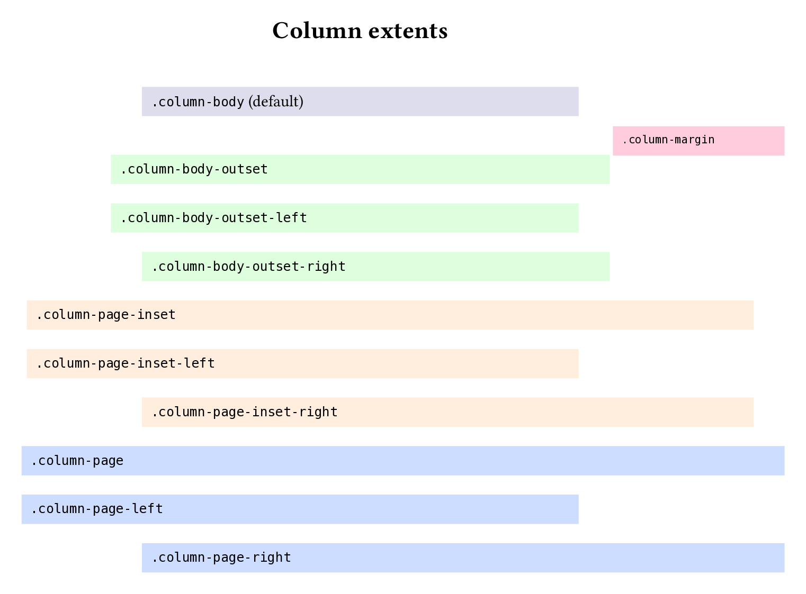

# PDF {#sec-typst}

## Overview

In this chapter, you'll learn how to create PDF documents with Quarto.
PDF is the right target when you plan to print, need a single self-contained file to share, or care about precise layout of content on "pages". 

We'll focus exclusively on creating PDFs via Typst, i.e. `format: typst`.
Typst is a modern typesetting system that comes bundled with Quarto.
There are alternatives in Quarto. 
Most notably, `format: pdf` which creates a PDF via LaTeX. 
We think for new authors, its both easier to get started, and easier to advance with Typst:

* Typst comes bundled with Quarto, so getting to your first PDF document requires nothing more than adding `format: typst`.

* Typst compiles very quickly, reducing the time it takes to preview your changes.

* Typst's scripting language is similar to other languages you may already know (like R and Python) which makes it easier to understand existing templates, and customize your documents.

There are situations where LaTeX may be a better fit:

* You need to work with existing LaTeX templates, like a journal article template.

* You already rely on LaTeX packages for advanced typesetting of math or equations.

If you are in these situations, you may find the [PDF Basics guide](https://quarto.org/docs/output-formats/pdf-basics.htmlv) in the Quarto documentation a better place to start. 

Readers who use screen readers and other assistive technologies generally have a smoother experience with HTML (@sec-html) than with PDF. 
If that describes part of your audience — or if accessibility is a primary concern — HTML is often the better target. 
Accessible PDFs are possible (we'll cover that in @sec-pdf-accessibility), but the tooling ecosystem is younger.

In the next section, you'll create your first PDF document with `format: typst`.
Then, you'll cover the types of content you'll most likely need in your first few documents: navigation, citations, math, code blocks, and computational outputs.

In @sec-pdf-accessibility you'll learn the keys to creating accessible PDFs, and in @sec-customizing-appearance how to customize the page layout, fonts, and colors of your document.

Finally, you'll learn where to head next if you need to go beyond Quarto's default Typst options.

## Your first PDF document

Creating a PDF is as simple as adding `format: typst` to your YAML header:

```{.markdown}
---
format: typst
---
```

Here's a short, but complete example, with some common content types — headings, 
a table, and cross-references:

````{.markdown filename="train-punctuality.qmd" .code-overflow-wrap}

````

To create the PDF, render, either by Previewing in your IDE, or in the terminal:

```{.bash filename="Terminal"}
quarto render train-punctuality.qmd
```

Behind the scenes, Quarto converts your markdown source into Typst's own markup language (`.typ`), then uses the bundled Typst to compile the `.typ` to PDF.
The result is `train-punctuality.pdf`, the rendered PDF, shown in @fig-typst-train-punctuality. 

{#fig-typst-train-punctuality .border fig-alt="A rendered PDF showing a Route Punctuality Report with a table of on-time rates by route and a recommendations section."}

You can see the headings, table and cross-references all "just work".
In the following sections, we'll cover other common content types you commonly need in your first few documents. 
You can also check out @sec-authoring for a more comprehensive set of features available across formats, including `format: typst`.

::: {.callout-note}

## PDFs are static documents

You can try swapping to `format: typst` in any existing Quarto document.
Most markdown features will carry over, but beware of features that introduce interactivity, like code folding, or hover effects, these won't be supported in PDF because PDF is a static format.

:::

## Navigation

PDF documents support links, allowing your readers to quickly navigate your document.
To make navigation easier for readers, you can add a table of contents (`toc`), and section numbers (`number-sections`) in your document header:

```{.yaml filename="train-punctuality.qmd"}
---
format:
  typst:
    toc: true
    number-sections: true
---
```

{#fig-typst-navigation .border fig-alt="A rendered PDF of the Route Punctuality Report showing a table of contents and numbered section headings."}

Items in the table of contents and cross-references are automatically clickable links that take readers to the relevant item.

## Links

You can also use markdown link syntax to add links directly to other sections in your document, or to external resources:

```{.markdown filename="train-punctuality.qmd" .code-overflow-wrap}

```

Both render as plain text in the default template — they're clickable in a PDF viewer, but visually indistinguishable from the surrounding prose.
You'll learn how to style them in @sec-customizing-appearance.

## Citations

Citations require a bibliography file holding reference metadata. 
A common format for this is BibTeX (`.bib`):

```{.bibtex filename="references.bib"}

```

To cite an item in the bibliography, specify the file in `bibliography` and use the `@` syntax in your text:

````{.markdown filename="train-punctuality.qmd" .code-overflow-wrap}

````

{#fig-typst-citations .border fig-alt="A short PDF document showing a numbered in-text citation and a bibliography entry."}

Citations in `format: typst` use Typst's native processing, and consequently, a different default citation style to other Quarto formats.
You can specify the citation style with the `csl` option.
Set `csl: chicago-author-date` to get the same Chicago author-date style as HTML output:

````{.yaml filename="train-punctuality.qmd"}
---
format: typst
bibliography: references.bib
csl: chicago-author-date
---
````

{#fig-typst-citations-chicago .border fig-alt="A short PDF document showing a Chicago author-date in-text citation and a bibliography entry."}

You can read more about citations in @sec-citations, including about various `@` syntax variations.

## Mathematical equations

When you author to Typst from Quarto, use TeX math syntax to write your equations.
Use single dollar signs (`$...$`) for inline math, and double dollar signs (`$$...$$`) for display equations:

````{.markdown filename="equations.qmd" .code-overflow-wrap}

````

{#fig-typst-math-equations .border fig-alt="A PDF showing an inline mean symbol in a sentence and a numbered display equation for the sample mean."}

::: {.callout-note}
## Typst has its own math syntax

Typst's has it's own (non-TeX) math notation, but you won't need to learn it, because Quarto converts TeX math to Typst math for you.
This keeps math portable — the same TeX syntax renders across HTML, Typst and other formats without edits.
:::

You can read more about writing equations, including cross-referencing, in @sec-equations.

### Alt text

Alt text makes an equation accessible to screen readers, and is required to meet the PDF/UA-1 standard.
You can add alternative text to cross-referenced display equations with an `alt=` attribute:

````{.markdown filename="equations.qmd" .code-overflow-wrap}

````

{#fig-typst-math-equations-alt .border fig-alt="A PDF showing a numbered display equation for the sample mean."}

::: {.callout-caution}

## No alt text for inline math

There is currently no way to add alt text to inline math in `format: typst`.
Inline math without alt text will fail PDF/UA-1 validation.

:::

### Theorems

When you use one Quarto's theorem environments you'll get special styling in Typst.
For example, to declare a theorem, you wrap it in a fenced div with an identifier that starts with `#thm-`:

````{.markdown filename="theorem.qmd" .code-overflow-wrap}

````

The default theorem appearance is `simple`: a bold title followed by italic body text.
Switch to a different flavor with `theorem-appearance`:

```{.yaml filename="_quarto-fancy.yml"}
format:
  typst:
    theorem-appearance: fancy
```

The available options are `simple`, `fancy`, `clouds`, and `rainbow`:

::: {#fig-typst-math-theorem}
::: {layout-ncol=2}
{#fig-typst-math-theorem-simple .border fig-alt="A theorem in simple LaTeX style with bold title and italic body text."}

{#fig-typst-math-theorem-fancy .border fig-alt="A theorem in a rounded box with an orange header."}

{#fig-typst-math-theorem-clouds .border fig-alt="A theorem with a soft pink background and rounded corners."}

{#fig-typst-math-theorem-rainbow .border fig-alt="A theorem with a red left border and red title."}
:::

Available values for `theorem-appearance` to style theorems.
:::

`theorem-appearance` applies to every theorem-like element Quarto recognizes, not just `thm-`.
You can find all the available types in @sec-theorems-proofs.
Under `fancy`, `clouds` and `rainbow`, different types get different accent colours so you can tell a definition from a theorem at a glance.

## Code blocks

When you include a code block it will get automatic syntax highlighting based
on the language you specify.
For example, you can set `r` on a code block:

````{.markdown filename="report.qmd" .code-overflow-wrap}

````

Then in your PDF, the block gets R syntax highlighting as shown in @fig-typst-code-blocks-highlight.
Executable code cells that are echoed in your document get the same treatment, so your code and its output are styled consistently.

{#fig-typst-code-blocks-highlight .border fig-alt="A short PDF showing a sentence followed by an R code block with colored syntax highlighting on a light blue-gray background."}

The default highlighting theme is `arrow`.
Pick a different one with `syntax-highlighting`:

```{.yaml filename="_quarto.yml"}
format:
  typst:
    syntax-highlighting: github
```

Supported themes include: `a11y`, `arrow`, `pygments`, `tango`, `espresso`, `zenburn`, `kate`, `monochrome`, `breezedark`, `haddock`, `atom-one`, `ayu`, `breeze`, `dracula`, `github`, `gruvbox`, `monokai`, `nord`, `oblivion`, `printing`, `radical`, `solarized`, and `vim`.

Typst also has a native highlighter, if you'd prefer to use it, you can set `syntax-highlighting` to `idiomatic`:

::: {#fig-typst-code-blocks-themes}
::: {layout-ncol=2}
{#fig-typst-code-blocks-github .border fig-alt="An R code block with GitHub-style syntax highlighting on a white background."}

{#fig-typst-code-blocks-idiomatic .border fig-alt="An R code block with Typst's native syntax highlighting on a gray background."}
:::

A comparison of the `github` theme for syntax highlighting and Typst's native `idiomatic` theme.
:::

### Filename

::: todo
[CVW] Regenerate screenshot and remove this once quarto-dev/quarto-cli#14170 is merged.
:::

You can add a `filename` attribute to label the code block:

````{.markdown filename="report.qmd" .code-overflow-wrap}

````

## Computational outputs

Computational code cells work in `format: typst` just as they do in other formats.
Outputs like figures, tables, and inline values are inserted into the PDF at the point of the cell.

For example, here's a cell that produces a figure:

::: {.panel-tabset}
## R

````{.markdown filename="report.qmd" .code-overflow-wrap}
```{{r}}

```
````

## Python

````{.markdown filename="report.qmd" .code-overflow-wrap}
```{{python}}

```
````
:::

The cell uses `echo: false`, so the code itself is hidden in the rendered output; the figure appears directly below the surrounding prose with a numbered caption, as shown in @fig-typst-computational-outputs-figures.

{#fig-typst-computational-outputs-figures .border fig-alt="A page showing the sentence 'Figure 1 shows on-time rates across the network's routes' followed by a bar chart of on-time rate by route, captioned Figure 1: On-time rate by route."}

While most computational outputs render as expected, there a few quirks to be aware of, which we'll cover the sections below: figure format, table formats and long tables.


### Figure format

Quarto defaults to SVG for computational figures in Typst.
SVG is a vector format, so it scales well and looks crisp at any size.
However, it can be slow to render when a figure contains many elements, like a busy scatterplot with thousands of points.
Set `fig-format` in the document header to switch default format, e.g. to `png` for raster output:

```{.yaml filename="report.qmd"}
---
format:
  typst:
    fig-format: png
---
```

### Table formats

Any code that produces a markdown, HTML, or raw Typst table will render to a table in your PDF.
Often it's not easy to tell which format you've ended up with. 
The easiest way to check is to add `keep-md` to your header and examine the resulting `.md` file:

````{.yaml filename="report.qmd"}
---
format:
  typst:
    keep-md: true
---
````

For simple tables, code that outputs a markdown table, will often be the best choice.
Markdown tables are converted to native Typst tables by Quarto, and it will inherit your documents styling, like fonts and colors, so the table will blend with the rest of your document. 

The advantage of HTML tables, is that cell-level formatting, like coloring that depends on the data, will be preserved. 
For example, these code blocks use the `gt` package in R and `great_tables` in Python to produce tables with colored cells:

::: {.panel-tabset}
## R

````{.markdown filename="report.qmd" .code-overflow-wrap}
```{{r}}

```
````

## Python

````{.markdown filename="report.qmd" .code-overflow-wrap}
```{{python}}

```
````
:::

When rendered to Typst the cell level coloring survives, as shown in @fig-typst-computational-outputs-tables.
However, notice the font is now the `gt`/`great_tables` default san-serif font.

{#fig-typst-computational-outputs-tables .border fig-alt="A table of on-time rates by route with four columns: Route, On time, Total, and On-time rate (%)."}

Most packages that produce HTML tables will have a way to customize the styles in the tables they produce. 
You'll need to look into the package documentation to find out how.


Packages that produce raw Typst tables, may get the best of both worlds, inheriting the document's fonts and styling, while allowing for cell-level formatting. 
However, there are currently very few packages that produce raw Typst tables.

### Long tables

When your code creates a very long table, you'll want it to break across pages, rather than being cut off at the bottom of the page.
If you haven't set `label:` and `tbl-cap:`, i.e. it isn't cross-referenceable, the table will break across pages by default.

If you have set `label:` and `tbl-cap:`, the table won't be breakable by default, and will overflow the page instead of breaking across it, as shown in @fig-typst-computational-outputs-long-table-broken.

{#fig-typst-computational-outputs-long-table-broken .border width="40%" fig-alt="A long gt table whose last two rows are cut off at the bottom of the page."}

To let cross-referenceable tables break across pages, add a raw Typst block after your document header:

````{.markdown filename="report.qmd"}
---
title: "Route Punctuality Report"
---

```{{=typst}}
#show figure: set block(breakable: true)
```
````

Now the long table flows cleanly across pages, with the table header repeated on each:

::: {#fig-typst-computational-outputs-long-table-fix}
::: {layout-ncol=2 layout-valign="top"}
{#fig-typst-computational-outputs-long-table-fix-p1 .border width="80%" fig-alt="Page 1 of a long gt table, with the first 27 rows visible."}

{#fig-typst-computational-outputs-long-table-fix-p2 .border width="80%" fig-alt="Page 2 of the long gt table, with the final 3 rows visible and the header repeated."}
:::

The long table broken cleanly across two pages.
:::

You'll learn more about raw Typst blocks in the next section.

## Raw Typst blocks

If you explore the [Typst documentation](https://typst.app/docs/reference/), you'll find a rich syntax that can go beyond what Quarto markdown supports.
For anything, that Quarto doesn't support you can use Typst syntax directly inside a raw block (@sec-raw-blocks).

The contents of a raw block pass through to Typst without being processed by Quarto, and are ignored in any other format.
For example, you can use a raw Typst block to add status badge that uses the [`rect`](https://typst.app/docs/reference/visualize/rect/), [`align`](https://typst.app/docs/reference/layout/align/), and [`text`](https://typst.app/docs/reference/text/text/) Typst functions:

````{.markdown .code-overflow-wrap filename="report.qmd"}

````

{#fig-typst-raw-typst-shape .border fig-alt="A line reading Service status, followed by a rounded blue rectangle with the word Normal centered in white."}

Another good usecase for raw blocks is to customize appearance with set and show rules as you'll see in @sec-use-show-rules.

## Full-width or margin content

By default, your document content will sit in the body column of your PDF document.
Sometime, you may want to break out of that column, and use the full page width, or put content into the right margin.

Add the `.column-margin` class to a fenced div to push content into the margin as an aside:

````{.markdown filename="report.qmd" .code-overflow-wrap}

````

{#fig-typst-column-layout-margin .border fig-alt="A PDF showing two body paragraphs with a short note in the right margin."}

Use the `.column-page` class to widen content across the page, extending beyond the body text:

````{.markdown filename="report.qmd" .code-overflow-wrap}

````

{#fig-typst-column-layout-page .border fig-alt="A PDF showing a narrow introductory line and a wide six-column table extending beyond the body width."}

In Typst, the column classes give you four distinct widths beyond the default body:

- `.column-margin` — content sits in the margin column
- `.column-body-outset` — slightly wider than the body, extending into the margins
- `.column-page-inset` — almost the full page width
- `.column-page` — extends to the page margins

Each of the wider three has `-left` and `-right` variants for one-sided expansion.
@fig-typst-column-layout-extents shows the extent of each.

{#fig-typst-column-layout-extents .border fig-alt="A page laid out with one rectangle per column class, sized to its width: a small body rectangle at top, a margin rectangle in the right margin, three body-outset rectangles slightly wider than the body, three page-inset rectangles wider still, and three page rectangles extending to the page margins."}

For document-wide defaults, set `tbl-column` and `fig-column` in the document header.
Both apply to every cross-referenceable table or figure in the document — markdown pipe tables, list tables, and computational outputs alike.
Tables and figures without an identifier are unaffected, as are non-cross-referenceable images and tables.

```{.yaml filename="report.qmd"}
---
format: typst
fig-column: page
tbl-column: page
---
```

## Making accessible PDFs {#sec-pdf-accessibility}

An accessible PDF is one that assistive technologies, like screen readers, can navigate and announce correctly.
The PDF/UA-1 standard defines what a tagged, accessible PDF looks like — document structure, language metadata, alt text on every image and equation.

Set `pdf-standard: ua-1` to produce a tagged PDF suitable for screen readers. Quarto validates the output against PDF/UA-1 at render time; a document that fails validation won't be produced.

Add PDF metadata — `title`, `author`, `date`, `lang` — so assistive tools can identify the document and announce it in the right language:

```{.yaml filename="report.qmd"}
---
title: "Route Punctuality Report"
author: "Dr. Sarah Okonkwo"
date: 2026-04-15
lang: en
format:
  typst:
    pdf-standard: ua-1
---
```

::: {.callout-tip}
## PDF/UA-1 is strict about alt text

Every image *and* every equation — display **and inline** — must carry alt text. Display equations take `alt=` in their attribute block (`$$ ... $$ {#eq-mean alt="..."}`); inline math currently doesn't. Avoid inline math under `ua-1`, or switch to a looser standard.
:::

See the Quarto accessibility guide for alt text syntax on images and equations. Other conformance standards are supported — archival PDF/A variants (`a-1b`, `a-2b`, ...) and explicit PDF versions; see the Typst format reference for the full list.

Don't skip heading levels: screen readers build the document outline from `##` → `###` in order. And some things no tool can check — color contrast, readability for color-deficient readers, and whether the reading order in the PDF matches your intent. Review those manually.

## Customizing appearance

### Page layout

#### Geometry

Set paper size with `papersize`:

```{.yaml filename="_quarto.yml"}
format:
  typst:
    papersize: a5
```

Typst accepts any of its supported paper sizes (`a4`, `a5`, `us-legal`, `jis-b5`, ...); the default is `us-letter`.

Use `margin` for page margins. Provide any combination of `top`, `bottom`, `left`, `right` — or the shortcuts `x` and `y`:

```{.yaml filename="_quarto.yml"}
format:
  typst:
    margin:
      top: 2cm
      bottom: 2cm
      left: 3cm
      right: 3cm
```

For finer control over how the body and margin columns split the page, use `grid`:

```{.yaml filename="_quarto.yml"}
format:
  typst:
    grid:
      body-width: 4in
      margin-width: 2in
      gutter-width: 0.25in
```

`body-width` is the text column; `margin-width` is the column reserved for `.column-margin` content; `gutter-width` is the gap between them.

#### Structure

Set the number of body-text columns with `columns`:

```{.yaml filename="_quarto.yml"}
format:
  typst:
    columns: 2
```

Margin content stays in the margin column and doesn't flow between body columns.

Use `page-numbering` to set the footer format (or `""` to suppress it), and `section-numbering` with `number-sections: true` to number headings:

```{.yaml filename="_quarto.yml"}
format:
  typst:
    page-numbering: "1 / 1"
    section-numbering: "1.A"
    number-sections: true
```

`page-numbering` follows Typst's numbering-pattern syntax — `1` for the current page, a second `1` for the total. `section-numbering` uses a similar scheme, one placeholder per heading level (`1.A` gives numeric first-level headings and alphabetic second-level).

Quarto doesn't expose YAML options for page headers or running titles in Typst output. For those, drop into a raw Typst block (covered below in [Use raw typst](#use-raw-typst)).

### Fonts and colors

#### Use brand

Add Typst fonts and colors to your project's `_brand.yml` — Quarto picks it up automatically and flows the keys into Typst's document template. No raw Typst required for the common cases.

Set the body font, page background, and foreground (body text color) under `typography.base` and `color`:

```{.yaml filename="_brand.yml"}
typography:
  base: Helvetica
color:
  background: "#fdf6e3"
  foreground: "#073642"
```

{#fig-typst-fonts-colors-base .border fig-alt="A short document with a solarized-light cream background, dark-teal text, and a Helvetica sans-serif face."}

Customise headings independently with `typography.headings`. Family, color, and weight can all be set:

```{.yaml filename="_brand.yml"}
typography:
  headings:
    family: Helvetica
    color: "#b58900"
    weight: bold
```

{#fig-typst-fonts-colors-headings .border fig-alt="Two headings rendered in bold amber Helvetica above serif body paragraphs."}

Set the code font with `typography.monospace.family`. Declare the font under `typography.fonts` and pick a `source` — `system` for an already-installed font, or `google` to have Quarto fetch it at render time:

```{.yaml filename="_brand.yml"}
typography:
  fonts:
    - family: JetBrains Mono
      source: google
  monospace:
    family: JetBrains Mono
```

{#fig-typst-fonts-colors-mono-font .border fig-alt="An R code block rendered in JetBrains Mono, with a left-arrow ligature replacing the two-character <- assignment operator."}

`monospace` covers both inline and block code. To target them separately, use `monospace-inline` and `monospace-block`.

Colour the code-block background with `typography.monospace-block.background-color`. Pair it with a `syntax-highlighting` theme whose token colors contrast against the background you picked — e.g. `a11y-dark` for a dark bg:

```{.yaml filename="_brand.yml"}
typography:
  monospace-block:
    background-color: "#1e1e2e"
```

```{.yaml filename="_quarto.yml"}
format:
  typst:
    syntax-highlighting: a11y-dark
```

{#fig-typst-fonts-colors-code-bg .border fig-alt="An R code block on a dark bluish-purple background with bright yellow function names, white variables, and orange numeric literals."}

::: {.callout-warning}
## Coordinate code backgrounds with syntax highlighting

Code-block background and `syntax-highlighting` aren't independent knobs. The default highlighting theme is tuned for a light code bg; on a dark background its argument-gray tokens fade into the page. Pick a theme whose token palette matches your chosen background.

`syntax-highlighting: github` is a second gotcha — it currently ignores `monospace-block.background-color` entirely, emitting its own code-block fill that the brand override doesn't reach.
:::

#### Use raw typst

When YAML and brand keys don't reach what you want, drop into a raw Typst block. Two rule flavours cover most cases:

- **Set rules** — `#set X(...)` — change default parameters for element `X`.
- **Show rules** — `#show X: ...` — transform how element `X` renders, often by setting parameters on a *different* element.

Both take effect from the point they appear onwards. Put them near the top of your document to apply globally.

##### Set rules

Add a running header to every page with `#set page(...)`:

````{.markdown filename="report.qmd"}
```{{=typst}}
#set page(header: align(right, text(fill: gray, [Route Punctuality Report])))
```
````

{#fig-typst-raw-typst-page-header .border fig-alt="A PDF page with a gray Route Punctuality Report header at top right, followed by Summary and Recommendations sections."}

::: {.callout-note}
## `#set page()` starts a new page

Typst treats `#set page()` as a page break — the current page finishes, the new settings take effect on the one that follows. A raw block at the top of the body therefore only applies from page 2 onwards. To reach page 1, override the `page.typ` partial instead (see [Custom templates](#custom-templates)).
:::

Widen paragraph line spacing with `#set par(...)`:

````{.markdown filename="report.qmd"}
```{{=typst}}
#set par(leading: 1em)
```
````

{#fig-typst-raw-typst-par-leading .border fig-alt="Two short paragraphs with extra vertical space between every line."}

Tint body text with `#set text(...)`. Because set rules apply forward from where they appear, you can open a scope, drop a paragraph in, then revert:

````{.markdown filename="report.qmd"}
```{{=typst}}
#set text(fill: rgb("#4a4a4a"))
```

Quarterly on-time performance held above 80% across the network...

```{{=typst}}
#set text(fill: black)
```

Off-peak services consistently outperformed peak services...
````

{#fig-typst-raw-typst-text-fill .border fig-alt="Two paragraphs of body text: the first rendered in medium gray, the second in black."}

##### Show rules

Reach for a show rule when the parameter you want lives on a *different* element. Heading spacing, for example, is a `block` parameter, not a `heading` one — `#show heading: set block(...)` bridges the two:

````{.markdown filename="report.qmd"}
```{{=typst}}
#show heading: set block(above: 2em, below: 0.5em)
```
````

{#fig-typst-raw-typst-heading-spacing .border fig-alt="Summary and Recommendations headings with wide vertical space above each."}

Narrow the target with `.where()`. Here level-2 headings go italic; level-1 stays upright:

````{.markdown filename="report.qmd"}
```{{=typst}}
#show heading.where(level: 2): set text(style: "italic")
```
````

{#fig-typst-raw-typst-heading-level .border fig-alt="Three headings: Summary and Recommendations in upright bold, with Observations rendered in italic bold between them."}

::: {.callout-note}
## Heading levels are shifted by one

Quarto's Typst format defaults to `shift-heading-level-by: -1`, so markdown `##` renders as Typst level 1 and `###` as level 2. That's why the rule above targets `level: 2` to match a `###` heading in the source. Override with `shift-heading-level-by: 0` in your YAML if you'd rather the numbers line up.
:::

Quarto exposes `_brand.yml` colors to raw Typst via the `brand-color` dictionary. With

```{.yaml filename="_brand.yml"}
color:
  primary: "#2e5090"
```

every heading can be painted in the brand primary:

````{.markdown filename="report.qmd"}
```{{=typst}}
#show heading: set text(fill: brand-color.primary)
```
````

{#fig-typst-raw-typst-heading-color .border fig-alt="Summary and Recommendations headings rendered in a dark blue brand color on white."}

## Custom templates

When set and show rules aren't enough. Or you want a reusable template.

Focus on the why you would build this, not how. Point to docs for how.

::: todo
[CVW] Cover the `page.typ` partial. It's the file that turns YAML like `papersize`, `margin`, `page-numbering`, and `columns` into a `#set page()` call; overriding it is the supported way to reach the Typst page parameters Quarto doesn't expose — running headers and footers are the motivating example.
:::